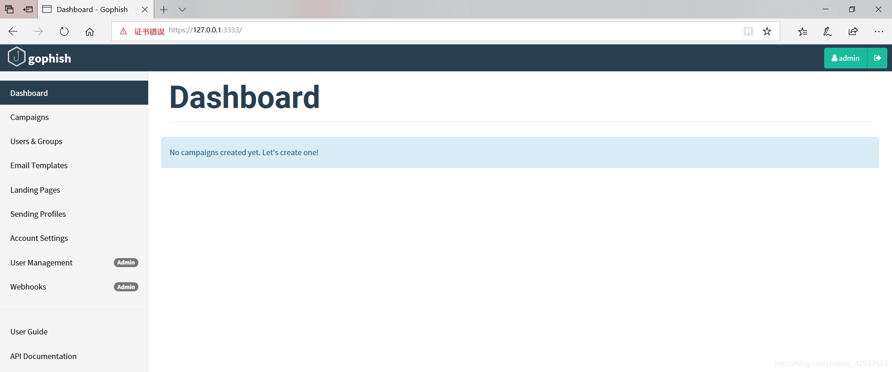
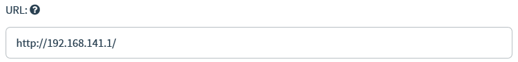
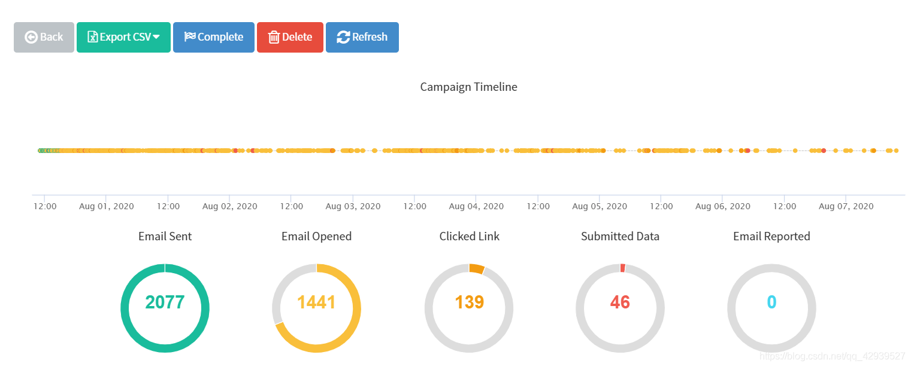

# 钓鱼工具gophish史上最详细教程（附实例） —— 手把手教你成为“捕鱼人”

#### 文章目录

-   [概念](#_7)
-   [快速安装](#_20)
-   -   [Linux](#Linux_26)
    -   [Windows](#Windows_112)
-   [功能介绍](#_140)
-   -   [Sending Profiles 发件策略](#Sending_Profiles__146)
    -   [Landing Pages 钓鱼页面](#Landing_Pages__178)
    -   -   [踩坑汇总](#_209)
    -   [Email Templates 钓鱼邮件模板](#Email_Templates__220)
    -   [Users & Groups 用户和组](#Users__Groups__249)
    -   [Campaigns 钓鱼事件](#Campaigns__264)
    -   [Dashboard 仪表板](#Dashboard__312)
    -   [查看捕获的数据](#_327)
-   [实际案例](#_350)
-   -   [前期准备](#_359)
    -   [配置gophish](#gophish_373)
    -   [查看钓鱼结果](#_378)

> **声明：**  
> 利用钓鱼网站骗取银行卡或信用卡账号、密码等私人资料属于非法行为，请不要进行任何非授权的网络攻击  
> 由于传播、利用本文所提供的信息而造成的任何直接或间接的后果及损失，均由使用者本人负责，文章作者不为此承担任何责任

`偶然发现了gophish这个钓鱼工具，可网上关于该工具的（中文）资料却寥寥无几。花了一些时间了解之后，发现这个工具真香，因此特意斥巨资(时间就是金钱)写了这篇个人认为比较详细的教程，希望可以帮到第一次接触这个工具的小伙伴。不足之处，还望各路大神批评！`

## 概念

Gophish项目地址：[https://github.com/gophish/gophish](https://github.com/gophish/gophish)  
Gophish官网地址：[https://getgophish.com/](https://getgophish.com/)

Gophish：开源网络钓鱼工具包

Gophish是为企业和渗透测试人员设计的开源网络钓鱼工具包。 它提供了快速，轻松地设置和执行网络钓鱼攻击以及安全意识培训的能力。

> 以上摘自gophish的[github](https://so.csdn.net/so/search?q=github&spm=1001.2101.3001.7020)项目简介

gophish自带web面板，对于邮件编辑、网站克隆、数据可视化、批量发送等功能的使用带来的巨大的便捷  
在功能上实现分块，令钓鱼初学者能够更好理解钓鱼工作各部分的原理及运用

## 快速安装

安装包下载：[https://github.com/gophish/gophish/releases](https://github.com/gophish/gophish/releases)

*当前（2020.07.23）最新版本是 v0.10.1*  
gophish可以运行在常见的操作系统上，下面分别介绍两大主流系统Linux与Windows上的安装及运行

### Linux

根据自身操作系统的版本下载相应的安装包  
[gophish-v0.10.1-linux-32bit.zip](https://github.com/gophish/gophish/releases/download/v0.10.1/gophish-v0.10.1-linux-32bit.zip)  
[gophish-v0.10.1-linux-64bit.zip](https://github.com/gophish/gophish/releases/download/v0.10.1/gophish-v0.10.1-linux-64bit.zip)

使用`wget`命令下载到本地

```bash
//32bit
root@ubuntu:~$ wget https://github.com/gophish/gophish/releases/download/v0.10.1/gophish-v0.10.1-linux-32bit.zip
//64bit
root@ubuntu:~$ wget https://github.com/gophish/gophish/releases/download/v0.10.1/gophish-v0.10.1-linux-64bit.zip
```

这里以64位Ubuntu系统为例：  
下载完成后，利用`unzip`命令进行解压

```bash
root@ubuntu:~$ mkdir gophish
#解压至gophish文件夹中
root@ubuntu:~$ unzip gophish-v0.10.1-linux-64bit.zip -d ./gophish
```

**修改配置文件：**

```bash
root@ubuntu:~$ cd gophish
```

若需要远程访问后台管理界面，将`listen_url`修改为`0.0.0.0:3333`，端口可自定义。（这项主要针对于部署在服务器上，因为一般的Linux服务器都不会安装可视化桌面，因此需要本地远程访问部署在服务器上的gophish后台）  
如果仅通过本地访问，保持`127.0.0.1:3333`即可

```bash
root@ubuntu:~$ vi config.json

{
		//后台管理配置
        "admin_server": {
                "listen_url": "0.0.0.0:3333",  // 远程访问后台管理
                "use_tls": true,
                "cert_path": "gophish_admin.crt",
                "key_path": "gophish_admin.key"
        },
        "phish_server": {
                "listen_url": "0.0.0.0:80",
                "use_tls": false,
                "cert_path": "example.crt",
                "key_path": "example.key"
        },
        "db_name": "sqlite3",
        "db_path": "gophish.db",
        "migrations_prefix": "db/db_",
        "contact_address": "",
        "logging": {
                "filename": "",
                "level": ""
        }
}
```

**运行gophish：**  
运行gophish脚本

```bash
root@ubuntu:~$ ./gophish
```

**访问后台管理系统：**  
本地打开浏览器，访问`https://ip:3333/` （注意使用https协议）  
可能会提示证书不正确，依次点击 `高级` — `继续转到页面` ，输入默认账密进行登录：`admin/gophish`

> **注：最新版本的gophsih(v0.11.0)删除了默认密码“ gophish”。取而代之的是，在首次启动Gophish时会随机生成一个初始密码并将其打印在终端中**  
> **详情见：[https://github.com/gophish/gophish/releases/tag/v0.11.0](https://github.com/gophish/gophish/releases/tag/v0.11.0)**

此处建议，如果是部署在公网服务器上，尽量登录后在功能面板`Account Settings`处修改高强度密码

> 如果依旧访问不到后台管理系统，有可能是服务器未对外开放3333端口，可查看防火墙策略、配置iptables 等方式自检


**访问钓鱼界面：**  
本地打开浏览器，访问`http://ip:80/`  
由于我们还未配置钓鱼页面，提示**小段的**`404 page not found`说明运行正常  
  
至此，已完成了Linux下gophish的安装以及相关配置，并且运行起来了。  
另外我在实践中遇到过一个小问题，当仅仅使用命令`./gophish`来启动gophish时，经过一段时间会自动掉线（脚本终止运行）  
所以需要长期保持运行时，可以结合`nohup`与`&`来启动gophish，保持后台稳定运行  
**具体命令：**

```bash
root@ubuntu:~$ nohup ./gophish &
```

### Windows

关于gophish的Windows平台安装包仅有64位的，如果是32的win可能会不兼容（未测试），不过现在的PC大多数都是64位了，因此还是具有普遍性

下载安装包：  
[gophish-v0.10.1-windows-64bit.zip](https://github.com/gophish/gophish/releases/download/v0.10.1/gophish-v0.10.1-windows-64bit.zip)  
下载完成后，使用压缩工具解压到文件夹中  
  
**（可选）修改配置文件：**  
如果有远程访问gophish的后台管理系统的需求，则修改配置文件。具体参考Linux下修改gophish配置文件  
使用编辑器打开`config.json`文件，修改字段`listen_url`的值为`0.0.0.0:3333` (默认为`127.0.0.1:3333`，仅本地访问)，端口可自定义

**运行gophish：**  
双击目录下的`gophish.exe`启动gophish，这里需要保持小黑框不被关闭，关闭则脚本终止（如果看着碍眼可以自行搜索后台运行的方法）  


**访问后台管理系统：**  
本地浏览器访问：`https://127.0.0.1:3333` 或 `https://远程ip:3333` (注意使用https协议)  
输入默认账密进行登录：`admin/gophish`

> **注：最新版本的gophsih(v0.11.0)删除了默认密码“ gophish”。取而代之的是，在首次启动Gophish时会随机生成一个初始密码并将其打印在终端中**  
> **详情见：[https://github.com/gophish/gophish/releases/tag/v0.11.0](https://github.com/gophish/gophish/releases/tag/v0.11.0)**

  
**访问钓鱼界面：**  
本地打开浏览器，访问`http://127.0.0.1:80/` 或 `http://远程ip:80/`  
由于我们还未配置钓鱼页面，提示**小段的**`404 page not found`说明运行正常  
  
至此完成了gophish在Windows平台下的安装配置及运行

## 功能介绍

由于后台管理系统是不区分操作系统的，因此不区分Linux和Windows来介绍各功能

进入后台后，左边的栏目即代表各个功能，分别是`Dashboard仪表板` 、`Campaigns钓鱼事件` 、`Users & Groups用户和组` 、`Email Templates邮件模板` 、`Landing Pages钓鱼页面` 、`Sending Profiles发件策略`六大功能  
由于实际使用中并不是按照该顺序来配置各个功能，因此下面通过`实际使用顺序`来详细介绍各功能的使用方法

### Sending Profiles 发件策略

Sending Profiles的主要作用是`将用来发送钓鱼邮件的邮箱配置到gophish`

点击`New Profile`新建一个策略，依次来填写各个字段  
**Name：**  
Name字段是为新建的发件策略进行命名，不会影响到钓鱼的实施，建议以发件邮箱为名字，例如如果使用qq邮箱来发送钓鱼邮件，则Name字段可以写`xxxxxx@qq.com`  
  
**Interface Type:**  
Interface Type 是接口类型，默认为`SMTP类型`且不可修改，因此需要发件邮箱开启SMTP服务  
**From:**  
From 是发件人，即钓鱼邮件所显示的发件人。（在实际使用中，一般需要进行近似域名伪造）这里为了容易理解，就暂时以qq邮箱为例，所以From字段可以写：`test<xxxxxx@qq.com>`  
  
**Host:**  
Host 是smtp服务器的地址，格式是smtp.example.com:25，例如qq邮箱的smtp服务器地址为`smtp.qq.com`  
  
**Username:**  
Username 是smtp服务认证的用户名，如果是qq邮箱，Username则是自己的qq邮箱号`xxxx@qq.com`  
**Password:**  
Password 是smtp服务认证的密码，例如qq邮箱，需要在登录qq邮箱后，点击 `设置` - `账户` - `开启SMPT服务` 生成`授权码`，Password的值则可以填收到的授权码  


**（可选）Email Headers:**  
Email Headers 是自定义邮件头字段，例如邮件头的`X-Mailer`字段，若不修改此字段的值，通过gophish发出的邮件，其邮件头的X-Mailer的值默认为gophish  
  
设置好以上字段，可以点击`Send Test Email`来发送测试邮件，以检测smtp服务器是否认证通过  
  
**成功收到测试邮件：**  
  
至此，发件邮箱的配置已经完成。当然，在实际钓鱼中，不可能使用自己的qq邮箱去发送钓鱼邮件。一是暴露自身身份，且邮件真实性低，二是qq邮箱这类第三方邮箱对每个用户每日发件数存在限制。  
因此，如果需要大批量去发送钓鱼邮件，最好的方式是**使用自己的服务器，申请近似域名，搭建邮件服务器来发件**

### Landing Pages 钓鱼页面

完成钓鱼邮件的编写后，下一步则需要设计由邮件中超链接指向的钓鱼网页，点击`New Page`新建页面  
**Name:**  
Name 是用于为当前新建的钓鱼页面命名，可以简单命名为`钓鱼页面1`  
  
**Import Site:**  
与钓鱼邮件模板的编辑一样，gophish为钓鱼页面的设计也提供了两种方式，第一种则是`Import Site`  
点击Import Site后，填写`被伪造网站的URL`，再点击Import，即可通过互联网自动抓取被伪造网站的前端代码  
这里以伪造XX大学电子邮箱登录界面为例，在Import Site中填写`https://mail.XX.edu.cn/cgi-bin/loginpage`，并点击`import`  


**内容编辑框：**  
内容编辑框是编辑钓鱼页面的第二种方法，但是绝大多数情况下，它更偏向于用来辅助第一种方法，即对导入的页面进行源码修改以及预览。  


由于编码的不同，通常直接通过Import Site导入的网站，其中文部分多少存在`乱码现象`，这时候就需要查看源码并`手动修改`过来  
例如预览刚才导入的XX大学邮箱登录界面，就发现在多处存在乱码现象  


**（重点）Capture Submitted Data:**  
通常，进行钓鱼的目的往往是捕获受害用户的用户名及密码，因此，在点击Save Page之前，记得一定要勾选`Capture Submitted Data`  
当勾选了`Capture Submitted Data`后，页面会多出一个`Capture Passwords`的选项，显然是捕获密码。通常，可以选择勾选上以验证账号的可用性。如果仅仅是测试并统计受害用户是否提交数据而不泄露账号隐私，则可以不用勾选  
另外，当勾选了`Capture Submitted Data`后，页面还会多出一个`Redirect to`，其作用是当受害用户点击提交表单后，将页面`重定向`到指定的URL。可以填写被伪造网站的URL，营造出一种受害用户第一次填写账号密码填错的感觉  
（一般来说，当一个登录页面提交的表单数据与数据库中不一致时，登录页面的URL会被添加上一个`出错参数`，以提示用户账号或密码出错，所以在`Redirect to`中，最好填写带出错参数的URL）  
因此，令此处的Redirect to的值为`https://mail.XX.edu.cn/cgi-bin/loginpage?errtype=1`  


填写好以上参数，点击`Save Page`，即可保存编辑好的钓鱼页面

#### 踩坑汇总

> **（必看）经验之谈 · 注意事项**  
> 在导入真实网站来作为钓鱼页面时，绝大多数情况下并非仅通过Import就能够达到理想下的克隆，通过多次实践，总结出以下几点注意事项
> 
> 1.  【捕获不到提交的数据】导入后要在HTML编辑框的非Source模式下观察源码解析情况，如果明显发现存在许多地方未加载，则有可能**导入的源码并非页面完全加载后的前端代码，而是一个半成品，需要通过浏览器二次解析，渲染未加载的DOM**。这种情况下，除非能够直接爬取页面完全加载后的前端代码，否则**无法利用gophish进行钓鱼**，造成的原因是不满足第2点。
> 2.  【捕获不到提交的数据】导入的前端源码，必须存在严格存在`<form method="post" ···><input name="aaa" ··· /> ··· <input type="submit" ··· /></form>`结构，即**表单（POST方式）— Input标签（具有name属性）Input标签（submit类型）— 表单闭合**的结构，如果不满足则无法捕获到提交的数据
> 3.  【捕获不到提交的数据】在满足第2点的结构的情况下，还需要求`<form method="post" ···>`在**浏览器解析渲染后**（即`预览`情况下）不能包含`action`属性，或者`action属性的值为空`。否则将会把表单数据提交给action指定的页面，而导致无法被捕获到
> 4.  【捕获数据不齐全】对于需要被捕获的表单数据，除了`input标签`需要被包含在`<form>`中，还需满足该`<input>`存在`name`属性。例如`<input name="username">`,否则会因为没有字段名而导致`value`被忽略
> 5.  【密码被加密】针对`https`页面的import，通常密码会进行加密处理，这时需要通过审计导入的前端代码，找到加密的`JavaScript函数`（多数情况存在于单独的`js文件`中，通过src引入），将其**在gophish的HTML编辑框中删除**，阻止表单数据被加密
> 
> 以上5点是在实践中总结出来的宝贵经验，或许还有其他许多坑未填，但所有的坑通常都围绕在`<form><input /></form>`结构中，所以如果遇到新坑，先将该结构排查一遍，还是不行，再另辟蹊径

### Email Templates 钓鱼邮件模板

完成了邮箱配置之后，就可以使用gophish发送邮件了。所以，接下来需要去编写钓鱼邮件的内容  
点击`New Template`新建钓鱼邮件模板，依次介绍填写各个字段

**Name:**  
同样的，这个字段是对当前新建的钓鱼邮件模板进行命名。可以简单的命名为：`邮件模板1`  
  
**Import Email:**  
gophish为编辑邮件内容提供了两种方式，第一种就是`Import Email`

用户可以先在自己的邮箱系统中设计好钓鱼邮件，然后发送给自己或其他伙伴，收到设计好的邮件后，打开并选择`导出为eml文件`或者`显示邮件原文`，然后将内容`复制到gophish的Import Email`中，即可将设计好的钓鱼邮件导入  
  
需要注意，在点击`Import`之前需要勾选上`Change Links to Point to Landing Page`，该功能实现了当创建钓鱼事件后，会将邮件中的超链接自动转变为钓鱼网站的URL  
**Subject:**  
Subject 是邮件的主题，通常为了提高邮件的真实性，需要自己去编造一个吸引人的主题。这里简单填写成`“第一次钓鱼测试”`  
  
**内容编辑框：**  
内容编辑框是编写邮件内容的第二种模式，内容编辑框提供了`Text`和`HTML`两种模式来编写邮件内容，使用方式与正常的编辑器无异。  
其中HTML模式下的`预览功能`比较常用到，在编辑好内容后，点击预览，就可以清晰看到邮件呈现的具体内容以及格式  
  
**Add Tracking Image:**  
Add Tracking Image 是在钓鱼邮件末添加一个`跟踪图像`，用来跟踪受害用户是否打开了收到的钓鱼邮件。默认情况下是勾选的，如果不勾选就无法跟踪到受害用户是否打开了钓鱼邮件  
（注：跟踪受害用户是否点击钓鱼链接以及捕捉提交数据不受其影响）  
**Add Files:**  
Add Files 是在发送的邮件中`添加附件`，一是可以添加相关文件提高邮件真实性，二是可以配合免杀木马诱导受害用户下载并打开

当填写完以上字段后，点击`Save Template`，就能保存当前编辑好的钓鱼邮件模板

### Users & Groups 用户和组

当完成上面三个功能的内容编辑，钓鱼准备工作就已经完成了80%，`Users & Groups` 的作用是将钓鱼的目标邮箱导入gophish中准备发送  
点击`New Group`新建一个钓鱼的目标用户组  
**Name:**  
Name 是为当前新建的用户组命名，这里简单命名为`目标1组`  
  
**Bulk Import Users:**  
Bulk Import Users是批量导入用户邮箱，它通过上传符合特定模板的`CSV文件`来批量导入目标用户邮箱  
点击旁边灰色字体的`Download CSV Template`可以下载特定的CSV模板文件。其中，模板文件的`Email`是必填项，其余的`Frist Name` 、`Last Name`、`Position`可选填  
  
**Add:**  
除了批量导入目标用户的邮箱，gophish也提供了单个邮箱的导入方法，这对于开始钓鱼前，钓鱼组内部测试十分方便，不需要繁琐的文件上传，直接填写`Email`即可，同样其余的`Frist Name` 、`Last Name`、`Position`可选填  
  
编辑好目标用户的邮箱后，点击`Save Changes`即可保存编辑好的目标邮箱保存在gophish中

### Campaigns 钓鱼事件

Campaigns 的作用是将上述四个功能`Sending Profiles` 、`Email Templates` 、`Landing Pages` 、`Users & Groups`联系起来，并创建钓鱼事件  
**在Campaigns中，可以新建钓鱼事件，并选择编辑好的钓鱼邮件模板，钓鱼页面，通过配置好的发件邮箱，将钓鱼邮件发送给目标用户组内的所有用户**

点击`New Campaign`新建一个钓鱼事件

**Name:**  
Name 是为新建的钓鱼事件进行命名，这里简单命名为`第一次钓鱼`  
  
**Email Template:**  
Email Template 即钓鱼邮件模板，这里选择刚刚上面编辑好的钓鱼邮件模板`邮件模板1`  
  
**Landing Page:**  
Landing Page 即钓鱼页面，这里选择刚刚上面编辑好的名为`钓鱼页面1`的XX大学邮箱登录页面的钓鱼页面  
  
**（重点）URL:**  
URL 是用来替换选定钓鱼邮件模板中超链接的值，该值指向部署了选定钓鱼页面的url网址（这里比较绕，下面具体解释一下，看完解释再来理解这句话）

简单来说，这里的URL需要填写**当前运行gophish脚本主机的ip**。  
因为启动gophish后，gophish默认监听了`3333`和`80`端口，其中`3333`端口是后台管理系统，而`80`端口就是用来部署钓鱼页面的。  
当URL填写了`http://主机IP/`，并成功创建了当前的钓鱼事件后。gophish会在主机的`80`端口部署当前钓鱼事件`所选定的钓鱼页面`，并在发送的钓鱼邮件里，将其中`所有的超链接`都替换成部署在`80`端口的钓鱼页面的url

所以，这里的URL填写我本地当前运行gophish主机的IP对应的url，即`http://192.168.141.1/`  
  
另外，需要保证的是该URL对于目标用户组的网络环境是可达的。例如填写`内网IP`，则该钓鱼事件仅能够被内网目标用户所参与，而外网目标用户网络不可达。如果部署了gophish的是公网服务器，URL填写`公网IP`或`域名`，则需要保证目标用户的内网环境能够访问该公网服务器的IP（有些企业的内网环境会设定防火墙策略，限制内网用户能够访问的公网IP）  
**Launch Date:**  
Launch Date 即钓鱼事件的实施日期，通常如果仅发送少量的邮箱，该项不需要修改。如果需要发送大量的邮箱，则配合旁边的`Send Emails By`效果更佳  


**（可选）Send Emails By:**  
Send Emails By 配合`Launch Date`使用，可以理解为当前钓鱼事件下所有钓鱼邮件发送完成的时间。`Launch Date`作为起始发件时间，`Send Emails By` 作为完成发件时间，而它们之间的时间将被所有邮件`以分钟为单位平分`。

例如，`Launch Date`的值为`2020.07.22，09:00`，`Send Emails By`的值为`2020.07.22，09:04`，该钓鱼事件需要发送`50封`钓鱼邮件。  
那么经过以上设定，`从9:00到9:04共有5个发件点`，这5个发件点被50封邮件平分，即每个发件点将发送10封，也就是`每分钟仅发送10封`。

这样的好处在于，当需要发送大量的钓鱼邮件，而发件邮箱服务器并未限制每分钟的发件数，那么通过该设定可以限制钓鱼邮件不受约束的发出，从而防止因短时间大量邮件抵达目标邮箱而导致的**垃圾邮件检测**，甚至**发件邮箱服务器IP被目标邮箱服务器封禁**  
**Sending Profile:**  
Sending Profile 即发件策略，这里选择刚刚编辑好的名为`XXXXX@qq.com`的发件策略  
  
**Groups:**  
Groups 即接收钓鱼邮件的目标用户组，这里选择刚刚编辑好的名为`目标1组`的目标用户组  
  
填写完以上字段，点击`Launch Campaign`后将会创建本次钓鱼事件（注意：如果未修改`Launch Date`，则默认在创建钓鱼事件后就立即开始发送钓鱼邮件）  


### Dashboard 仪表板

当创建了钓鱼事件后，Dashboard 会自动开始统计数据。统计的数据项包括`邮件发送成功的数量及比率`，`邮件被打开的数量及比率`，`钓鱼链接被点击的数量及比率`，`账密数据被提交的数量和比率`，`以及收到电子邮件报告的数量和比率`。另外，还有时间轴记录了每个行为发生的时间点

> 关于电子邮件报告，详情参考：  
> https://docs.getgophish.com/user-guide/documentation/email-reporting


需要注意的是，Dashboard统计的是`所有钓鱼事件`的数据，而非单个钓鱼事件的数据，如果仅需要查看单个钓鱼事件的统计数据，可以在`Campaigns`中找到该钓鱼事件，点击`View Results`按钮查看  
  
Results for 第一次钓鱼：  


至此，一次在gophish发起的钓鱼事件所需实施步骤就已经全部完成，接下来就等着鱼儿上钩

### 查看捕获的数据

模拟目标用户的行为，打开上述发送的钓鱼邮件  


点击超链接，跳转到部署好的钓鱼页面，发现与真实的XX大学邮箱登录界面无差别。（乱码问题以通过人工替换解决）观察网站的URL，可以看到钓鱼邮件中的超链接指向的就是之前在新建`Campaigns`的表单中填写的`URL`，只不过后面多了一个`rid参数`。  
这里的`?rid=csF1qTj`具有唯一性，即唯一指向打开的这封钓鱼邮件，换句话说`csF1qTj`是为这封邮件的收件人`唯一分配的`。  
如果此次名为`第一次钓鱼`的Campaigns选择的目标存在多个目标邮箱，则gophish会为`每一封目标邮件`分配一个`唯一的rid值`，以此来区别不同的收件人  


输入用户名密码，test/test并点击提交  


点击提交后，部署的钓鱼页面`重定向`到了真实的XX大学邮箱系统页面，且添加上了出错参数`errtype=1`，使`账号或密码错误`的提示显示出来，达到迷惑受害用户的作用  


在gophish中查看捕获的数据 依次点击 `Campaigns` - `选择第一次钓鱼的View Results按钮` - `展开Details` - `展开Submitted Data`  
可以看到在钓鱼页面提交的账密信息  
  
以上即gophish功能面板中所有功能的介绍，通过以上功能的学习和利用，已经可以实施较为基础的网络钓鱼了。而`Sending Profiles发件策略` — `Landing Pages钓鱼页面` — `Email Templates邮件模板` — `Users & Groups用户和组` — `Campaigns钓鱼事件` — `Dashboard仪表板`的顺序也是在实际使用中需要按照的顺序，如果前一步不能配置好，将会影响到后续的功能达不到想要的效果。因此，严格遵循该步骤不说可以事半功倍，至少能避免在成为“捕鱼人”的道路上迷踪失路。

## 实际案例

熟悉了上面的各项功能，虽然可以进行简单的钓鱼，但对于`仿真度`、`可信度`要求较高的网络钓鱼还是不够的。但凡具有一定网络安全意识的人一般情况下都不会上钩，所以下面采用一个实际的案例来看看一个常规的钓鱼还需要额外做哪些工作。

事情是这样的，一天，客户要求对公司的人员进行一次为期7天的网络钓鱼，来提高员工的网络安全意识，避免在真正的HW行动中因为钓鱼而使系统被攻陷。所以，一场漫长的网络钓鱼就开始在偷偷被谋划准备中了···

> 因为涉及公司信息，故以文字和少量图片来叙述。主要是学习一些方式方法，并在实际需要中提供一些思路  
> 本文提到的所有方式方法请在得到授权的前提下进行，并确保仅以提高员工安全意识为目的  
> 再次提醒，一切未经授权的网络攻击均为违法行为，互联网非法外之地

### 前期准备

**近似域名：**  
搜寻了一番，我们锁定了客户公司具有登录功能的门户网站，打算通过它来钓员工的OA门户账号密码。为了提高可信度，我们根据门户网站的域名`abclmn.com`申请了近似域名`abcimn.com`，因为i的大写I，与门户网站的l(L)在某些字体下看起来是没有区别的，所以能够达到一定的仿真效果

**搭建邮箱服务器：**  
有了近似域名后，我们将域名映射到服务器上。然后在服务器上利用`postfix+dovecot`搭建了邮箱服务，因为只需要发信，所以仅开启了`SMTP`服务。这样，我们就能够以`xxx@abcI(i)mn.com`为发件人来发邮件了，当然客户公司的邮箱系统账号是`xxx@abcl(L)mn.com`的形式，因此可以达到以假乱真的效果。

**选择邮件主题：**  
经过一番信息收集，我们找到了一则通知是关于客户公司近期正在推广新的信息公示系统，并附上了信息公示系统的URL（无需身份认证），所以可以利用这一点编辑一封主题是`关于推广新信息公示系统`的钓鱼邮件，诱导公司员工先通过我们的钓鱼页面登录OA门户，再通过`重定向`，定位到新的信息公示系统。这样，既能捕获到员工的OA账号密码，又能够有效降低可疑度，形成一个`闭环`。  


**确定发件人：**  
准备的差不多后，客户发来了一份员工及部门的邮箱列表，通过筛选，结合公司情况，我们确定了一个技术部的邮箱，并伪造成"`技术部<jishubu@abcI(i)mn.com>`"来发送钓鱼邮件，保证了钓鱼邮件的权威性和可信度

### 配置gophish

将门户页面、钓鱼邮件模板、目标用户邮箱导入到gophisih中保存，并在Sending Profiles配置好我们搭建的邮箱服务使其可以正常发件并不被丢进垃圾箱、过滤箱等。  
配置完成后，创建钓鱼事件，因为发送量较大，需要设定`Send Emails By` 来限制每分钟的发信量，我们设定了`10封/分钟`的速度来发送，避免被识别成垃圾邮件。  
完成所有字段填写后启动钓鱼事件，就开始缓缓地发送钓鱼邮件了···

### 查看钓鱼结果

虽然上钩的只有`46`个用户，占发件数量的`2%`，但是在真实场景下，哪怕仅有`1`个真实用户上钩，对于系统来说就足够造成巨大的威胁，这也是为什么社会工程能够成为一项重要攻击手段的原因  


- - -

- - -

~*分界线*~

- - -

- - -

```ruby
距离上一次更新已经过去了好久好久好久了
不是因为我忙，而是因为我太懒了哈哈哈哈哈哈哈嗝哈哈哈哈
**************************
Date：2020/08/19           
Category：Tools
Author：Ve99tr
**************************
```

- - -

- - -
