# 钓鱼指北 Gophish钓鱼平台和邮件服务器搭建

# [](#0x00-%E6%94%BB%E9%98%B2%E6%BC%94%E7%BB%83%E9%92%93%E9%B1%BC "0x00 攻防演练钓鱼")0x00 攻防演练钓鱼

起因，在大型攻防演练中，传统的web层面Nday打点突破难点变大，于是越来越多的攻击队会加入钓鱼行动中，本文章就常规邮件的钓鱼进行介绍，后续还有IM这种也是很有效的方式。

# [](#0x01-%E6%90%AD%E5%BB%BAGophish%E9%92%93%E9%B1%BC%E5%B9%B3%E5%8F%B0 "0x01 搭建Gophish钓鱼平台")0x01 搭建Gophish钓鱼平台

Gophish 是一个功能强大的开源网络钓框架，安装运行都非常简单。

Github 地址：[https://github.com/gophish/gophish](https://github.com/gophish/gophish)

### [](#1%E3%80%81%E4%B8%8B%E8%BD%BD "1、下载")1、下载

[https://github.com/gophish/gophish/releases](https://github.com/gophish/gophish/releases)

下载对应的版本

[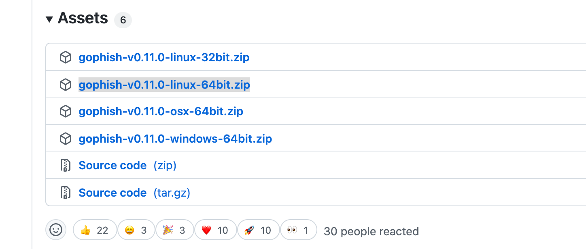](http://zeo.cool/images/new202303191626134.png)

```tools
apache
```

|     |     |
| --- | --- |
| ```plain<br>1<br>2<br>3<br>``` | ```plain<br>wget https://github.com/gophish/gophish/releases/download/v0.11.0/gophish-v0.11.0-linux-64bit.zip<br><br>unzip gophish-v0.11.0-linux-64bit.zip<br>``` |

[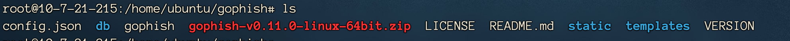](http://zeo.cool/images/new202303191626673.png)

### [](#2%E3%80%81%E4%BF%AE%E6%94%B9-config-json "2、修改 config.json")2、修改 config.json

```tools
arduino
```

|     |     |
| --- | --- |
| ```plain<br>1<br>``` | ```plain<br>vim config.json<br>``` |

[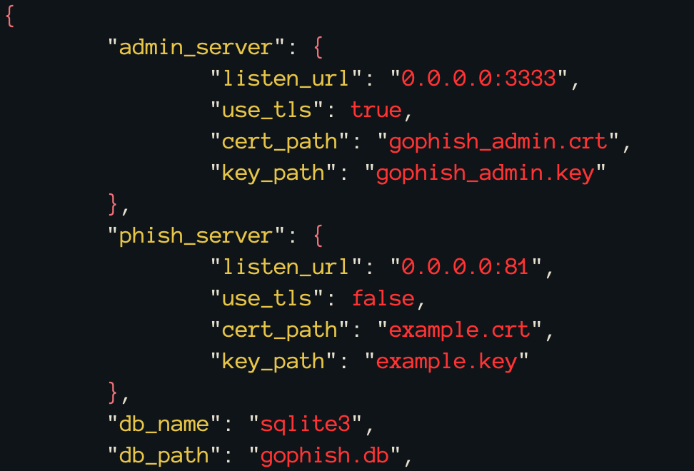](http://zeo.cool/images/new202303191627804.png)

-   admin\_server 把 127.0.0.1 改为 0.0.0.0,外网直接访问就要0.0.0.0
    
-   listen\_url也要是0.0.0.0:81，我的80端口被占用了，所以改81
    

### [](#3%E3%80%81%E8%BF%90%E8%A1%8C "3、运行")3、运行

```tools
bash
```

|     |     |
| --- | --- |
| ```plain<br>1<br>2<br>``` | ```plain<br>chmod u+x gophish<br>./gophish<br>``` |

[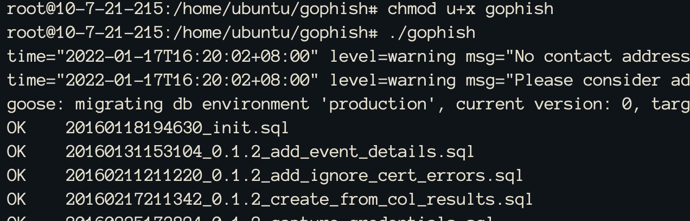](http://zeo.cool/images/new202303191627091.png)

默认的admin密码再在最后，自己找一下

[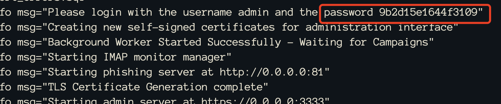](http://zeo.cool/images/new202303191627558.png)

### [](#4%E3%80%81%E6%90%AD%E5%BB%BA%E5%AE%8C%E6%88%90 "4、搭建完成")4、搭建完成

```tools
awk
```

|     |     |
| --- | --- |
| ```plain<br>1<br>``` | ```plain<br>https://VPS-IP:3333/<br>``` |

[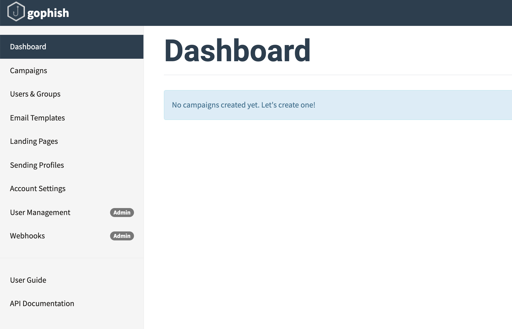](http://zeo.cool/images/new202303191627118.png)

也可以直接使用公共邮箱，去开通一下就好了。但是发多了会被封的，所以我们还是自己搭。

# [](#0x02-%E8%B4%AD%E4%B9%B0%E5%9F%9F%E5%90%8D "0x02 购买域名")0x02 购买域名

建议使用国外的域名和云vps

要自己去弄一个近似域名发件人去发一些钓鱼邮件，这个自己购买吧

在此近似域名的DNS管理页面增加两条记录:

[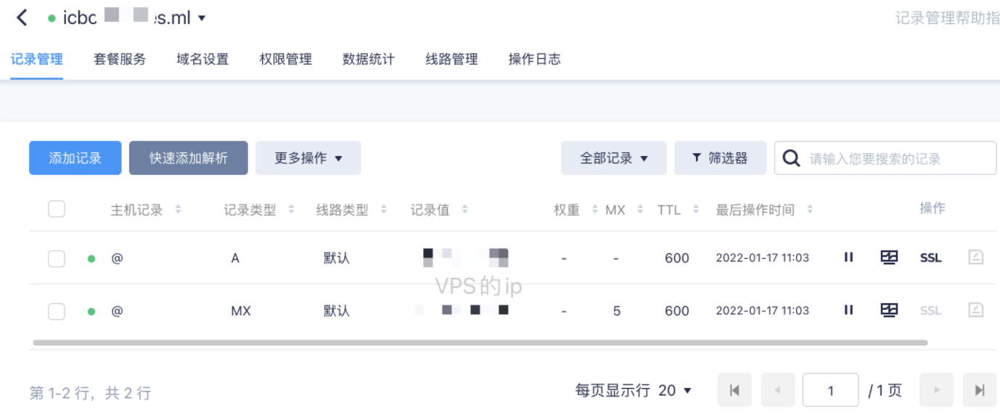](http://zeo.cool/images/new202303191627342.png)

# [](#0x03-%E9%82%AE%E4%BB%B6%E6%9C%8D%E5%8A%A1%E5%99%A8%E7%9A%84%E6%90%AD%E5%BB%BA "0x03 邮件服务器的搭建")0x03 邮件服务器的搭建

-   公共邮箱其实也是可以，但是发多了会被封的，所以我们还是自己搭。
-   由于我的VPS一直是Ubuntu，所以选择使用 Postfix+mailutils

（如果是centos，有更好用的平台EwoMail搭建，参考官方文档进行一步步搭建[http://doc.ewomail.com/docs/ewomail/install）](http://doc.ewomail.com/docs/ewomail/install%EF%BC%89)

### [](#1%E3%80%81%E5%AE%89%E8%A3%85Postfix "1、安装Postfix")1、安装Postfix

```tools
cmake
```

|     |     |
| --- | --- |
| ```plain<br>1<br>``` | ```plain<br>apt install postfix<br>``` |

[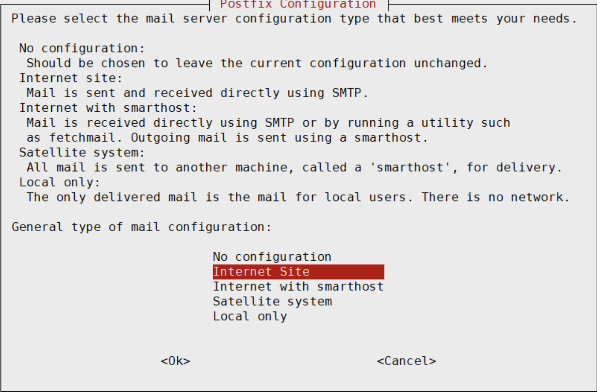](http://zeo.cool/images/new202303191627501.png)

写入自己域名，不需要前缀

[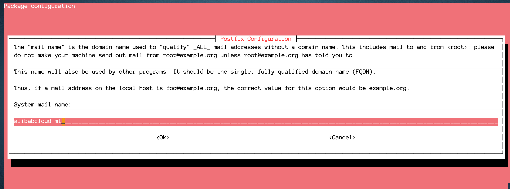](http://zeo.cool/images/new202303191627376.png)

### [](#2%E3%80%81%E5%AE%89%E8%A3%85mailx%E8%BD%AF%E4%BB%B6%E5%8C%85 "2、安装mailx软件包")2、安装mailx软件包

```tools
cmake
```

|     |     |
| --- | --- |
| ```plain<br>1<br>``` | ```plain<br>apt install mailutils<br>``` |

### [](#3%E3%80%81%E5%A2%9E%E5%8A%A0%E6%B5%8B%E8%AF%95%E7%94%A8%E6%88%B7 "3、增加测试用户")3、增加测试用户

这个用户就是将来收发邮件那个同名用户

```tools
crmsh
```

|     |     |
| --- | --- |
| ```plain<br>1<br>2<br>``` | ```plain<br>useradd -m -s /bin/bash master<br>passwd master<br>``` |

[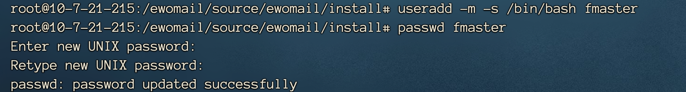](http://zeo.cool/images/new202303191627441.png)

### [](#4%E3%80%81%E6%B5%8B%E8%AF%95%E9%82%AE%E4%BB%B6%E5%8F%91%E9%80%81 "4、测试邮件发送")4、测试邮件发送

```tools
vim
```

|     |     |
| --- | --- |
| ```plain<br>1<br>2<br>3<br>4<br>5<br>6<br>7<br>8<br>9<br>10<br>11<br>12<br>13<br>14<br>15<br>16<br>17<br>18<br>19<br>20<br>21<br>22<br>23<br>24<br>25<br>26<br>27<br>28<br>29<br>30<br>``` | ```plain<br>root@10-7-21-215:~# telnet localhost 25<br>Trying ::1...<br>Connected to localhost.<br>Escape character is '^]'.<br>220 10-7-21-215 ESMTP Postfix (Ubuntu)<br>ehlo localhost<br>250-10-7-21-215<br>250-PIPELINING<br>250-SIZE 10240000<br>250-VRFY<br>250-ETRN<br>250-STARTTLS<br>250-ENHANCEDSTATUSCODES<br>250-8BITMIME<br>250-DSN<br>250 SMTPUTF8<br>mail from:master@icbxxxxices.ml<br>250 2.1.0 Ok<br>rcpt to:123456@qq.com<br>250 2.1.5 Ok<br>data<br>354 End data with <CR><LF>.<CR><LF><br>Subject:this is test qq mail<br>qqqq<br>ssss<br>.<br>250 2.0.0 Ok: queued as 09B30C444A<br>quit<br>221 2.0.0 Bye<br>Connection closed by foreign host.<br>``` |

[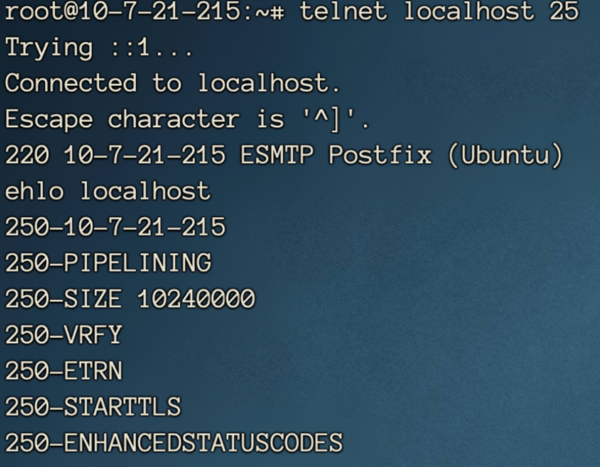](http://zeo.cool/images/ffe9acbfe78571c9eeefb478dea1da76.png)

[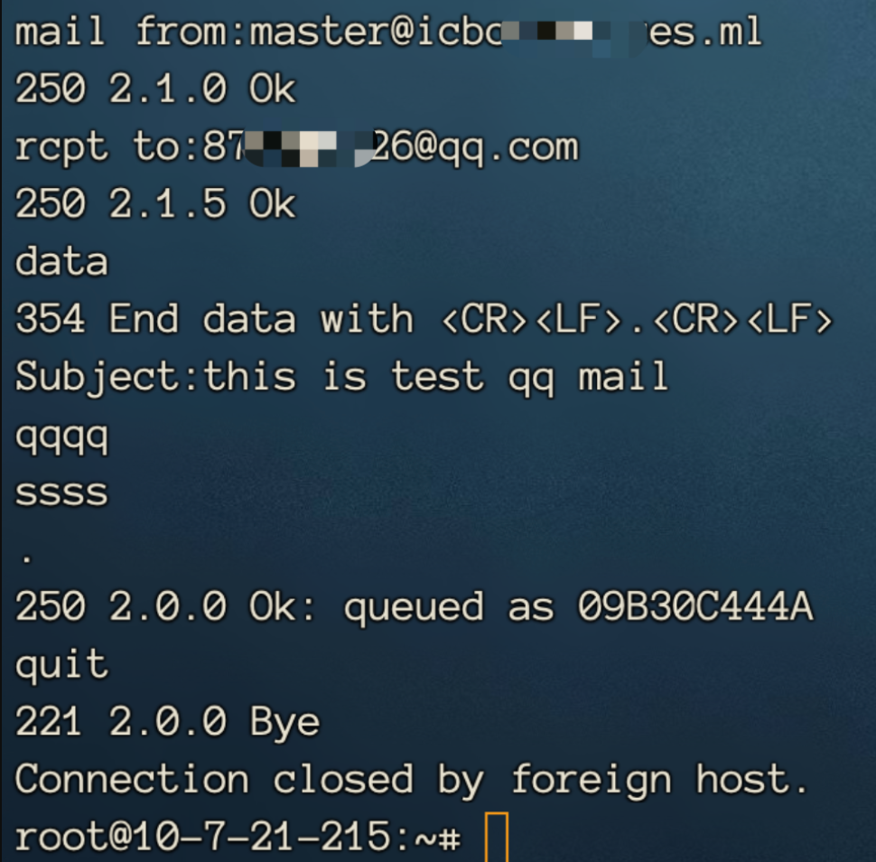](http://zeo.cool/images/new202303191628408.png)

### [](#5%E3%80%81%E6%94%B6%E5%88%B0%E6%B5%8B%E8%AF%95%E9%82%AE%E4%BB%B6 "5、收到测试邮件")5、收到测试邮件

[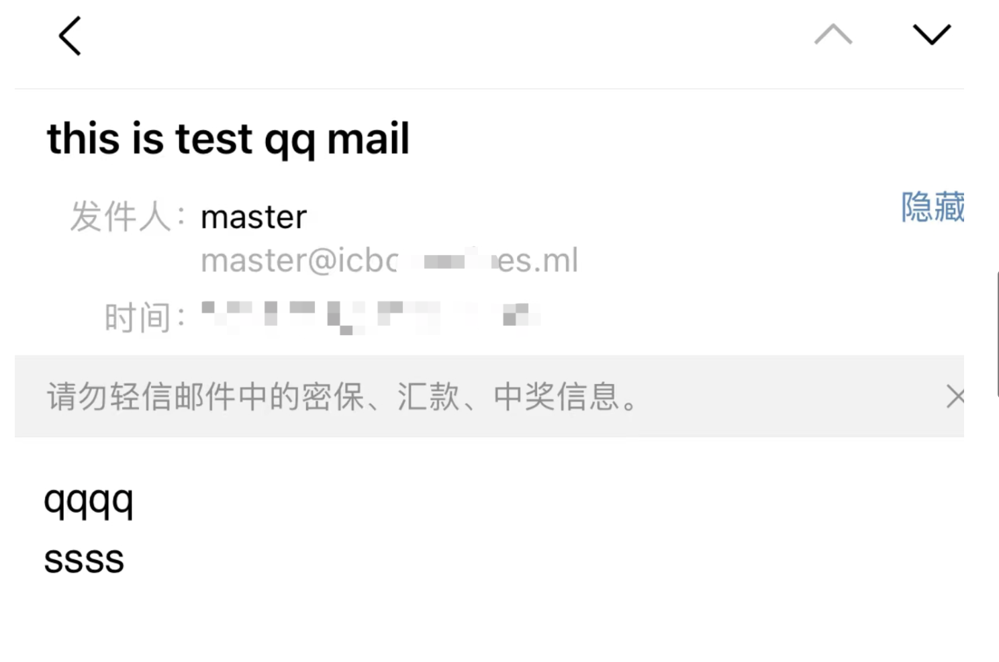](http://zeo.cool/images/new202303191628130.png)

### [](#6%E3%80%81%E5%9B%9E%E5%A4%8D%E4%B8%80%E4%B8%8B%E9%82%AE%E4%BB%B6%EF%BC%8C%E5%8F%AF%E4%BB%A5%E6%8E%A5%E5%8F%97%E9%82%AE%E4%BB%B6 "6、回复一下邮件，可以接受邮件")6、回复一下邮件，可以接受邮件

切换用户看一下

```tools
crmsh
```

|     |     |
| --- | --- |
| ```plain<br>1<br>2<br>``` | ```plain<br>su - master<br>mail<br>``` |

[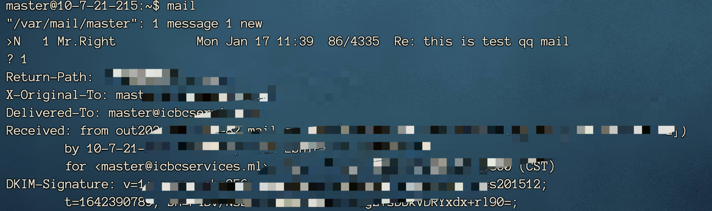](http://zeo.cool/images/new202303191628096.png)

### [](#7%E3%80%81%E9%82%AE%E4%BB%B6%E6%9C%8D%E5%8A%A1%E5%99%A8done "7、邮件服务器done")7、邮件服务器done

# [](#0x04-%E5%AE%9E%E6%88%98%E9%92%93%E9%B1%BC "0x04 实战钓鱼")0x04 实战钓鱼

环境搭建好了，那么下面就开始正式钓鱼了

## [](#1%E3%80%81Sending-Profiles-%E9%82%AE%E7%AE%B1%E9%85%8D%E7%BD%AE "1、Sending Profiles-邮箱配置")1、Sending Profiles-邮箱配置

使用本机刚刚陪着好邮件服务器

[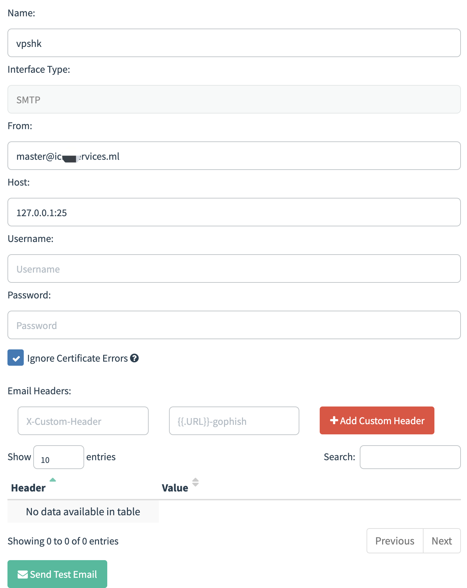](http://zeo.cool/images/new202303191628799.png)

**此处需要注意的是Host处：**

-   因为大部分的国内云厂商因为 监管要求，为防止邮件泛滥，都将25端口禁用了，因此可采用带有SSL的SMTP服务的端 口：465端口。
-   我能用是因为，我用的vps是国外的，大家自行更改。
-   因为我们的 Gophish 服务器跟邮件服务器搭在同一台 VPS 上面，所以在这里填写 127.0.0.1

### [](#%E5%8F%91%E9%80%81%E6%B5%8B%E8%AF%95%E4%B8%80%E4%B8%8B "发送测试一下")发送测试一下

[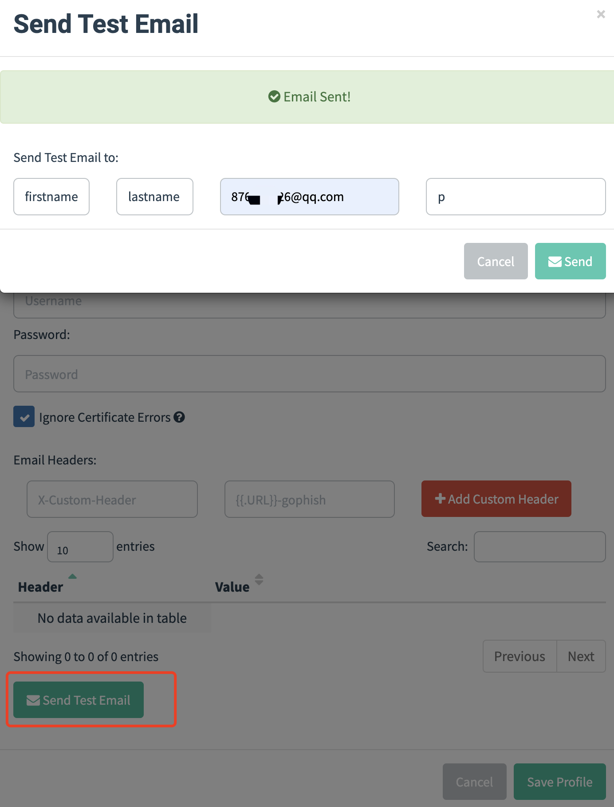](http://zeo.cool/images/new202303191628913.png)

### [](#%E6%94%B6%E5%88%B0%E9%82%AE%E4%BB%B6 "收到邮件")收到邮件

[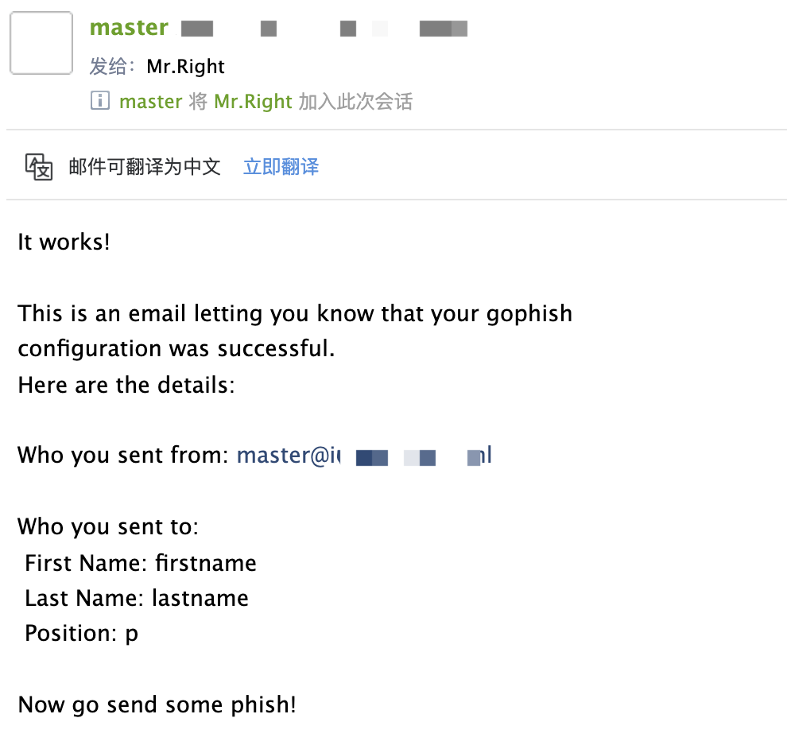](http://zeo.cool/images/new202303191628903.png)

## [](#2%E3%80%81Email-Templates-%E9%92%93%E9%B1%BC%E9%82%AE%E4%BB%B6%E6%A8%A1%E6%9D%BF "2、Email Templates-钓鱼邮件模板")2、Email Templates-钓鱼邮件模板

第一种自己写

[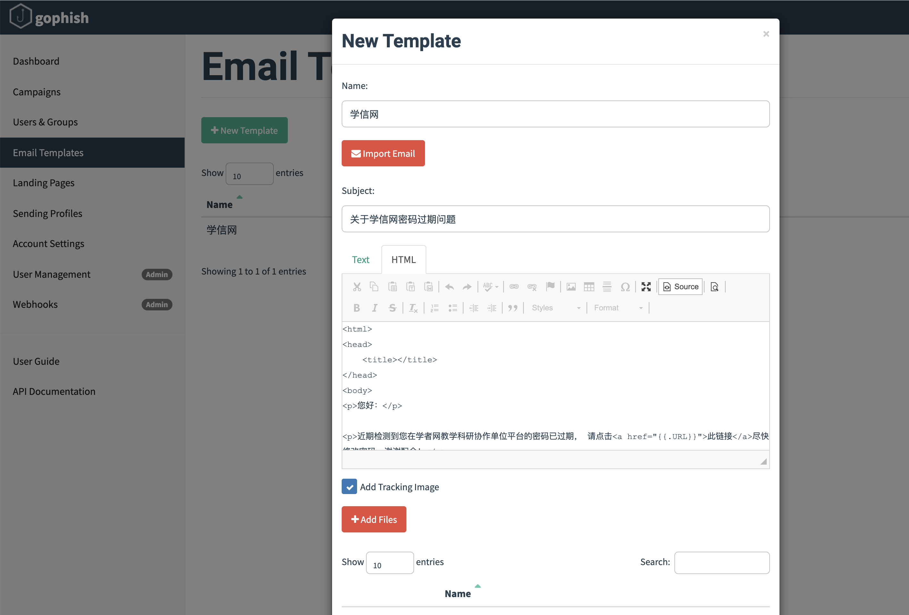](http://zeo.cool/images/new202303191628603.png)

```tools
handlebars
```

|     |     |
| --- | --- |
| ```plain<br>1<br>2<br>3<br>4<br>5<br>6<br>7<br>8<br>9<br>10<br>11<br>12<br>13<br>``` | ```plain<br><html><br><head><br>	<title></title><br></head><br><body><br><p>您好：</p><br><br><p>近期检测到您在学者网教学科研协作单位平台的密码已过期， 请点击<a href="{{.URL}}">此链接</a>尽快修改密码，谢谢配合！</p><br>{{.Tracker}}</body><br><br><p>请不要直接回复本邮件。</p><br><p>学信网</p><br></html><br>``` |

第二种可以导入现有的邮件

首先将原有的邮件导出为eml格式。

[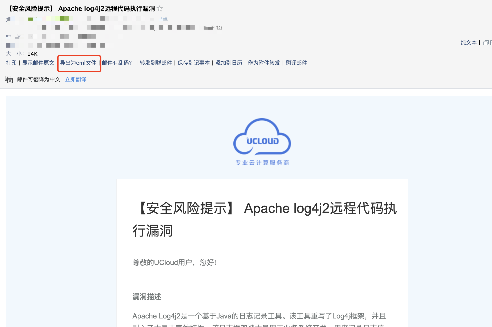](http://zeo.cool/images/new202303191628564.png)

导入即可

[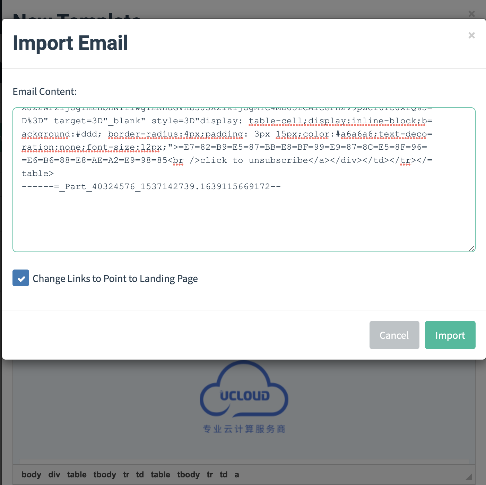](http://zeo.cool/images/new202303191628430.png)

把超链接的部分，加上URL标签，最后设置钓鱼页面

[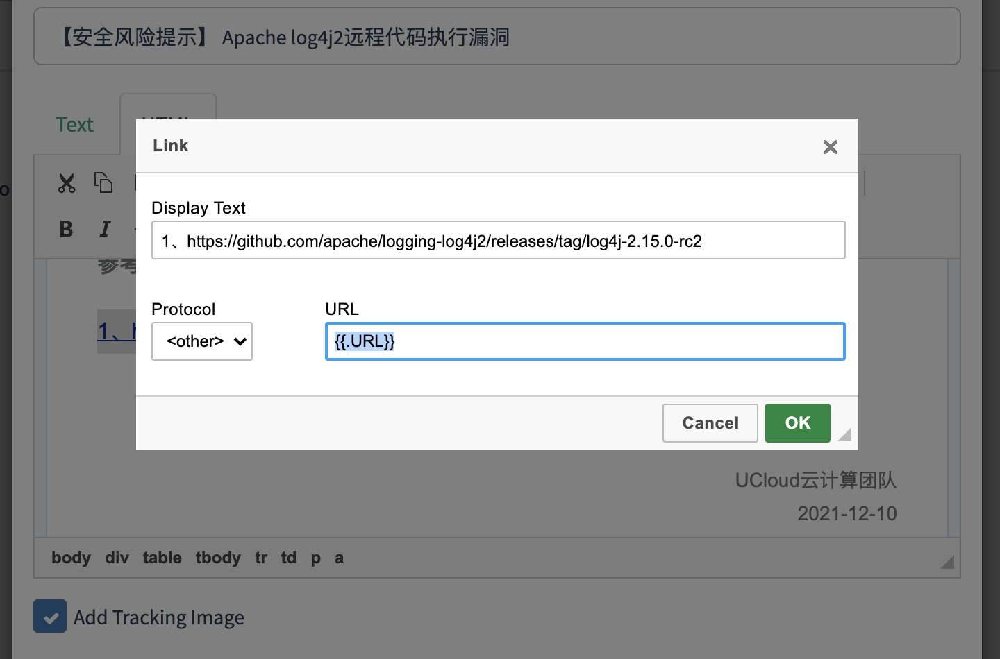](http://zeo.cool/images/new202303191628496.png)

## [](#3%E3%80%81Landing-Pages-%E4%BC%AA%E9%80%A0%E9%92%93%E9%B1%BC%E9%A1%B5%E9%9D%A2 "3、Landing Pages-伪造钓鱼页面")3、Landing Pages-伪造钓鱼页面

配置好钓鱼邮件后，就可以通过LandingPages模块来新建钓鱼网站页面。

1、此处支持手写 html文件

2、直接克隆网站

我使用第二种：

[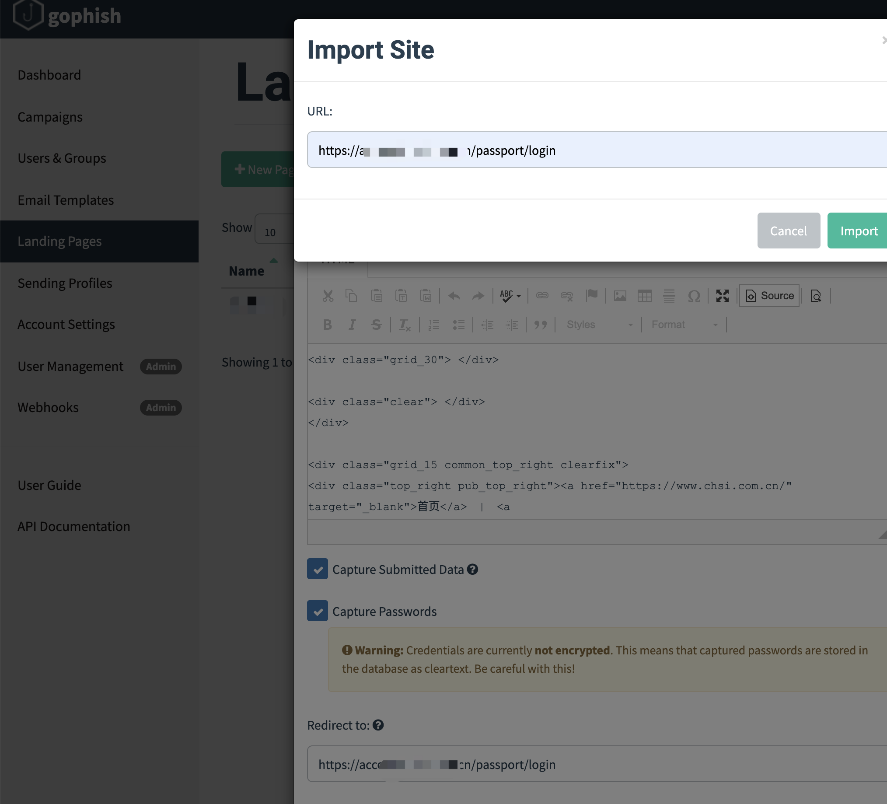](http://zeo.cool/images/new202303191628304.png)

其中选项：

-   CaptureSubmitted Data和CapturePasswords，记录受害者输入的账号和密码。
-   Redirect to填写该页面真实的地址，方便受害者点击完提交按钮后，自动跳转至真正的网站。

## [](#4%E3%80%81Users-amp-Groups-%E9%82%AE%E4%BB%B6%E7%94%A8%E6%88%B7%E5%92%8C%E7%BB%84 "4、Users& Groups-邮件用户和组")4、Users& Groups-邮件用户和组

此时就可以进行下一步的配置，设置要进行钓鱼攻击的邮箱地址

使用模版批量导入，导入邮箱可以使用CSV进行批量添加

(格式可点击`Download CSV TEmplate`获取模板)

[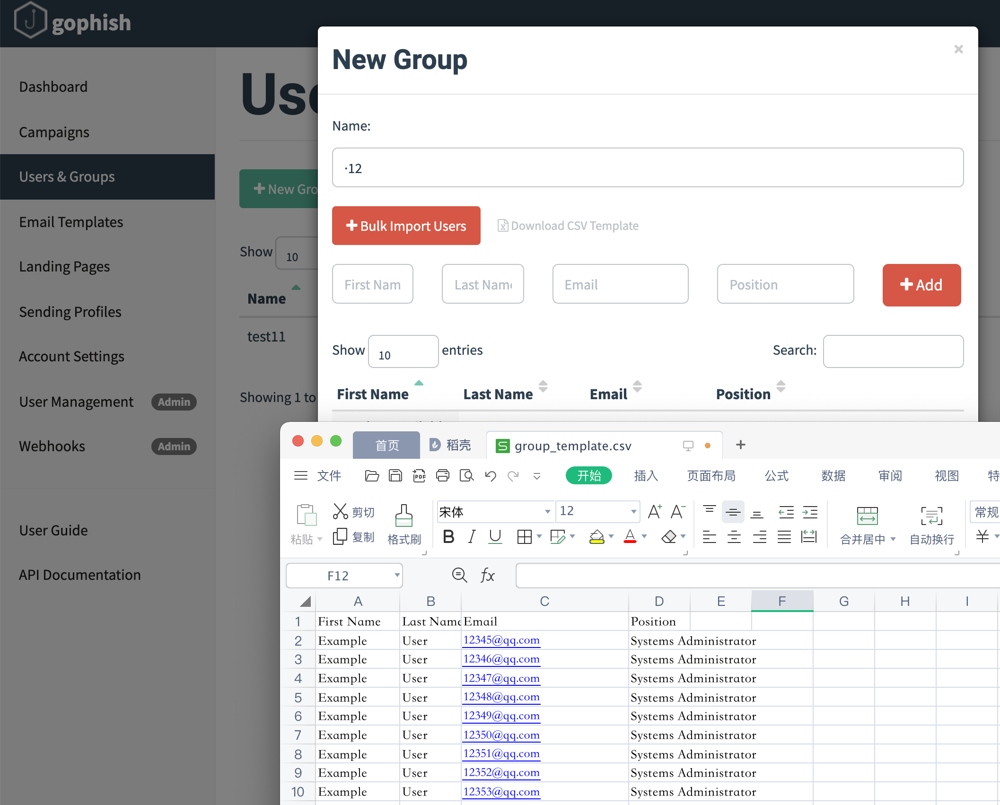](http://zeo.cool/images/new202303191628902.png)

## [](#5%E3%80%81Campaigns-%E9%92%93%E9%B1%BC%E6%B5%8B%E8%AF%95 "5、Campaigns-钓鱼测试")5、Campaigns-钓鱼测试

配置Campaigns，填写Name、选择钓鱼邮件模板、选择钓鱼网站模板、填写钓鱼网站 URL、填写发件邮箱、选择受害者邮件组。

[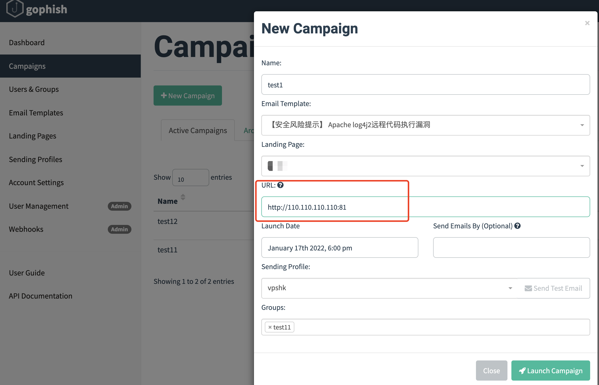](http://zeo.cool/images/new202303191629567.png)

注意这个URL是VPS上gophish一开始配置的那个

就是 [http://vps-ip:81](http://vps-ip:81/)

[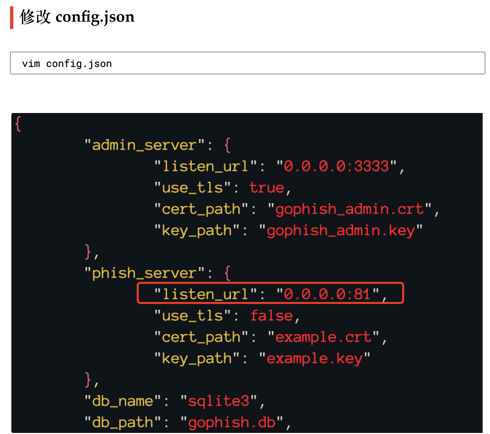](http://zeo.cool/images/new202303191629533.png)

## [](#6%E3%80%81%E6%9F%A5%E7%9C%8B%E6%88%98%E6%9E%9C "6、查看战果")6、查看战果

这里有全部任务的统计

[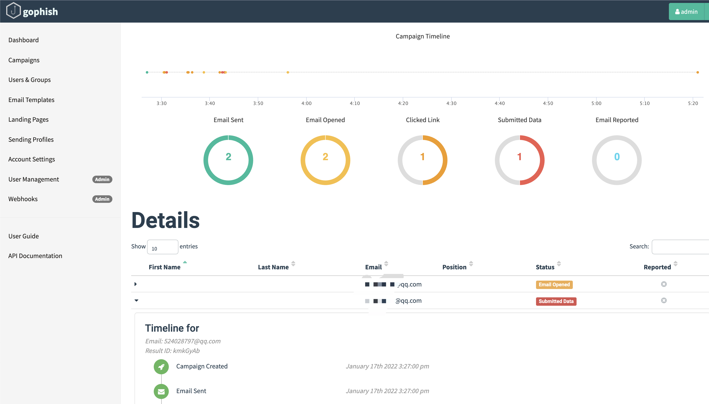](http://zeo.cool/images/new202303191629293.png)

## [](#7%E3%80%81%E6%89%93%E5%BC%80%E8%AF%A6%E7%BB%86%E5%86%85%E5%AE%B9 "7、打开详细内容")7、打开详细内容

可以看到发送成功的邮件、打开邮件的情况、点击链接的情况、提交数据的情况

[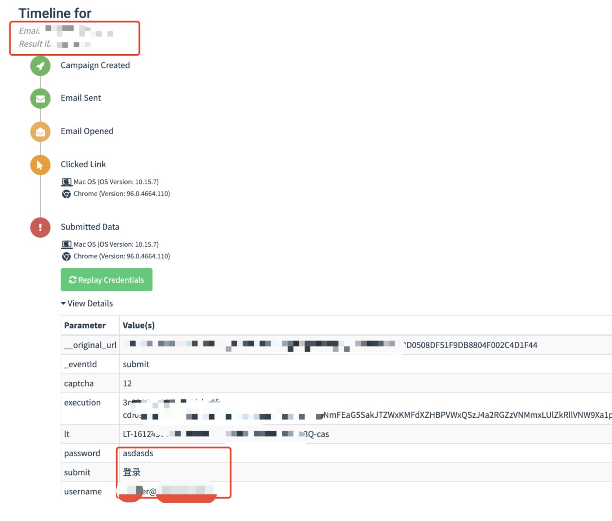](http://zeo.cool/images/new202303191629908.png)

# [](#0x05-%E6%80%BB%E7%BB%93 "0x05 总结")0x05 总结

这个只是邮件钓鱼的基础设施搭建，和基本使用方式，后续还有很多要点，木马免杀、钓鱼话术、邮箱收集等等。。。还有就是通过IM的方式也是十分有效的，后续再说。
