# 银狐处置及分析 - 先知社区

银狐处置及分析

- - -

最近很多企业都中了银狐，这里出一个简单处置和分析的文章  
1、现象确认  
存在外联银狐的域名或IP  
[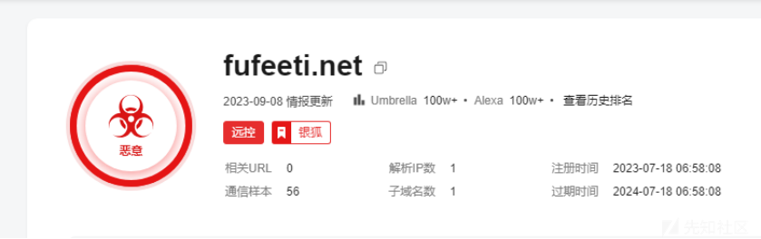](https://xzfile.aliyuncs.com/media/upload/picture/20231028134250-d523343c-7554-1.png)

2、病毒文件定位  
由于银狐会拉起计划任务，所以我们直接去计划任务找，这样比通过外联定位进程名再定位文件所在位置要快些和简单些。

（1）可以看到有以下计划任务，格式一般为在一个随机生成的目录名下运行一个exe文件，目录名和exe名都是随机生成的

[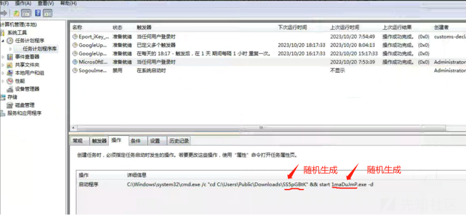](https://xzfile.aliyuncs.com/media/upload/picture/20231028134312-e1be5118-7554-1.png)

（2）直接到计划任务所在的目录去找，可以看到有以下结构的文件，一个edge.xml一个edge.jpg和随机文件名的exe文件以及和exe同名的dat文件

[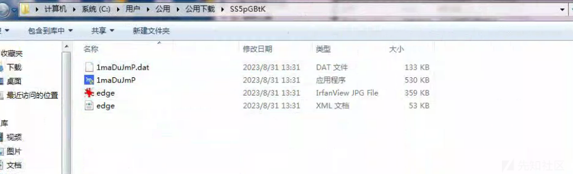](https://xzfile.aliyuncs.com/media/upload/picture/20231028134323-e866c572-7554-1.png)

3、处置过程  
（1）停止外联进程：根据计划任务定位到的exe名去找进程的pid

[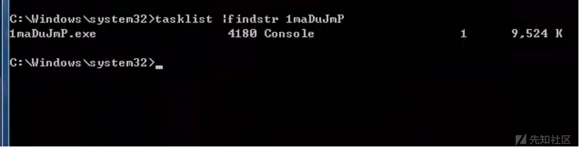](https://xzfile.aliyuncs.com/media/upload/picture/20231028134330-ecb96dbe-7554-1.png)

终止进程

[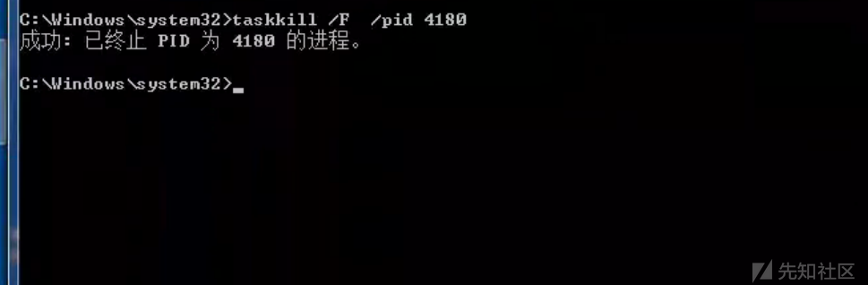](https://xzfile.aliyuncs.com/media/upload/picture/20231028134336-f0264be8-7554-1.png)

（2）删除银狐病毒所在的整个文件夹

[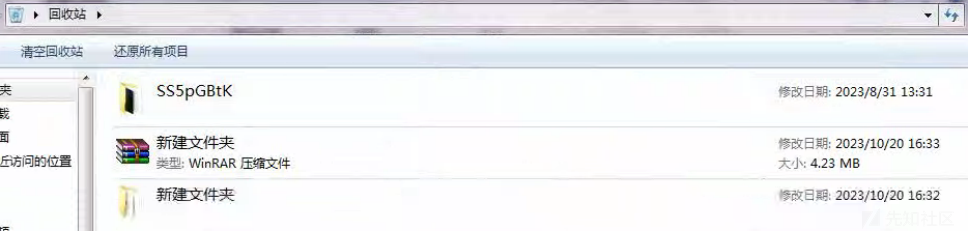](https://xzfile.aliyuncs.com/media/upload/picture/20231028134344-f53f7938-7554-1.png)

[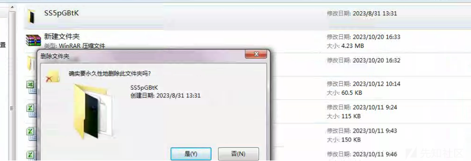](https://xzfile.aliyuncs.com/media/upload/picture/20231028134349-f83678f8-7554-1.png)

（3）删除计划任务

[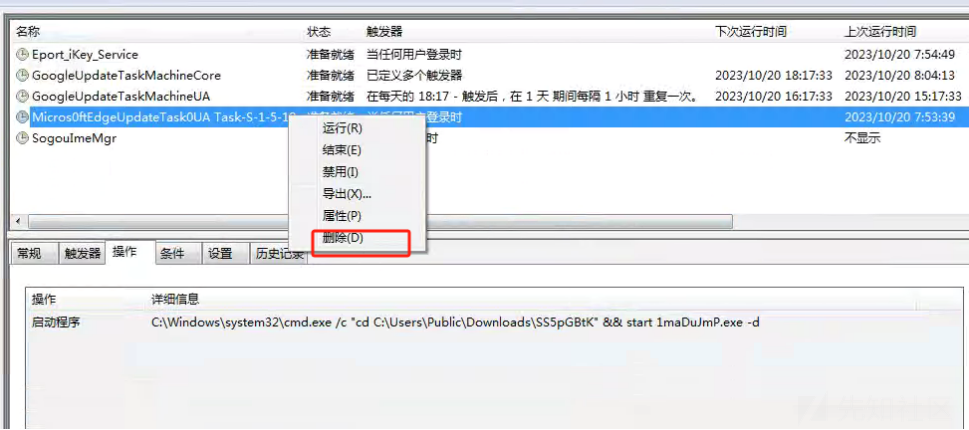](https://xzfile.aliyuncs.com/media/upload/picture/20231028134354-fb0f55cc-7554-1.png)

[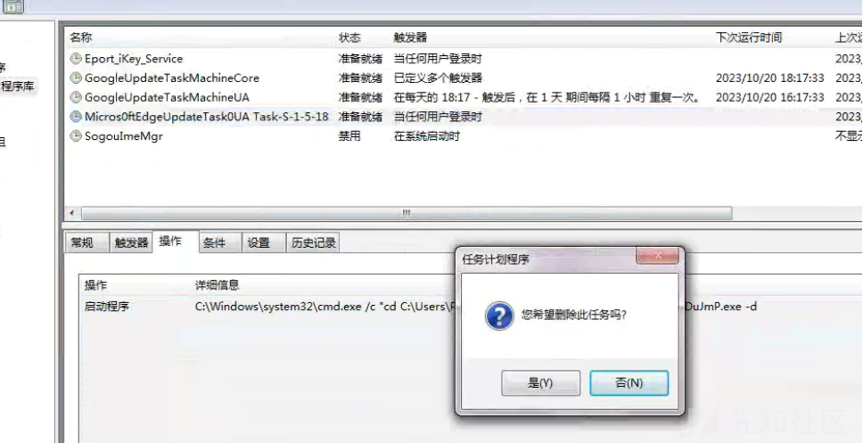](https://xzfile.aliyuncs.com/media/upload/picture/20231028134400-fea60ae6-7554-1.png)

4、溯源  
（1）根据银狐病毒落地时间使用lastActivityView工具定位用户是如何感染病毒的

[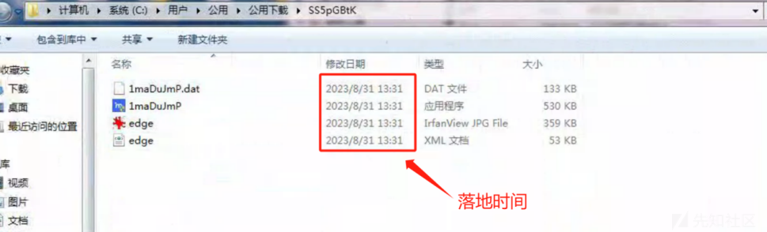](https://xzfile.aliyuncs.com/media/upload/picture/20231028134410-04abc2e6-7555-1.png)

（2）可以看到用户运行了QQ收到的一份文件名为《本市2023年度企业税收稽查名单公布.rar》的文件，通过winrar打开后运行了内部名为2023.exe的木马文件

[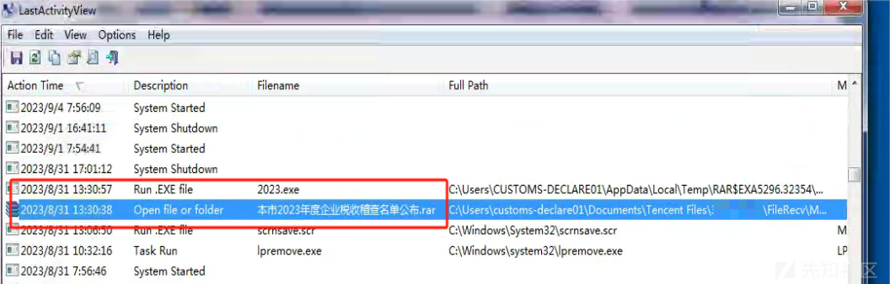](https://xzfile.aliyuncs.com/media/upload/picture/20231028134417-08dd4664-7555-1.png)

（3）根据工具看到的目录找到该钓鱼文件并删除（如果想研究下可以备份下样本，记得加密压缩）

[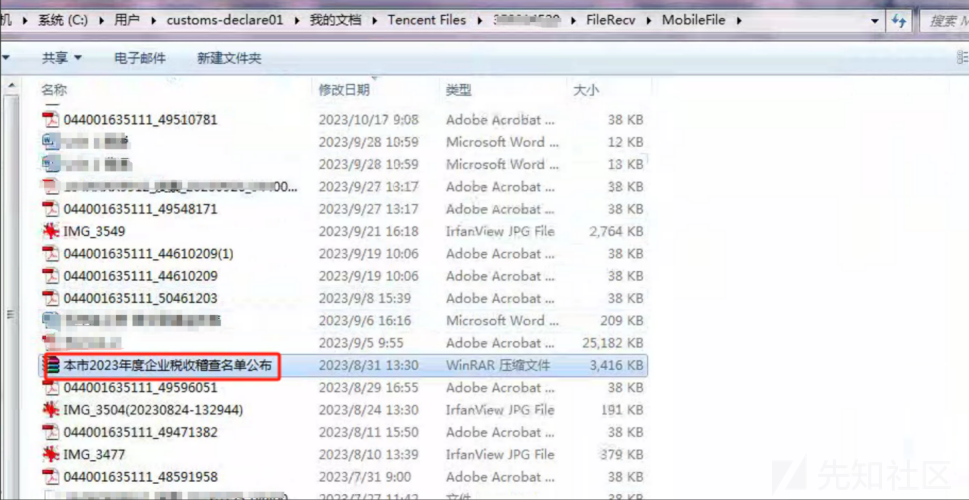](https://xzfile.aliyuncs.com/media/upload/picture/20231028134423-0c4338f4-7555-1.png)

[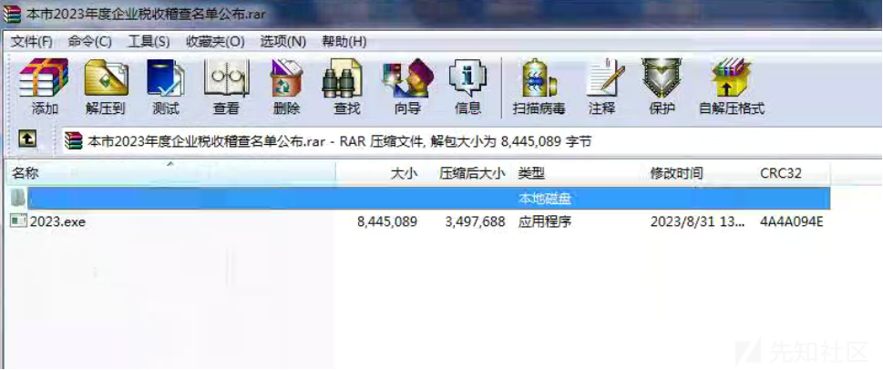](https://xzfile.aliyuncs.com/media/upload/picture/20231028134427-0e954a34-7555-1.png)

5、逆向分析  
xml文件为PE文件，攻击者为了安全软件无法能够正常识别程序将PE头标识MZ去除。

[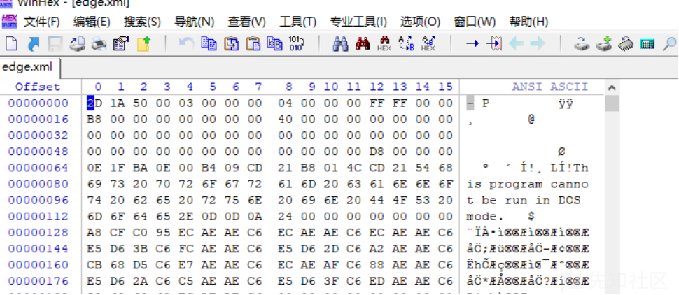](https://xzfile.aliyuncs.com/media/upload/picture/20231028134434-12fb0546-7555-1.png)

修复PE头之后分析，该程序必须需要加入参数才能够运行，接收到参数之后创建新线程。

[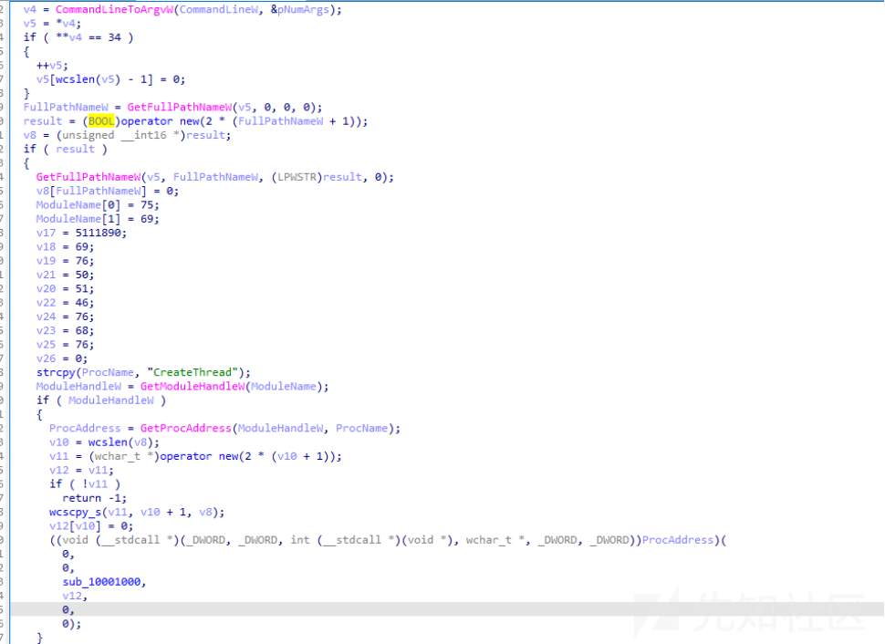](https://xzfile.aliyuncs.com/media/upload/picture/20231028134440-163b6430-7555-1.png)

并且创建任务计划主要是为了实现程序维权。

[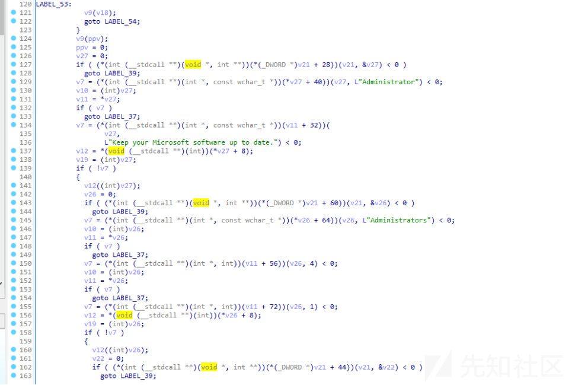](https://xzfile.aliyuncs.com/media/upload/picture/20231028134446-1a14b714-7555-1.png)

接着读取edge.jpg图片内包含的shellcode信息，将其拷贝进内存当中执行，实现远程控制的目的。  
[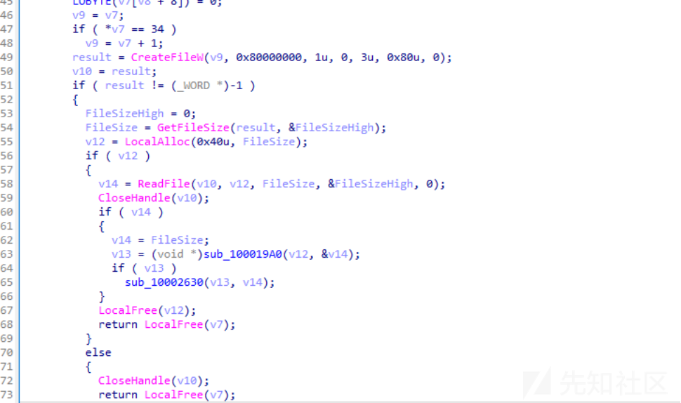](https://xzfile.aliyuncs.com/media/upload/picture/20231028134452-1d836738-7555-1.png)

[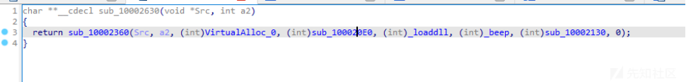](https://xzfile.aliyuncs.com/media/upload/picture/20231028134457-205daf04-7555-1.png)

6、应急报告输出
