# 静态程序分析系列(二)

# 静态程序分析(二)

## 1 调用图：Call Graph Construction

### 1.1 概念

本质上来说，一个调用图就是从调用点到目标方法(callee)的**一系列调用边**。

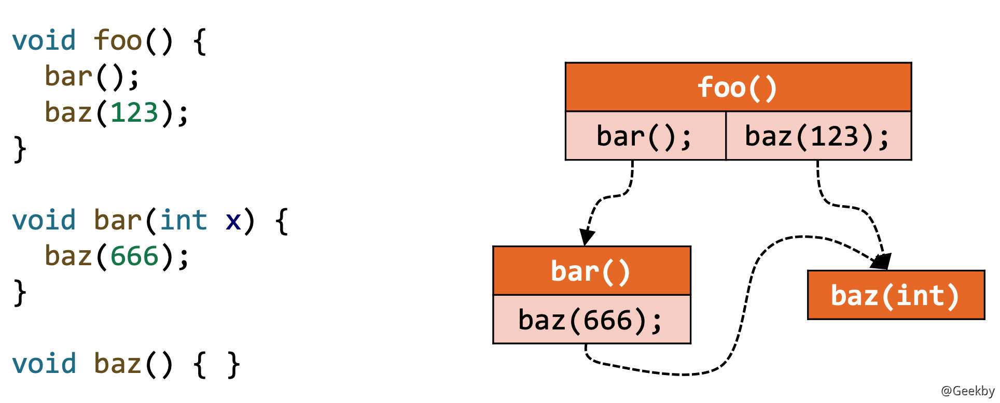

程序调用图是过程间分析的基础，可以用于程序优化、理解、调试、测试等。

### 1.2 分类

Call Graph 有很多种不同的构造方法，本文接下来会讲解两个极端：最准确的和最快速的。

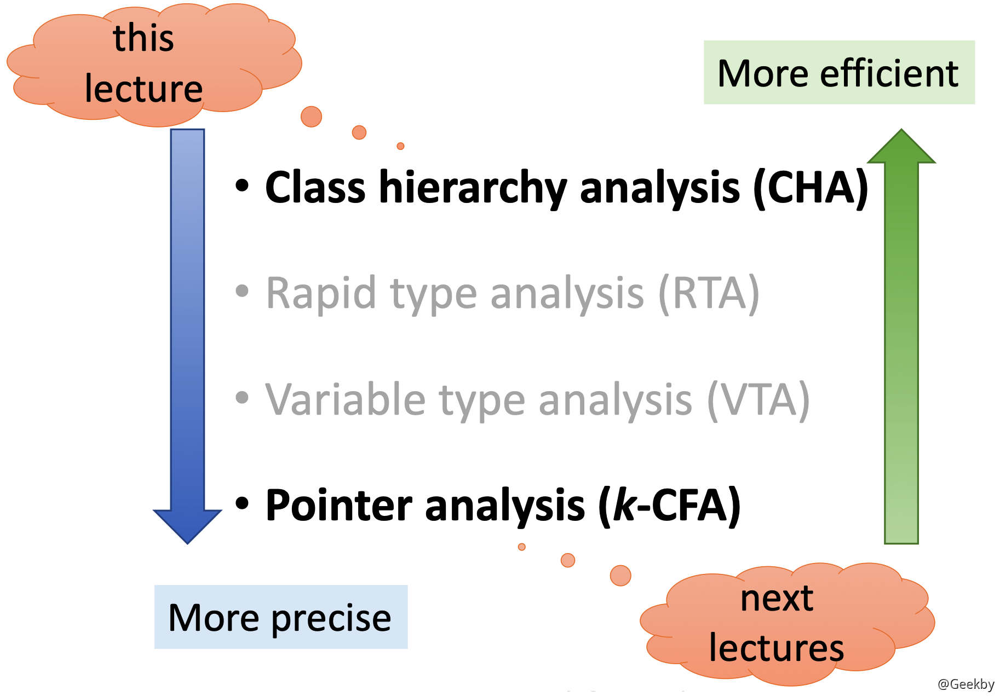

调用图构造主要作用于面向对象语言，即以 Java 为代表的，面向对象的语言。一般用到如图四种算法，其中 CHA 是最快的，指针分析 K-CHA 是最准的，本文主要将 CHA，后面的文章会讲指针分析。

### 1.3 Java 中的方法调用形式

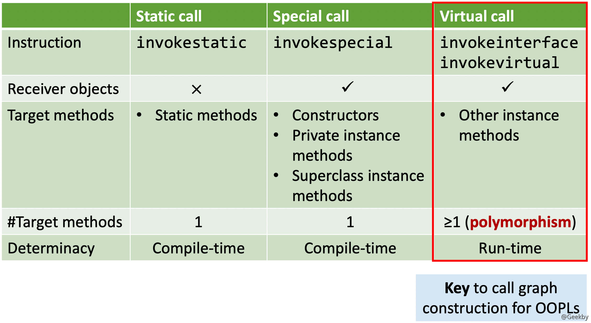

-   Instruction：指 Java 的 **IR 中的指令**
-   Receiver objects：方法调用对应的实例对象（static 方法调用不需要对应实例）。
-   Target methods：表示 **IR 指令到被调用目标方法的映射关系**
-   Num of target methods：call 对应的可能被调用的目标方法的数量。Virtual call 与动态绑定和多态实现有关，可以对应多个对象下的重写方法。所以 **Virtual call 的可能对象可能超过 1 个**。
-   Determinacy：指什么时候能够确定这个 call 的对应方法。Virtual call 与多态有关，只能在运行时决定调用哪一个具体方法的实现。其他两种 call 都和多态机制不相关，编译时刻就可以确定。

### 1.4 Virtual Call的方法调度函数 (Dispatch)

Virtual call 是几种调用中最为复杂的一种，首先重点讨论它。在动态运行时，Virtual call 基于两点决定调用哪个具体方法：

1.  virtual call 返回内容的接收对象是谁：**c**
2.  调用点处的**方法签名：m**
    1.  Signature = class type + method name + descriptor
    2.  Descriptor = return type + parameter types

本文中的方法签名定义如下：

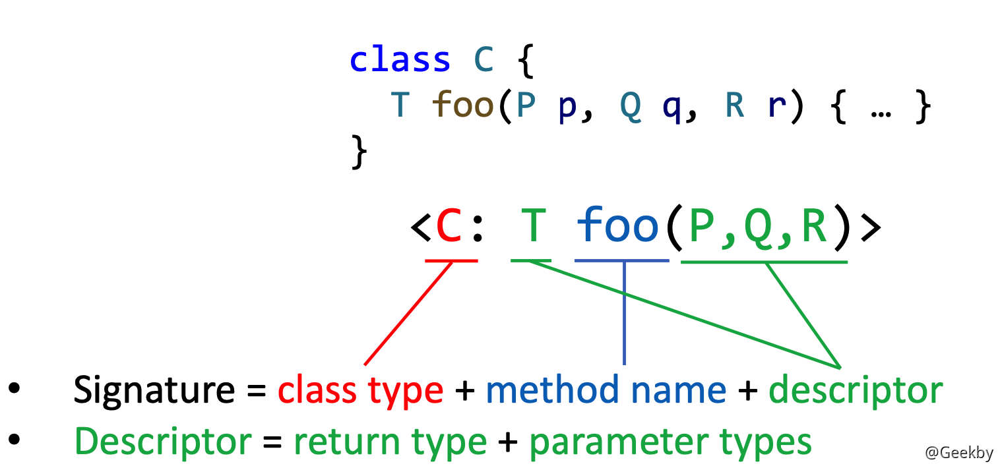

定义 `Dispatch(c,m)` 函数来描述函数间的分配关系：Java 中 Dispatch 机制决定具体调用哪个方法，c 是类名，m 是一个方法。如果能在本类中找到 name 和 descriptor 一致的方法，则调用 c 的方法，否则到父类中寻找。

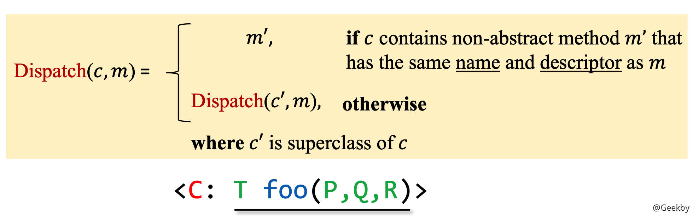

一个示例：Dispatch 关注 `Receiver Object` 即 `new B()` 和方法签名：`A.foo()`

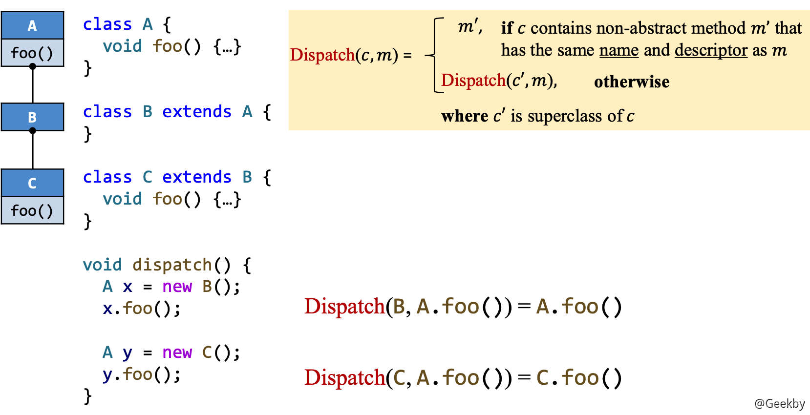

## 2 Class Hierarchy Analysis (CHA)

### 2.1 定义

-   需要首先获得整个程序的类继承关系图
-   通过接收变量的声明类型来解析 Virtual call
    -   接收变量的例子：在 `a.foo()` 中，a 就是接收变量
-   假设一个接收变量能够指向 A 或 A 的所有子类

### 2.2 具体过程

下面介绍解析调用的算法。定义 `Reslove(cs)` 函数为：通过 CHA 算法寻找到某个程序调用点对应的可能的目标函数实体。

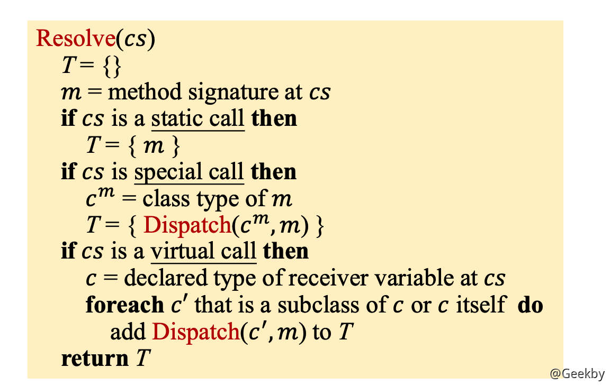

-   call site(cs) 就是调用语句，m(method) 就是对应的函数签名。
-   T 集合中保存找到的结果
-   三个 if 分支分别对应之前提到的 Java 中的三种 call 类型
    -   Static call
    -   Special call
    -   Virtual call

#### 2.2.1 static call

静态方法调用前写的是类名，而非静态方法调用前写的是变量或指针名。静态方法调用不需要依赖实例。因此静态方法调用的分析结果十分简单，很明显调用的就是当前类的方法，所以直接加到集合 T 中。

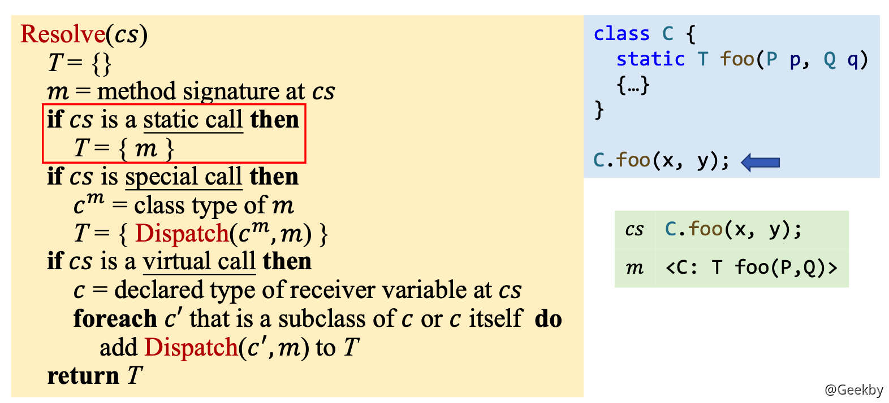

#### 2.2.2 special call

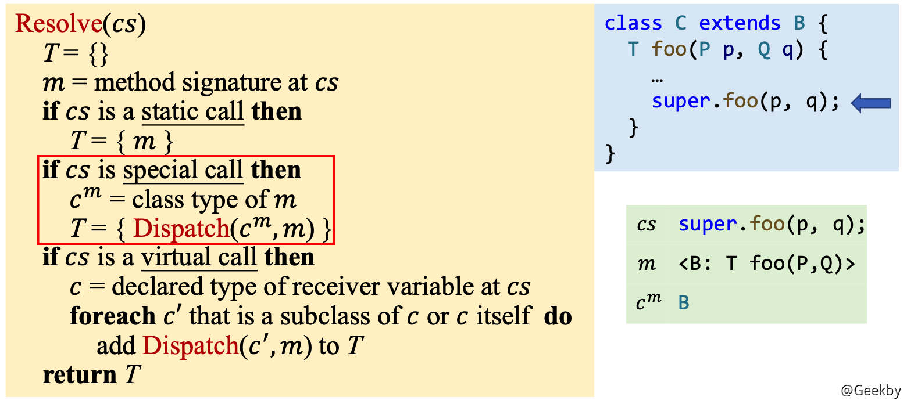

special call 主要分为三种情况。上图是第一种使用 super 类的调用方法。`foo()` 虽然在当前类有定义，但是实际使用的是父类的 `foo()`，因此需要使用 `Dispatch` 函数，其中的 `foo()` 的签名 `m` 由编译器返回信息可以知道是 `B` 的，那么获取 `foo()` 返回值的 `c` 也指向 `B`，也就相当于在父类中寻找了。

为什么处理 `super` 调用需要使用 `Dispatch` 函数？在下图所示情况中没有 `Dispatch` 函数时无法正确解析 `C` 类的 `super.foo` 调用：

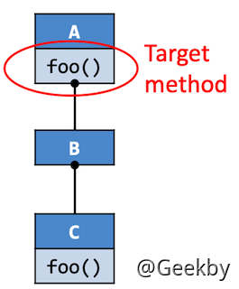

而 `Private instance method` 和 `Constructor`（一定由类实现或有默认的构造函数）都会在本类的实现中给出，使用 Dispatch 函数能够将这三种情况都包含，简化代码。

#### 2.2.3 virtual call

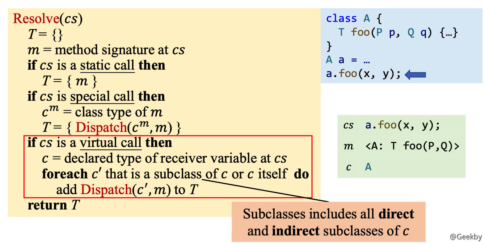

最后是处理 virtual call，这也是 CHA 区别于其他算法的主要之处。该算法会对此方法做一个 `Dispatch(c,m)` 并将 c 的所有子集以及子集的子集全都做一次 `Dispatch(c', m)`。直观来看，可以分为两步，第一步是对本身做一次 Dispatch，看看当前类中是否有 foo()，没有的话就到父类中递归地找；第二步是在当前类地所有子集中找到所有的 foo()，然后将这些 foo 同第一步找到的 foo 全都加入 T 中。

一个例子：

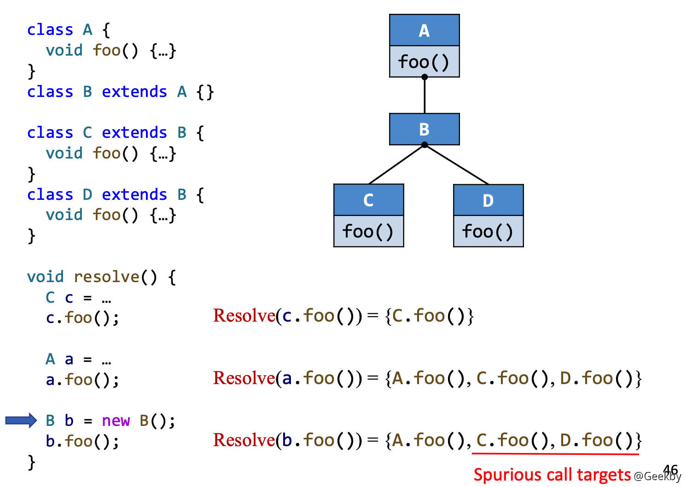

常用于 IDE 中，给用户提供提示。比如写一小段测试代码，看看 b.foo() 可能会调用哪些函数签名。可以看出 CHA 分析中认为 `b.foo()` 可能调用 A、C、D 中的 `foo()` 方法。

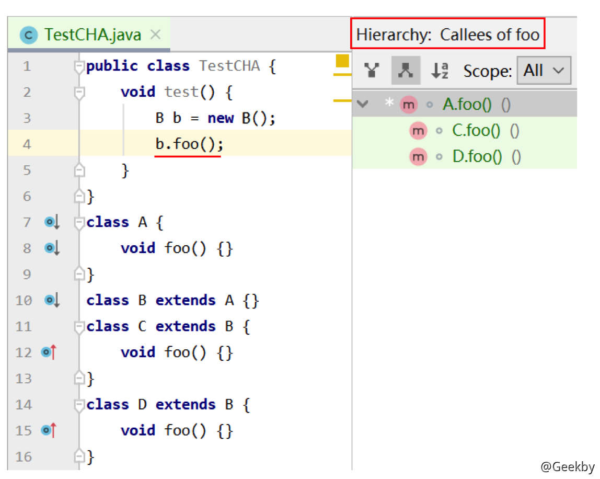

### 2.3 CHA 的特征

1.  只考虑类继承结构，所以**很快**
2.  因为忽略了数据流和控制流的信息，所以**不太准确**

### 2.4 调用图构建

分为三步：

1.  从入口方法进入，一般是 main 方法
2.  对于每个可到达的方法 m，通过 CHA 算法找出点调用的方法 `m'` 的调用位置
3.  对于每个 m (以及新加入的 `m'`) 都进行第二步，知道不再有新的方法被发现

构造调用图的算法如下：

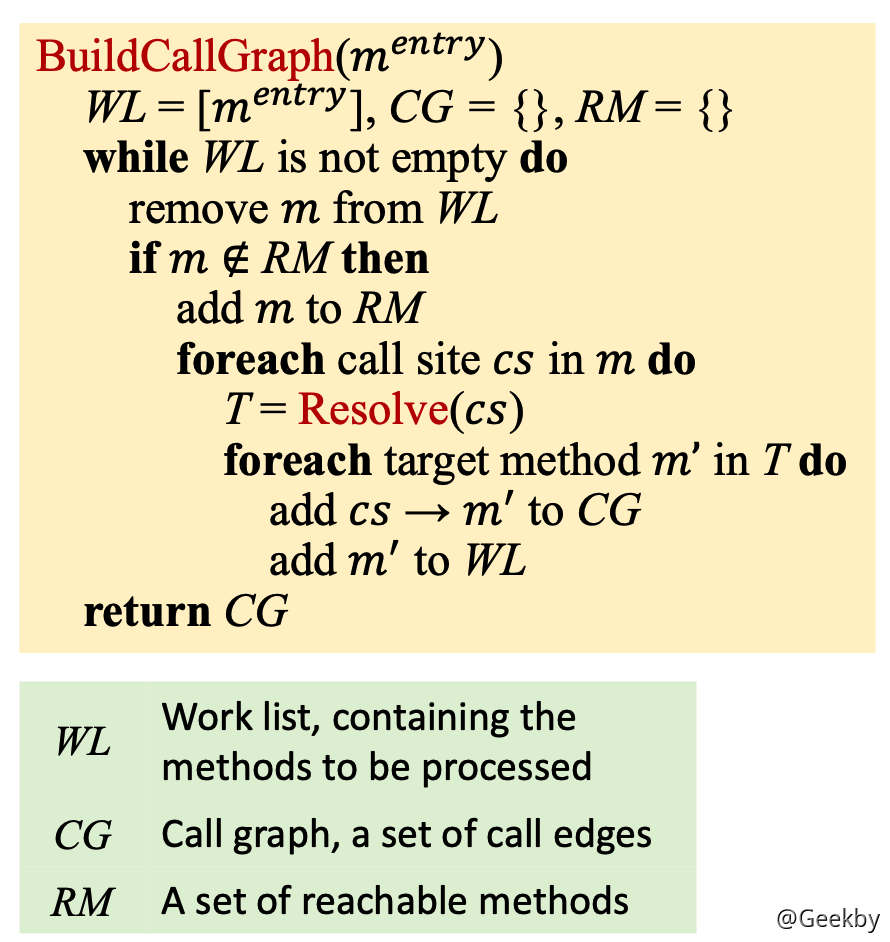

-   Worklist 记录需要处理的 methods
-   Call graph 是需要构建的目标，是 call edges 的集合
-   Reachable method (RM) 是已经处理过的目标，在 Worklist 中取新目标时，不需要再次处理已经在 RM 中的目标

一个例子：

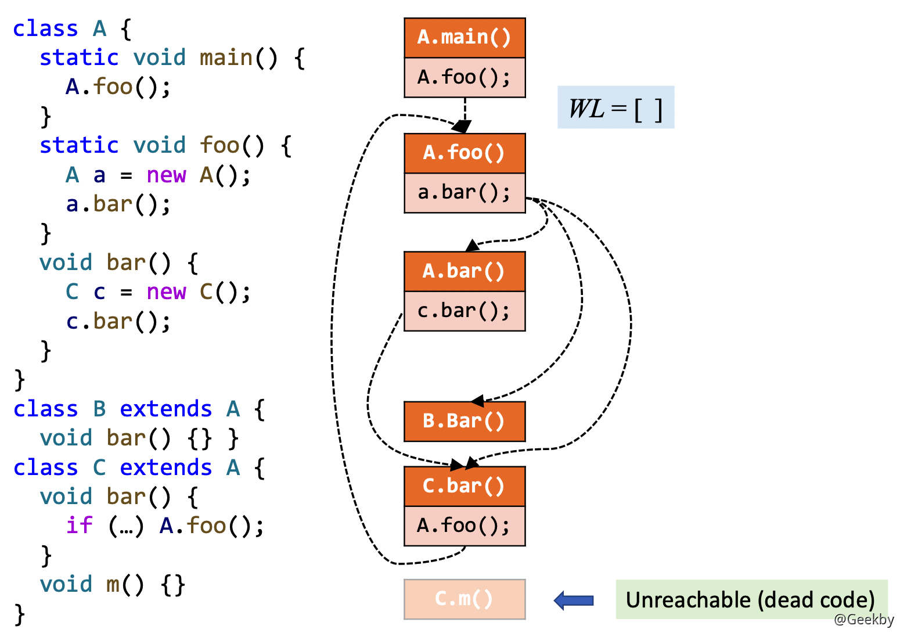

## 3 过程间的控制流图：Interprocedural Control-Flow Graph

> ICFG = CFGs + **call & return edges**

-   调用边：从调用点 call site 到被调方法 callee 的入口
-   返回边：从 callee 的返回语句到 call site 的**下一句**

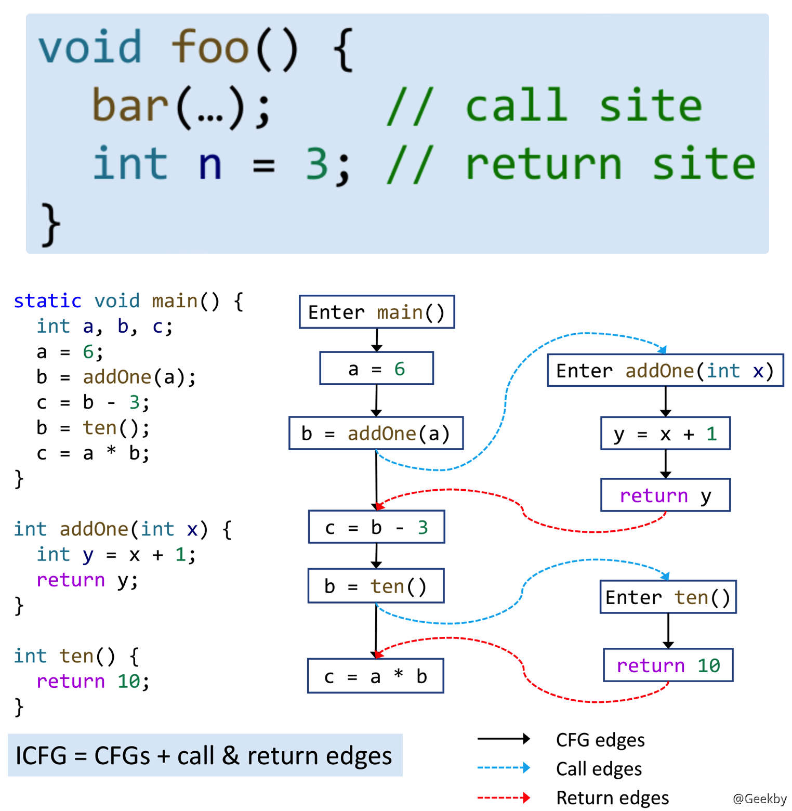

图示便是过程间的控制流图，ICFG 本质还是 CFG，应该用三地址码构成的 Basic Block 构成，但是此处为了清晰分析，所以还是将 BB 拆开来分析。

## 4 过程间数据流分析：Interprocedural Data-Flow Analysis

### 4.1 定义与比较

过程间分析多了一个调用返回边及对应的传递函数。

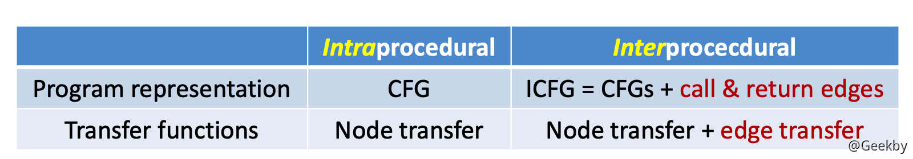

-   Call edge transfer：从调用者向被调用者传递参数
-   Return edge transfer：被调用者向调用者传递返回值
-   Node transfer：与前面文章提到的传递函数基本一样，但是多了一个性质，对于每次调用 (例如 b=foo(a)) 会将等式左侧的数值 kill 掉，然后在下一步中有返回边传递函数重新赋值。这个操作可以在返回值与原值不同时防止数据冲突。

### 4.2 示例

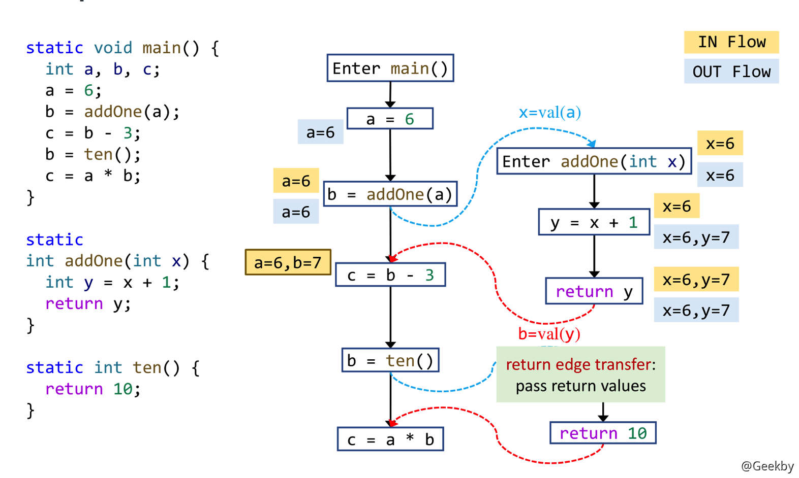

这一段存在的必要性？

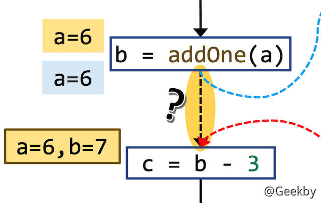

如果没有这一段，那么变量 a 在分析被调用函数的全程中都需要记住 a 的值，这在程序运行时会浪费大量内存。

此外，要记得在调用语句处 kill 掉表达式左边的值，否则会造成结果的不准确：

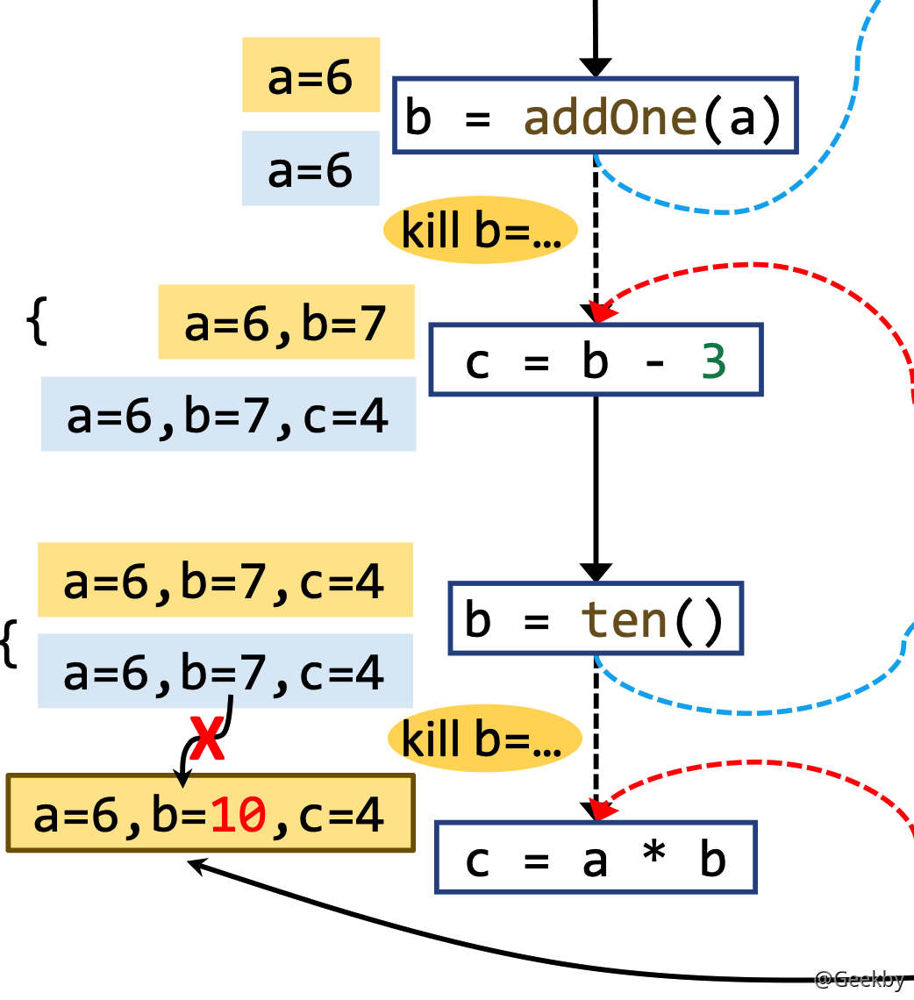
