# 高效的 Web 渗透测试：Mitmdump 和 Burp Suite 整合详解 - 先知社区

高效的 Web 渗透测试：Mitmdump 和 Burp Suite 整合详解

- - -

# mitmdump

最近好几次众测遇到前端js加密，除了需要进行前端加密算法分析之外，还需要mitmdump配合burp进行自动化解密，因此这里就遇到了mitmdump的使用，之前遇到的加密站是朋友帮忙写的，我本想着在此基础上修修改改但是在修改的过程中遇到了很多问题，本质上是对上下游代理的转发不是很熟悉，于是自己在本地进行手动调试做了详细的记录。

## 上下游代理

在此之前我们先了解一下代理，平时我们正常渗透一般是在浏览器挂代理，将流量转发给burp，在转发给服务器。同时服务器响应先返回给burp，burp在返回给客户端。

[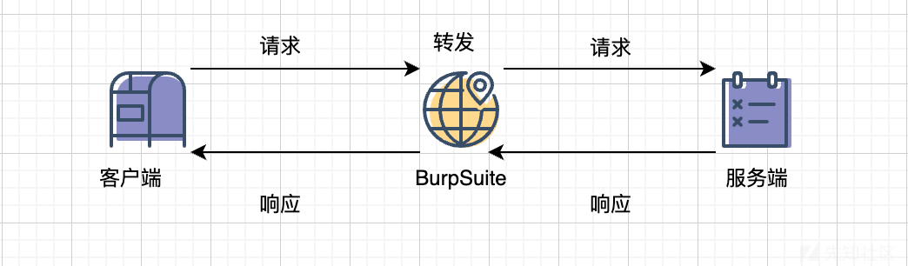](https://xzfile.aliyuncs.com/media/upload/picture/20231231213045-cd1657e2-a7e0-1.png)

那么我们结合mitmdump的时候具体的请求如下:

[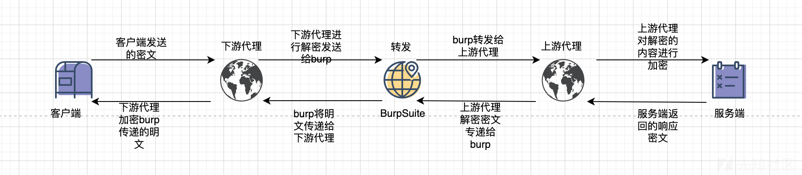](https://xzfile.aliyuncs.com/media/upload/picture/20231231213902-f5a184ba-a7e1-1.png)

### 下游代理

下游代理主要是接收客户端的加密请求密文，进行解密将解密结果发送到burp，burp将解密的数据呈现给我们。同时将burp传递的明文加密然后返回给客户端。

### 上游代理

上游代理主要是处理burp传递的请求进行加密返回给服务端。同时接收服务端的加密响应密文，进行解密将解密结果发送到burp，burp将解密结果呈现给我们。

### burp

burp的主要作用其实就是将解密结果呈现给我们，在一个就是可以使用repeter重发。

## mitmproxy

上下游代理均需要使用函数去处理请求和响应。

```plain
from mitmproxy import flowfilter,ctx
from mitmproxy.http import HTTPFlow
from mitmproxy import flowfilter
from mitmproxy.http import HTTPFlow

class Mimit():
    def request(self,flow):

    def response(self,flow):

addons = [Mimit(),]
```

上游代理:

-   request函数:处理burp发送的请求，编写函数进行加密并将结果发送给服务端。因为上游的request请求是处理burp中的数据的，在burp中无法看到处理之后的请求。这里通过控制台演示一下

[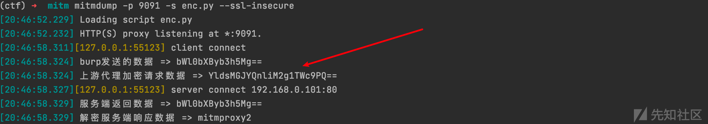](https://xzfile.aliyuncs.com/media/upload/picture/20231231213120-e224054e-a7e0-1.png)

-   response函数:处理服务端返回的响应，编写函数进行解密将结果发送给burp。

[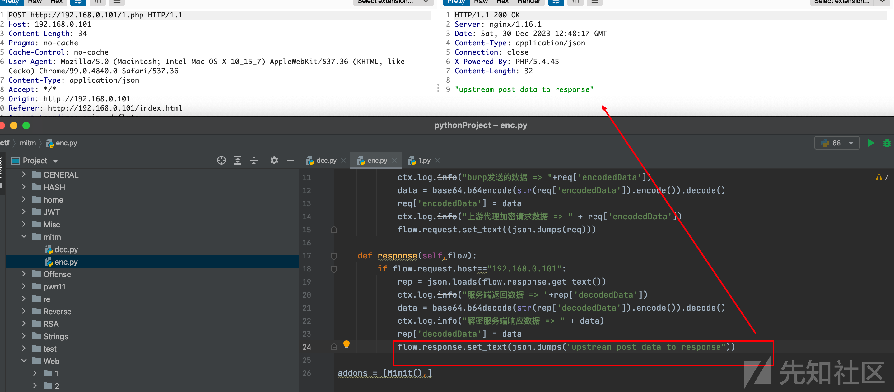](https://xzfile.aliyuncs.com/media/upload/picture/20231231213131-e88cf44a-a7e0-1.png)

下游代理:

-   request函数:处理客户端发送的请求，编写函数进行解密并将结果返回给burp。

[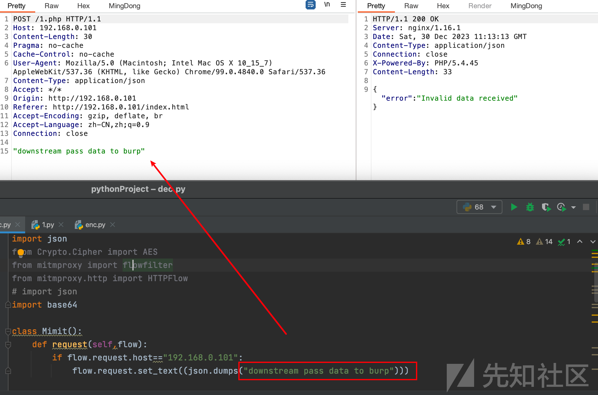](https://xzfile.aliyuncs.com/media/upload/picture/20231231213147-f2632b74-a7e0-1.png)

-   response函数:处理burp接收到的明文响应，编写函数进行加密并将结果返回给客户端。  
    [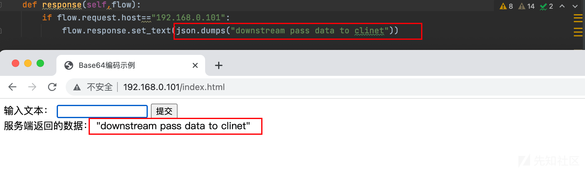](https://xzfile.aliyuncs.com/media/upload/picture/20231231213157-f87ec220-a7e0-1.png)

为了方便理解，这里单独对上、下游代理进行调试，梳理一下处理流程。这里我使用GPT简单写了一个客户端和服务端。

主要逻辑就是客户端对数据base64加密，然后服务端解密继续base64加密并将结果返回。

前端代码

```plain
<!DOCTYPE html>
<html lang="en">
<head>
    <meta charset="UTF-8">
    <meta name="viewport" content="width=device-width, initial-scale=1.0">
    <title>Base64编码示例</title>
</head>
<body>

    <form id="myForm">
        <label for="userInput">输入文本：</label>
        <input type="text" id="userInput" name="userInput" required>
        <button type="button" onclick="encodeAndSend()">提交</button>
    </form>

    <!-- 添加用于显示服务端返回的数据的元素 -->
    <div id="responseDataContainer"></div>

    <script>
        function encodeAndSend() {
            var userInput = document.getElementById("userInput").value;
            var encodedData = btoa(userInput);

            var jsonData = {
                encodedData: encodedData
            };

            fetch('1.php', {
                method: 'POST',
                headers: {
                    'Content-Type': 'application/json'
                },
                body: JSON.stringify(jsonData)
            })
            .then(response => response.text()) // 修改部分：使用 response.text() 获取字符串
            .then(data => {
                // 修改部分：将服务端返回的字符串显示在页面上
                var responseDataContainer = document.getElementById("responseDataContainer");
                responseDataContainer.innerHTML = '服务端返回的数据： ' + data;
            })
            .catch(error => {
                console.error('Error:', error);
            });
        }
    </script>

</body>
</html>
```

后端代码

```plain
<?php
header('Content-Type: application/json');

// 获取 POST 参数
$postData = json_decode(file_get_contents("php://input"), true);

// 检查是否接收到有效数据
if (isset($postData['encodedData'])) {
    // 获取 Base64 编码的数据
    $encodedData = $postData['encodedData'];

    // 判断是否以等号("=")结尾
     if (substr($encodedData, -1) === '=') {
            // 如果以等号结尾，解码并再次进行加密传递给客户端
            $decodedData = base64_decode($encodedData);
            $decodedData = base64_encode($decodedData);
    } else {
        // 如果不是 Base64 编码，直接对原始数据进行 Base64 编码
        $decodedData = base64_encode($encodedData);
    }

    // 返回继续加密后的数据
    $response = array('reencodedData' => $decodedData);
    echo json_encode($response);
} else {
    // 返回错误信息
    $errorResponse = array('error' => 'Invalid data received');
    echo json_encode($errorResponse);
}
?>
```

正常请求，如图:可以看到正常的请求就是加密处理的，这里我们就需要使用mitmproxy对请求和响应加解密方便我们进行渗透测试。

[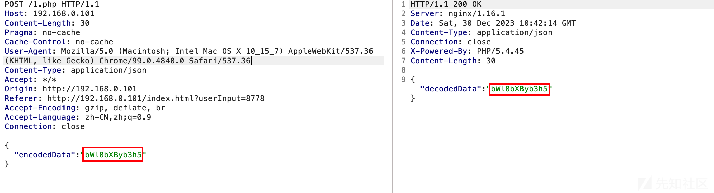](https://xzfile.aliyuncs.com/media/upload/picture/20231231213211-00ebb1ac-a7e1-1.png)

## 上游代理调试

下游处理函数

```plain
from mitmproxy import flowfilter,ctx
from mitmproxy.http import HTTPFlow
from mitmproxy import flowfilter
from mitmproxy.http import HTTPFlow
import base64

class Mimit():
    def request(self,flow):
        if flow.request.host=="192.168.0.101":
            req = json.loads(flow.request.get_text())
            ctx.log.info("浏览器请求数据 => "+req['encodedData'])
            data = base64.b64decode(str(req['encodedData']).encode()).decode()
            req['encodedData'] = data
            ctx.log.info("下游代理解密请求数据 => " + req['encodedData'])
            flow.request.set_text((json.dumps(req)))

    def response(self,flow):
        if flow.request.host=="192.168.0.101":
            rep = json.loads(flow.response.get_text())
            ctx.log.info("响应数据 => "+rep['decodedData'])
            data = base64.b64encode(str(rep['decodedData']).encode()).decode()
            ctx.log.info("响应数据 => " + data)
            rep['decodedData'] = data
            flow.response.set_text(json.dumps(rep))

addons = [Mimit(),]
```

命令行启动下游代理并将上游代理设置为burp。

```plain
mitmdump -p 7070 -s dec.py  --mode upstream:http://127.0.0.1:8080 --ssl-insecure
```

在浏览器中设置下游代理。

[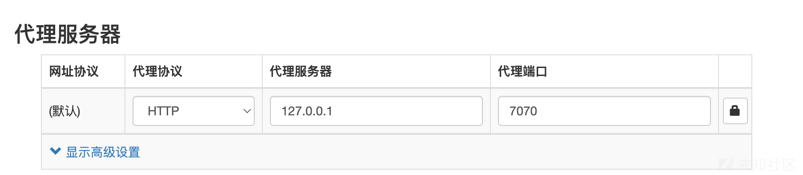](https://xzfile.aliyuncs.com/media/upload/picture/20231231213225-08d16df8-a7e1-1.png)

此时的流程为

[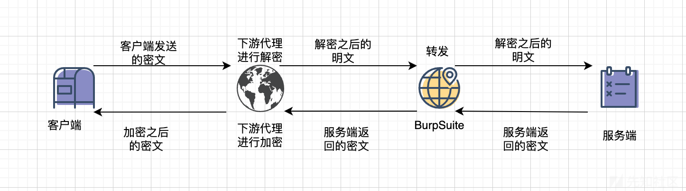](https://xzfile.aliyuncs.com/media/upload/picture/20231231213234-0e1f6f76-a7e1-1.png)

配置好之后发起请求，此时我们查看命令行和burp中的数据

[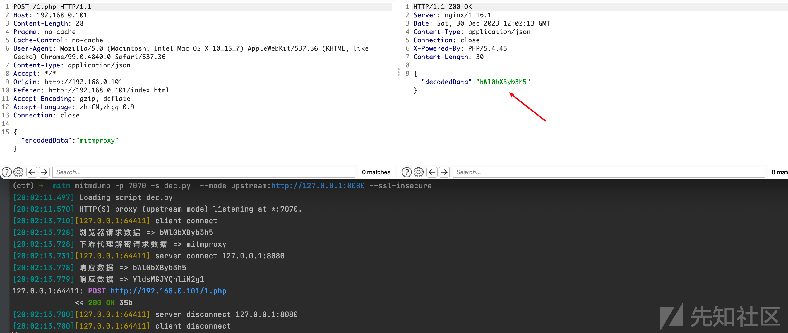](https://xzfile.aliyuncs.com/media/upload/picture/20231231213244-14621eba-a7e1-1.png)

可以看到，没有挂上游代理不会对响应数据进行解密，只是下游代理将客户端的请求解密在burp中呈现，因此请求包是明文，返回包是密文。

下游代理会加密burp传递的参数，也就是服务端传递的bWl0bXByb3h5，最终得到结果YldsMGJYQnliM2g1。因为这里没有上游代理，返回包没有被解密，所以会二次base64加密嘛。

[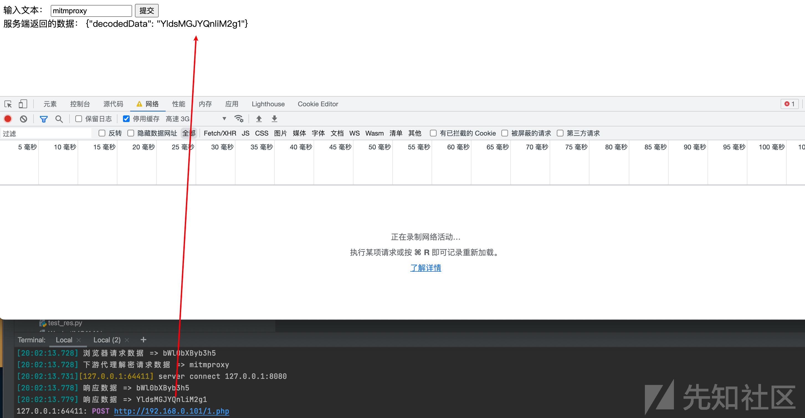](https://xzfile.aliyuncs.com/media/upload/picture/20231231213302-1f41b02a-a7e1-1.png)

## 上游代理调试

上游处理函数

```plain
from mitmproxy import flowfilter,ctx
from mitmproxy.http import HTTPFlow
from mitmproxy import flowfilter
from mitmproxy.http import HTTPFlow
import base64

class Mimit():
    def request(self,flow):
        if flow.request.host=="192.168.0.101":
            req = json.loads(flow.request.get_text())
            ctx.log.info("浏览器请求数据 => "+req['encodedData'])
            data = base64.b64decode(str(req['encodedData']).encode()).decode()
            req['encodedData'] = data
            ctx.log.info("下游代理解密请求数据 => " + req['encodedData'])
            flow.request.set_text((json.dumps(req)))

    def response(self,flow):
        if flow.request.host=="192.168.0.101":
            rep = json.loads(flow.response.get_text())
            ctx.log.info("响应数据 => "+rep['decodedData'])
            data = base64.b64encode(str(rep['decodedData']).encode()).decode()
            ctx.log.info("响应数据 => " + data)
            rep['decodedData'] = data
            flow.response.set_text(json.dumps(rep))
```

命令行启动上游代理。

```plain
mitmdump -p 9091 -s enc.py --ssl-insecure
```

burp挂上游代理

[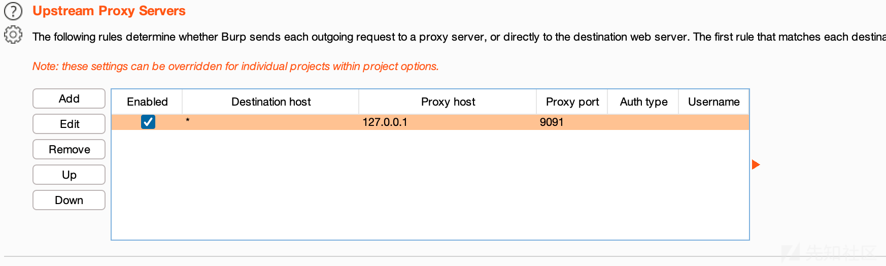](https://xzfile.aliyuncs.com/media/upload/picture/20231231213314-264722c4-a7e1-1.png)

此时流程为

[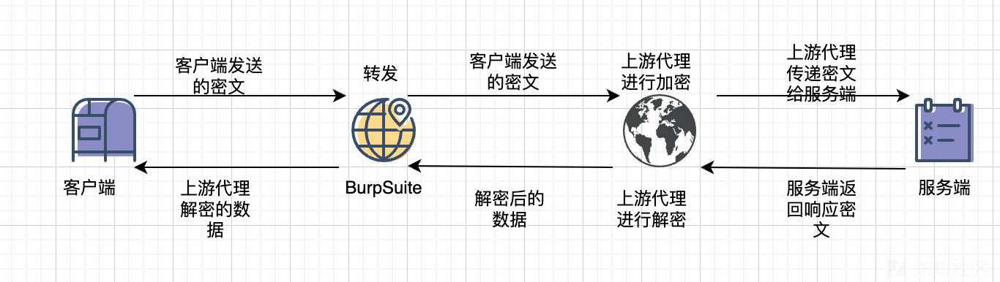](https://xzfile.aliyuncs.com/media/upload/picture/20231231214820-424f3086-a7e3-1.png)

配置好之后发起请求，此时我们查看命令行和burp中的数据。注意因为我们没有下游代理不会对客户端发送的请求解密，然而上游代理会进行加密，因此进行了二次base64加密。此时为了方便岩石，服务端也需要二次解密。所以修改一下代码。

```plain
// 判断是否以等号("=")结尾
     if (substr($encodedData, -1) === '=') {
            // 如果以等号结尾，解码并再次进行加密传递给客户端
            $decodedData = base64_decode($encodedData);
            $decodedData = base64_decode($decodedData);
            $decodedData = base64_encode($decodedData);
    } else {
        // 如果不是 Base64 编码，直接对原始数据进行 Base64 编码
        $decodedData = base64_encode($encodedData);
    }
```

可以看到上游代理对服务端返回的数据进行解密，呈现给客户端。

[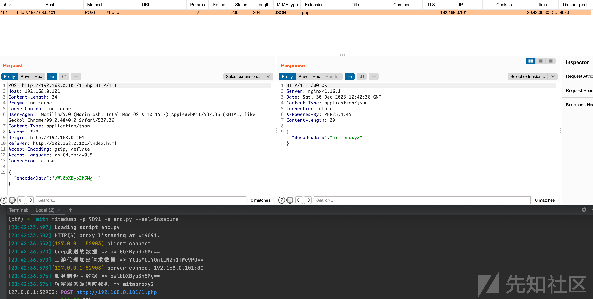](https://xzfile.aliyuncs.com/media/upload/picture/20231231213337-33ece6de-a7e1-1.png)

此时并没有下游代理对数据进行加密，因此客户端接收的是明文。

[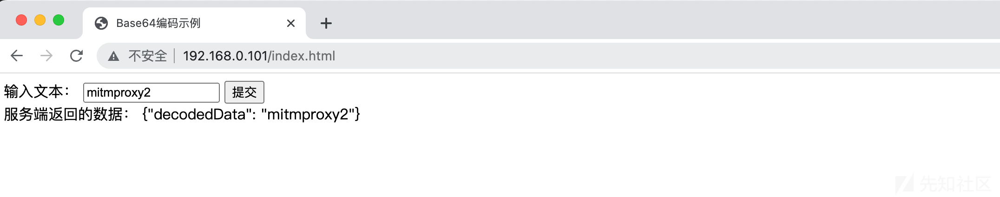](https://xzfile.aliyuncs.com/media/upload/picture/20231231213348-3ab71142-a7e1-1.png)

## 上下游调试

最后我们上、下游代理同时挂起进行调试。

下游代理

```plain
mitmdump -p 7070 -s dec.py  --mode upstream:http://127.0.0.1:8080 --ssl-insecure
```

[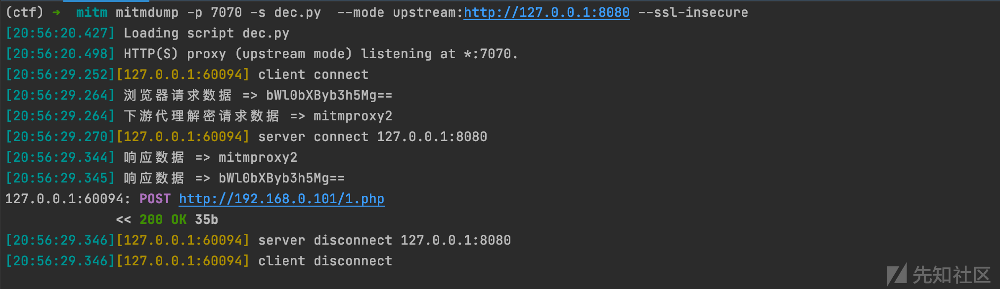](https://xzfile.aliyuncs.com/media/upload/picture/20231231213359-40e1887c-a7e1-1.png)

上游代理

```plain
mitmdump -p 9091 -s enc.py --ssl-insecure
```

[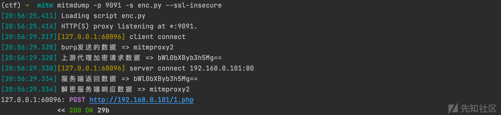](https://xzfile.aliyuncs.com/media/upload/picture/20231231213409-47036810-a7e1-1.png)

最终burp呈现数据如下

[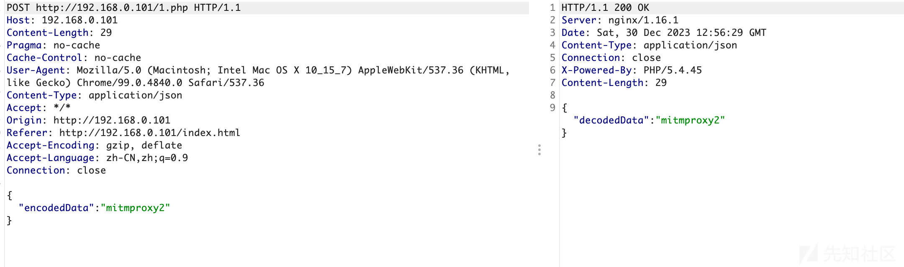](https://xzfile.aliyuncs.com/media/upload/picture/20231231213420-4d385394-a7e1-1.png)

客户端也可以正常接收请求

[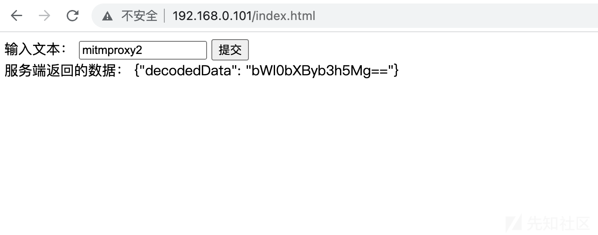](https://xzfile.aliyuncs.com/media/upload/picture/20231231213429-53106626-a7e1-1.png)

## Debug

平时在测试的时候，编写脚本可能需要debug，在上游代理可以使用以下脚本进行debug

```plain
import sys
import os
from mitmproxy.tools.main import mitmdump

sys.path.append(os.path.dirname(os.path.abspath(__file__)))
print(os.path.dirname(os.path.abspath(__file__)))

# 使用 mitmdump 启动并指定端口
mitmdump(['-s', 'enc.py', '-p', str(9091)])
```

此时在enc.py中下断点就行。

[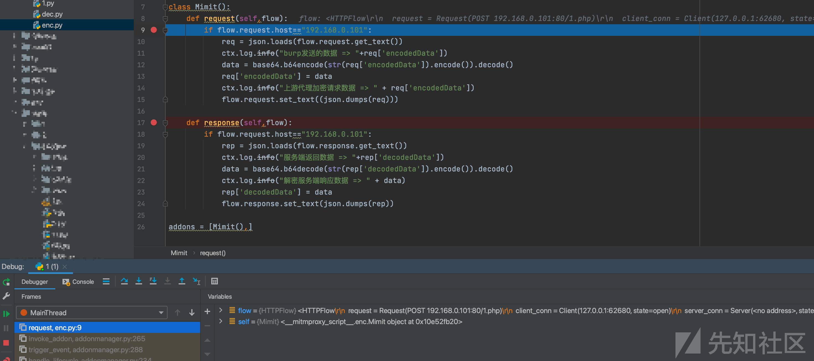](https://xzfile.aliyuncs.com/media/upload/picture/20231231213443-5b7ca176-a7e1-1.png)

下游代理同理

```plain
import sys
import os
from mitmproxy.tools.main import mitmdump

sys.path.append(os.path.dirname(os.path.abspath(__file__)))
print(os.path.dirname(os.path.abspath(__file__)))


# 启动 mitmdump
mitmdump(['-s', 'dec.py','-p', str(7071), '--mode', "upstream:http://127.0.0.1:8080"])
```

在dec.py下断点即可

[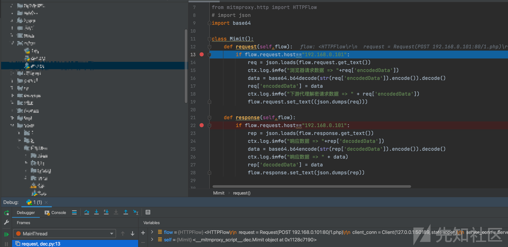](https://xzfile.aliyuncs.com/media/upload/picture/20231231213454-6210fbc2-a7e1-1.png)
